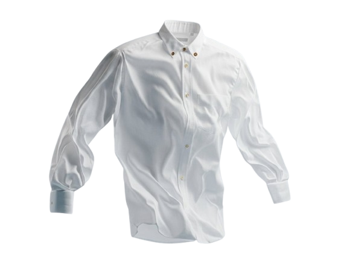

This file is a merged representation of a subset of the codebase, containing files not matching ignore patterns, combined into a single document by Repomix.

# File Summary

## Purpose
This file contains a packed representation of a subset of the repository's contents that is considered the most important context.
It is designed to be easily consumable by AI systems for analysis, code review,
or other automated processes.

## File Format
The content is organized as follows:
1. This summary section
2. Repository information
3. Directory structure
4. Repository files (if enabled)
5. Multiple file entries, each consisting of:
  a. A header with the file path (## File: path/to/file)
  b. The full contents of the file in a code block

## Usage Guidelines
- This file should be treated as read-only. Any changes should be made to the
  original repository files, not this packed version.
- When processing this file, use the file path to distinguish
  between different files in the repository.
- Be aware that this file may contain sensitive information. Handle it with
  the same level of security as you would the original repository.

## Notes
- Some files may have been excluded based on .gitignore rules and Repomix's configuration
- Binary files are not included in this packed representation. Please refer to the Repository Structure section for a complete list of file paths, including binary files
- Files matching these patterns are excluded: **/*.png, **/*.jpg, **/*.jpeg, **/*.svg, **/*.webp, **/*.gif, **/*.woff, **/*.woff2
- Files matching patterns in .gitignore are excluded
- Files matching default ignore patterns are excluded
- Files are sorted by Git change count (files with more changes are at the bottom)

# Directory Structure
````
css/
  animations.css
  components.css
  responsive.css
  style.css
js/
  animations.js
  booking.js
  cards.js
  main.js
  navigation.js
  pricing.js
  roadmap.js
about.html
booking.html
contact.html
how-it-works.html
index.html
pricing.html
prompt.txt
README.md
services.html
````

# Files

## File: css/animations.css
````css
/* ============================================================
   MeraDhobi: animations
   Philosophy: "quiet luxury". Fades, slides and reveals in the
   300 to 900ms range. All major motion is disabled when the user
   prefers reduced motion (see the media query at the bottom).
   ============================================================ */

/* ---------- 1. Keyframes ---------- */
@keyframes rise-in {
    from { opacity: 0; transform: translateY(26px); }
    to   { opacity: 1; transform: translateY(0); }
}

@keyframes fade-in {
    from { opacity: 0; }
    to   { opacity: 1; }
}

/* Slow background rings breathing behind the hero */
@keyframes ring-breathe {
    0%, 100% { transform: scale(1); opacity: 0.55; }
    50%      { transform: scale(1.05); opacity: 0.8; }
}

/* ---------- 2. Scroll-reveal system (driven by animations.js) ----------
   Hidden states only apply when JS is running (html.js), so the page
   stays fully visible if scripts fail or are disabled. */
.js .reveal {
    opacity: 0;
    transform: translateY(28px);
    transition: opacity 0.7s ease, transform 0.7s cubic-bezier(0.22, 0.61, 0.36, 1);
    will-change: opacity, transform;
}

.js .reveal.revealed {
    opacity: 1;
    transform: none;
}

/* Staggered children: parent gets .reveal-stagger, children .reveal-child */
.js .reveal-stagger .reveal-child {
    opacity: 0;
    transform: translateY(24px);
    transition: opacity 0.65s ease, transform 0.65s cubic-bezier(0.22, 0.61, 0.36, 1);
    transition-delay: calc(var(--reveal-index, 0) * 90ms);
}

.js .reveal-stagger.revealed .reveal-child {
    opacity: 1;
    transform: none;
}

/* ---------- 3. Hero entrance ---------- */
.hero-copy > * {
    animation: rise-in 0.9s cubic-bezier(0.22, 0.61, 0.36, 1) both;
}

.hero-copy > *:nth-child(1) { animation-delay: 0.05s; }
.hero-copy > *:nth-child(2) { animation-delay: 0.18s; }
.hero-copy > *:nth-child(3) { animation-delay: 0.31s; }
.hero-copy > *:nth-child(4) { animation-delay: 0.44s; }
.hero-copy > *:nth-child(5) { animation-delay: 0.57s; }
.hero-copy > *:nth-child(6) { animation-delay: 0.7s; }

/* ---------- 4. Roadmap dynamism ----------
   The home strip's auto-advance bar fills over each interval, and the live
   marker on the full roadmap emits a slow halo. Both are plain CSS; JS only
   restarts / recolours them. */
@keyframes hiw-fill {
    from { width: 0; }
    to   { width: 100%; }
}

@keyframes marker-pulse {
    0%   { box-shadow: 0 0 0 0 color-mix(in srgb, var(--stage-color) 34%, transparent); }
    70%  { box-shadow: 0 0 0 14px color-mix(in srgb, var(--stage-color) 0%, transparent); }
    100% { box-shadow: 0 0 0 0 color-mix(in srgb, var(--stage-color) 0%, transparent); }
}

/* ---------- 5. Hero soap bubbles ----------
   Each bubble rises from its start point, drifting sideways as it fades in
   and out. Duration and delay come from inline custom properties, so the
   six bubbles never move in lockstep. */
@keyframes bubble-rise {
    0%   { transform: translate3d(0, 0, 0) scale(0.9); opacity: 0; }
    18%  { opacity: 0.9; }
    50%  { transform: translate3d(16px, -34px, 0) scale(1.08); }
    100% { transform: translate3d(-12px, -72px, 0) scale(0.85); opacity: 0; }
}

/* ---------- 6. Decorative rings ---------- */
.backdrop .ring {
    animation: ring-breathe 9s ease-in-out infinite;
}

/* ---------- 7. Marquee band between sections ---------- */
.marquee {
    overflow: hidden;
    border-block: 1px solid rgba(18, 50, 67, 0.08);
    background: var(--color-surface);
    padding: 16px 0;
}

.marquee-track {
    display: flex;
    gap: 64px;
    width: max-content;
    animation: marquee-scroll 26s linear infinite;
}

.marquee-track span {
    display: inline-flex;
    align-items: center;
    gap: 14px;
    font-family: var(--font-display);
    font-style: italic;
    font-size: 1.05rem;
    color: var(--color-muted);
    white-space: nowrap;
}

.marquee-track svg {
    color: var(--color-accent);
}

@keyframes marquee-scroll {
    from { transform: translateX(0); }
    to   { transform: translateX(-50%); }
}

/* ---------- 8. Route truck marker pulse ---------- */
.route-truck {
    transition: offset-distance 0.2s linear;
}

/* ---------- 9. Reduced motion: calm everything down ---------- */
@media (prefers-reduced-motion: reduce) {
    html {
        scroll-behavior: auto;
    }

    *,
    *::before,
    *::after {
        animation-duration: 0.01ms !important;
        animation-iteration-count: 1 !important;
        transition-duration: 0.01ms !important;
    }

    /* Keep content visible; never hide revealed state behind animation */
    .reveal,
    .reveal-stagger .reveal-child {
        opacity: 1;
        transform: none;
    }

    .marquee-track {
        animation: none;
    }

    /* The auto-advance bar only communicates timing; drop it entirely. */
    .hiw-progress {
        display: none;
    }
}
````

## File: css/components.css
````css
/* ============================================================
   MeraDhobi: reusable components
   Cards, forms, calculator, roadmap, route map, FAQ, tables.
   Every component stays inside the pale-blue / navy palette.
   ============================================================ */

/* ---------- 1. Cards ---------- */
.card {
    position: relative;
    background: var(--color-surface);
    border: 1px solid rgba(18, 50, 67, 0.08);
    border-radius: var(--radius-lg);
    padding: 30px;
    transition: transform 0.4s ease, box-shadow 0.4s ease, border-color 0.4s ease;
}

.card:hover {
    transform: translateY(-4px);
    box-shadow: var(--shadow-lift);
    border-color: rgba(120, 184, 200, 0.45);
}

.card-icon {
    display: grid;
    place-items: center;
    width: 54px;
    height: 54px;
    border-radius: 16px;
    background: var(--color-pale);
    color: var(--color-deep);
    margin-bottom: 20px;
    transition: background-color 0.4s ease, color 0.4s ease, transform 0.4s ease;
}

.card h3 {
    margin-bottom: 8px;
}

.card p {
    font-size: 0.97rem;
    margin-bottom: 0;
}

/* Expandable detail panel inside a card (toggled by cards.js) */
.card-details {
    display: grid;
    grid-template-rows: 0fr;
    transition: grid-template-rows 0.5s ease, opacity 0.45s ease;
    opacity: 0;
}

.card-details > div {
    overflow: hidden;
}

/* Active card: stronger border, tinted wash, icon flips to navy */
.card.active {
    border-color: var(--color-accent);
    background: linear-gradient(175deg, #fbfdfe 0%, var(--color-pale) 130%);
    box-shadow: var(--shadow-soft);
}

.card.active .card-icon {
    background: var(--color-deep);
    color: var(--color-surface);
    transform: rotate(-6deg);
}

.card.active .card-details {
    grid-template-rows: 1fr;
    opacity: 1;
    margin-top: 16px;
}

.card-details ul {
    display: grid;
    gap: 8px;
    padding-top: 14px;
    border-top: 1px dashed rgba(18, 50, 87, 0.14);
}

.card-details li {
    display: flex;
    gap: 10px;
    align-items: flex-start;
    font-size: 0.9rem;
    color: var(--color-muted);
}

.card-details li svg {
    flex-shrink: 0;
    margin-top: 3px;
    color: var(--color-accent);
}

/* Non-active cards compress slightly so the active one leads */
.card-grid.has-active .card:not(.active) {
    opacity: 0.72;
}

.card-hint {
    margin-top: 18px;
    font-size: 0.82rem;
    letter-spacing: 0.06em;
    text-transform: uppercase;
    color: var(--color-accent);
    display: inline-flex;
    align-items: center;
    gap: 8px;
}

.card-hint svg {
    transition: transform 0.3s ease;
}

.card.active .card-hint svg {
    transform: rotate(180deg);
}

/* ---------- 2. Badges & pills ---------- */
.badge {
    display: inline-flex;
    align-items: center;
    gap: 7px;
    padding: 6px 14px;
    border-radius: 999px;
    font-size: 0.78rem;
    font-weight: 700;
    letter-spacing: 0.04em;
    background: var(--color-pale);
    color: var(--color-deep);
    border: 1px solid rgba(120, 184, 200, 0.35);
}

.badge-mint { background: rgba(185, 221, 213, 0.35); color: #3d7a6d; border-color: rgba(185, 221, 213, 0.8); }

/* ---------- 3. Forms ---------- */
.form-grid {
    display: grid;
    grid-template-columns: 1fr 1fr;
    gap: 20px;
}

.form-field {
    display: flex;
    flex-direction: column;
    gap: 8px;
}

.form-field.full {
    grid-column: 1 / -1;
}

.form-field label {
    font-size: 0.88rem;
    font-weight: 700;
    color: var(--color-deep);
}

.form-field label .optional {
    font-weight: 500;
    color: var(--color-muted);
    font-size: 0.8rem;
}

.form-field input,
.form-field select,
.form-field textarea {
    font: inherit;
    color: var(--color-ink);
    background: var(--color-surface);
    border: 1.5px solid rgba(18, 50, 67, 0.14);
    border-radius: var(--radius-sm);
    padding: 13px 16px;
    transition: border-color 0.3s ease, box-shadow 0.3s ease, background-color 0.3s ease;
}

.form-field textarea {
    resize: vertical;
    min-height: 110px;
}

.form-field input:focus,
.form-field select:focus,
.form-field textarea:focus {
    outline: none;
    border-color: var(--color-accent);
    box-shadow: 0 0 0 4px rgba(120, 184, 200, 0.18);
    background: #fdfeff;
}

/* Validation feedback: green border + message when valid, red when not */
.form-field.valid input,
.form-field.valid select,
.form-field.valid textarea {
    border-color: #74B7A8;
}

.form-field.invalid input,
.form-field.invalid select,
.form-field.invalid textarea {
    border-color: #c86f6f;
    background: #fdf7f6;
}

.field-error {
    font-size: 0.8rem;
    color: #b3554f;
    display: none;
}

.form-field.invalid .field-error {
    display: block;
}

/* Confirmation card shown after successful (demo) submission */
.form-success {
    display: none;
    background: var(--color-surface);
    border: 1px solid rgba(116, 183, 168, 0.5);
    border-radius: var(--radius-lg);
    padding: clamp(28px, 4vw, 44px);
    text-align: center;
    box-shadow: var(--shadow-soft);
}

.form-success.show {
    display: block;
    animation: rise-in 0.6s ease both;
}

.success-icon {
    display: grid;
    place-items: center;
    width: 72px;
    height: 72px;
    margin: 0 auto 20px;
    border-radius: 50%;
    background: rgba(116, 183, 168, 0.16);
    color: #4d8f7f;
}

.form-success h3 {
    font-size: 1.5rem;
}

/* Key/value summary of what the user entered */
.booking-summary {
    margin: 24px auto 28px;
    max-width: 460px;
    text-align: left;
    border: 1px dashed rgba(18, 50, 67, 0.18);
    border-radius: var(--radius-md);
    padding: 18px 22px;
    display: grid;
    gap: 10px;
    background: var(--color-background);
}

.booking-summary div {
    display: flex;
    justify-content: space-between;
    gap: 16px;
    font-size: 0.92rem;
}

.booking-summary dt { color: var(--color-muted); }
.booking-summary dd { margin: 0; color: var(--color-deep); font-weight: 600; text-align: right; }

.ref-chip {
    display: inline-block;
    font-family: "SFMono-Regular", Consolas, "Liberation Mono", monospace;
    font-size: 0.95rem;
    letter-spacing: 0.08em;
    background: var(--color-deep);
    color: var(--color-mint);
    border-radius: 8px;
    padding: 8px 16px;
    margin-bottom: 8px;
}

.form-note {
    font-size: 0.82rem;
    color: var(--color-muted);
}

/* ---------- 4. Pricing calculator & table ---------- */
.calc-shell {
    display: grid;
    grid-template-columns: 1.1fr 0.9fr;
    border: 1px solid rgba(18, 50, 67, 0.1);
    border-radius: var(--radius-lg);
    overflow: hidden;
    background: var(--color-surface);
    box-shadow: var(--shadow-soft);
}

.calc-form {
    padding: clamp(28px, 4vw, 44px);
    display: grid;
    gap: 20px;
    align-content: start;
}

.calc-result {
    background: var(--color-deep);
    color: var(--color-pale);
    padding: clamp(28px, 4vw, 44px);
    display: flex;
    flex-direction: column;
    justify-content: center;
    gap: 6px;
}

.calc-result .eyebrow {
    color: var(--color-mint);
}

.calc-total {
    font-family: var(--font-display);
    font-size: clamp(2.6rem, 5vw, 3.6rem);
    font-weight: 600;
    color: var(--color-surface);
    line-height: 1;
    margin: 6px 0 14px;
}

.calc-breakdown {
    font-size: 0.9rem;
    color: rgba(228, 241, 245, 0.75);
    border-top: 1px dashed rgba(228, 241, 245, 0.25);
    padding-top: 14px;
}

.calc-note {
    font-size: 0.8rem;
    color: rgba(228, 241, 245, 0.5);
}

.price-table-wrap {
    border: 1px solid rgba(18, 50, 67, 0.1);
    border-radius: var(--radius-lg);
    background: var(--color-surface);
    overflow: hidden;
}

.price-table {
    width: 100%;
    border-collapse: collapse;
    font-size: 0.95rem;
}

.price-table th,
.price-table td {
    text-align: left;
    padding: 14px 22px;
    border-bottom: 1px solid rgba(18, 50, 67, 0.07);
}

.price-table thead th {
    background: var(--color-pale);
    color: var(--color-deep);
    font-size: 0.8rem;
    letter-spacing: 0.08em;
    text-transform: uppercase;
}

.price-table tbody tr:last-child td {
    border-bottom: none;
}

.price-table tbody tr {
    transition: background-color 0.25s ease;
}

.price-table tbody tr:hover {
    background: rgba(228, 241, 245, 0.55);
}

.price-table .price {
    font-weight: 700;
    color: var(--color-deep);
    text-align: right;
}

.price-table th:last-child,
.price-table td:last-child {
    text-align: right;
}

/* ---------- 5. FAQ accordion ---------- */
.faq-list {
    display: grid;
    gap: 12px;
    max-width: 760px;
}

.faq-item {
    background: var(--color-surface);
    border: 1px solid rgba(18, 50, 67, 0.09);
    border-radius: var(--radius-md);
    overflow: hidden;
    transition: border-color 0.3s ease, box-shadow 0.3s ease;
}

.faq-item.open {
    border-color: rgba(120, 184, 200, 0.55);
    box-shadow: var(--shadow-soft);
}

.faq-question {
    width: 100%;
    display: flex;
    align-items: center;
    justify-content: space-between;
    gap: 16px;
    padding: 18px 22px;
    background: none;
    border: none;
    text-align: left;
    font-weight: 700;
    color: var(--color-deep);
    font-size: 1rem;
}

.faq-question svg {
    flex-shrink: 0;
    color: var(--color-accent);
    transition: transform 0.35s ease;
}

.faq-item.open .faq-question svg {
    transform: rotate(180deg);
}

.faq-answer {
    display: grid;
    grid-template-rows: 0fr;
    transition: grid-template-rows 0.4s ease;
}

.faq-answer > div {
    overflow: hidden;
}

.faq-item.open .faq-answer {
    grid-template-rows: 1fr;
}

.faq-answer p {
    padding: 0 22px 18px;
    margin: 0;
    font-size: 0.94rem;
}

/* ---------- 6. Route map visual (pure SVG, no API key) ---------- */
.route-map {
    position: relative;
    background: linear-gradient(160deg, var(--color-pale) 0%, #eef7fa 60%, var(--color-background) 100%);
    border: 1px solid rgba(120, 184, 200, 0.35);
    border-radius: var(--radius-lg);
    overflow: hidden;
    min-height: 420px;
}

.route-map > svg {
    position: absolute;
    inset: 0;
    width: 100%;
    height: 100%;
}

/* Small icons inside labels stay inline-sized */
.route-label svg {
    flex-shrink: 0;
}

.route-label {
    position: absolute;
    background: var(--color-surface);
    border: 1px solid rgba(120, 184, 200, 0.4);
    box-shadow: var(--shadow-soft);
    border-radius: 12px;
    padding: 10px 14px;
    font-size: 0.82rem;
    font-weight: 600;
    color: var(--color-deep);
    display: flex;
    align-items: center;
    gap: 8px;
}

.route-label small {
    display: block;
    font-weight: 500;
    color: var(--color-muted);
}

/* ---------- 7. How-it-works strip (compact 6-stage overview) ---------- */
.hiw-strip {
    display: grid;
    grid-template-columns: repeat(6, 1fr);
    gap: 12px;
    counter-reset: stage;
}

.hiw-step {
    position: relative;
    background: var(--color-surface);
    border: 1px solid rgba(18, 50, 67, 0.08);
    border-radius: var(--radius-md);
    padding: 22px 18px;
    display: flex;
    flex-direction: column;
    gap: 10px;
    cursor: pointer;
    text-align: left;
    transition: transform 0.35s ease, border-color 0.35s ease, box-shadow 0.35s ease;
}

.hiw-step:hover {
    transform: translateY(-3px);
    box-shadow: var(--shadow-soft);
}

/* Each stage owns a muted accent; the active state tints border + dot */
.hiw-step[data-stage="1"] { --stage-color: var(--stage-1); }
.hiw-step[data-stage="2"] { --stage-color: var(--stage-2); }
.hiw-step[data-stage="3"] { --stage-color: var(--stage-3); }
.hiw-step[data-stage="4"] { --stage-color: var(--stage-4); }
.hiw-step[data-stage="5"] { --stage-color: var(--stage-5); }
.hiw-step[data-stage="6"] { --stage-color: var(--stage-6); }

.hiw-step .step-num {
    font-family: var(--font-display);
    font-style: italic;
    font-size: 1.5rem;
    color: var(--stage-color, var(--color-accent));
}

.hiw-step .step-title {
    font-weight: 700;
    color: var(--color-deep);
}

.hiw-step .step-desc {
    font-size: 0.84rem;
    color: var(--color-muted);
    line-height: 1.5;
}

.hiw-step .step-dot {
    width: 10px;
    height: 10px;
    border-radius: 50%;
    background: var(--stage-color, var(--color-accent));
    opacity: 0.5;
    transition: opacity 0.35s ease, box-shadow 0.35s ease;
}

/* Active step: lifted, ringed dot, full-opacity accent */
.hiw-step.active {
    border-color: var(--stage-color, var(--color-accent));
    box-shadow: var(--shadow-soft);
    transform: translateY(-3px);
}

.hiw-step.active .step-dot {
    opacity: 1;
    box-shadow: 0 0 0 4px color-mix(in srgb, var(--stage-color) 22%, transparent);
}

/* Auto-advance bar under the strip. The fill is an animation, not a width
   transition, so roadmap.js can restart it cleanly on every step. */
.hiw-progress {
    position: relative;
    height: 3px;
    margin-top: 14px;
    border-radius: 999px;
    background: rgba(18, 50, 67, 0.08);
    overflow: hidden;
}

.hiw-progress span {
    display: block;
    width: 0;
    height: 100%;
    border-radius: inherit;
    background: var(--stage-color, var(--color-accent));
}

.hiw-progress span.is-running {
    animation: hiw-fill var(--hiw-duration, 3500ms) linear forwards;
}

.hiw-progress span.is-paused {
    animation-play-state: paused;
}

/* Detail panel that follows the strip (roadmap.js writes into it) */
.hiw-detail {
    margin-top: 22px;
    background: var(--color-surface);
    border: 1px solid rgba(120, 184, 200, 0.35);
    border-left: 4px solid var(--stage-color, var(--color-accent));
    border-radius: var(--radius-md);
    padding: 22px 26px;
    display: grid;
    grid-template-columns: auto 1fr;
    gap: 20px;
    align-items: start;
}

.hiw-detail .detail-icon {
    display: grid;
    place-items: center;
    width: 52px;
    height: 52px;
    border-radius: 14px;
    background: var(--color-pale);
    color: var(--color-deep);
}

.hiw-detail h3 {
    margin-bottom: 4px;
}

.hiw-detail p {
    margin: 0;
    font-size: 0.94rem;
}

/* ---------- 8. Full roadmap timeline (how-it-works page) ---------- */
.roadmap {
    position: relative;
    padding-block: 10px;
}

/* Confined to the marker column so the drawn line runs through the stage
   markers rather than down the centre of the text column. */
.roadmap-path {
    position: absolute;
    inset: 0 auto 0 0;
    width: 72px;
    height: 100%;
    pointer-events: none;
}

/* Both layers are dotted, so the connector reads as a dotted line; the
   progress layer simply fills in over the lighter track as you scroll. */
.roadmap-path .path-outline {
    fill: none;
    stroke: rgba(120, 184, 200, 0.35);
    stroke-width: 2.5;
    stroke-dasharray: 1.4 9;
    stroke-linecap: round;
    vector-effect: non-scaling-stroke; /* keep stroke thin despite stretched viewBox */
}

.roadmap-path .path-progress {
    fill: none;
    stroke: url(#roadmapGradient);
    stroke-width: 2.5;
    stroke-dasharray: 1.4 9;
    stroke-linecap: round;
    vector-effect: non-scaling-stroke;
}

/* Head of the progress line. roadmap.js sets its `top` from the scroll
   progress and its --stage-color from the active stage, so the dot visibly
   travels between stages as the page scrolls. */
.roadmap-pointer {
    position: absolute;
    top: 0;
    left: 36px;
    width: 16px;
    height: 16px;
    margin: -8px 0 0 -8px;
    border-radius: 50%;
    background: var(--color-surface);
    border: 3px solid var(--stage-color, var(--color-accent));
    box-shadow: 0 0 0 6px rgba(120, 184, 200, 0.16);
    z-index: 3;
    pointer-events: none;
    transition: top 0.2s linear, border-color 0.5s ease;
}

.roadmap-item {
    position: relative;
    display: grid;
    grid-template-columns: 72px 1fr;
    gap: 28px;
    padding: 26px 0;
    opacity: 0.45;
    transition: opacity 0.6s ease;
}

.roadmap-item.active {
    opacity: 1;
}

.roadmap-marker {
    position: relative;
    z-index: 2;
    display: grid;
    place-items: center;
    width: 72px;
    height: 72px;
    border-radius: 50%;
    background: var(--color-surface);
    border: 2px solid rgba(120, 184, 200, 0.3);
    color: var(--color-muted);
    transition: border-color 0.5s ease, color 0.5s ease, transform 0.5s ease, box-shadow 0.5s ease;
}

.roadmap-item.active .roadmap-marker {
    transform: scale(1.06);
    border-color: var(--stage-color, var(--color-accent));
    color: var(--stage-color, var(--color-accent));
    box-shadow: 0 0 0 6px color-mix(in srgb, var(--stage-color) 15%, transparent);
    /* Slow halo on the live stage; keyframes live in animations.css. */
    animation: marker-pulse 2.4s ease-out infinite;
}

.roadmap-item h3 {
    display: flex;
    align-items: baseline;
    gap: 14px;
    cursor: pointer;
}

.roadmap-item .stage-num {
    font-family: var(--font-display);
    font-style: italic;
    font-size: 1.1rem;
    color: var(--stage-color, var(--color-accent));
}

/* Click-to-expand detail inside each timeline entry */
.roadmap-more {
    display: grid;
    grid-template-rows: 0fr;
    opacity: 0;
    transition: grid-template-rows 0.5s ease, opacity 0.5s ease;
}

.roadmap-more > div {
    overflow: hidden;
}

.roadmap-item.expanded .roadmap-more {
    grid-template-rows: 1fr;
    opacity: 1;
}

.roadmap-more p {
    padding-top: 10px;
    margin: 0;
    border-top: 1px dashed rgba(18, 50, 67, 0.14);
    max-width: 640px;
    font-size: 0.95rem;
}

.roadmap-item[data-stage="1"] { --stage-color: var(--stage-1); }
.roadmap-item[data-stage="2"] { --stage-color: var(--stage-2); }
.roadmap-item[data-stage="3"] { --stage-color: var(--stage-3); }
.roadmap-item[data-stage="4"] { --stage-color: var(--stage-4); }
.roadmap-item[data-stage="5"] { --stage-color: var(--stage-5); }
.roadmap-item[data-stage="6"] { --stage-color: var(--stage-6); }

/* ---------- 9. Fabric cards (homepage) ---------- */
.fabric-card {
    position: relative;
    border-radius: var(--radius-lg);
    border: 1px solid rgba(18, 50, 67, 0.08);
    background: var(--color-surface);
    padding: 26px;
    overflow: hidden;
    cursor: pointer;
    text-align: left;
    width: 100%;
    transition: transform 0.35s ease, box-shadow 0.35s ease, border-color 0.35s ease;
}

.fabric-card:hover {
    transform: translateY(-4px);
    box-shadow: var(--shadow-soft);
    border-color: rgba(120, 184, 200, 0.45);
}

.fabric-card .fabric-head {
    display: flex;
    align-items: center;
    justify-content: flex-start;
    gap: 14px;
    margin-bottom: 14px;
}

.fabric-card .fabric-swatch {
    width: 44px;
    height: 44px;
    border-radius: 12px;
    flex-shrink: 0;
    box-shadow: inset 0 0 0 1px rgba(18, 50, 67, 0.08);
    transition: transform 0.35s ease;
}

.fabric-card:hover .fabric-swatch,
.fabric-card.active .fabric-swatch {
    transform: rotate(-6deg) scale(1.05);
}

.fabric-card h3 {
    font-size: 1.1rem;
    margin: 0;
}

.fabric-card .fabric-body p {
    font-size: 0.9rem;
    margin-bottom: 10px;
}

.fabric-card .fabric-tags {
    display: flex;
    flex-wrap: wrap;
    gap: 6px;
}

.fabric-card .fabric-tags span {
    font-size: 0.75rem;
    font-weight: 600;
    padding: 4px 10px;
    border-radius: 999px;
    background: var(--color-pale);
    color: var(--color-deep);
}

.fabric-card .fabric-tip {
    display: grid;
    grid-template-rows: 0fr;
    opacity: 0;
    transition: grid-template-rows 0.45s ease, opacity 0.45s ease;
}

.fabric-card .fabric-tip > div {
    overflow: hidden;
}

.fabric-card.active .fabric-tip {
    grid-template-rows: 1fr;
    opacity: 1;
}

.fabric-card .fabric-tip p {
    margin: 12px 0 0;
    padding-top: 12px;
    border-top: 1px dashed rgba(18, 50, 67, 0.14);
    font-size: 0.85rem;
    color: var(--color-deep);
    display: flex;
    gap: 8px;
}

.fabric-card .fabric-tip svg {
    flex-shrink: 0;
    margin-top: 2px;
    color: #58A795;
}

/* ---------- 10. Misc blocks ---------- */
.check-list li {
    display: flex;
    gap: 12px;
    align-items: flex-start;
    margin-bottom: 14px;
    color: var(--color-muted);
}

.check-list svg {
    flex-shrink: 0;
    margin-top: 4px;
    color: #58A795;
}

.check-list strong {
    color: var(--color-deep);
    font-weight: 700;
}

.value-list {
    display: grid;
    gap: 18px;
}

.value-list .value-row {
    display: flex;
    gap: 18px;
    align-items: flex-start;
    padding-bottom: 18px;
    border-bottom: 1px dashed rgba(18, 50, 67, 0.12);
}

.value-list .value-row:last-child {
    border-bottom: none;
    padding-bottom: 0;
}

.value-list .value-icon {
    display: grid;
    place-items: center;
    width: 48px;
    height: 48px;
    border-radius: 14px;
    background: var(--color-pale);
    color: var(--color-deep);
    flex-shrink: 0;
}

.value-list h3 {
    font-size: 1.05rem;
    margin-bottom: 4px;
}

.value-list p {
    margin: 0;
    font-size: 0.93rem;
}

.stat-line {
    display: flex;
    flex-wrap: wrap;
    gap: 12px;
    margin-top: 26px;
}

/* Split feature layout used on several pages */
.feature-media {
    border-radius: var(--radius-lg);
    overflow: hidden;
    border: 1px solid rgba(120, 184, 200, 0.3);
    background: linear-gradient(160deg, var(--color-pale), #eef7fa);
    min-height: 380px;
    position: relative;
}

.promise-grid {
    display: grid;
    grid-template-columns: repeat(5, 1fr);
    gap: 18px;
}

.promise-card {
    background: rgba(255, 255, 255, 0.06);
    border: 1px solid rgba(228, 241, 245, 0.14);
    border-radius: var(--radius-md);
    padding: 24px 20px;
    transition: background-color 0.35s ease, border-color 0.35s ease, transform 0.35s ease;
}

.promise-card:hover {
    background: rgba(120, 184, 200, 0.12);
    border-color: rgba(120, 184, 200, 0.4);
    transform: translateY(-3px);
}

.promise-card .card-icon {
    width: 46px;
    height: 46px;
    border-radius: 13px;
    background: rgba(120, 184, 200, 0.16);
    color: var(--color-mint);
    margin-bottom: 16px;
}

.promise-card h3 {
    color: var(--color-surface);
    font-size: 1rem;
    margin-bottom: 6px;
}

.promise-card p {
    font-size: 0.87rem;
    color: rgba(228, 241, 245, 0.68);
    margin: 0;
}

/* CTA band above the footer on most pages */
.cta-band {
    text-align: center;
    padding: clamp(70px, 9vw, 110px) 0;
    position: relative;
    overflow: hidden;
}

.cta-band h2 {
    font-size: clamp(2rem, 4vw, 3rem);
    max-width: 640px;
    margin-inline: auto;
}

.cta-band .btn-row {
    margin-top: 34px;
}

.btn-row {
    display: flex;
    gap: 14px;
    flex-wrap: wrap;
    align-items: center;
}

.btn-row.center { justify-content: center; }
````

## File: css/responsive.css
````css
/* ============================================================
   MeraDhobi: responsive rules
   Desktop-first. Breakpoints: 1024, 768, 520.
   Mobile reorganizes rather than merely shrinking: the hero
   stacks, grids collapse, and navigation becomes a drawer.
   ============================================================ */

/* ---------- ≤1024px: small desktop / large tablet ---------- */
@media (max-width: 1024px) {
    .hero {
        padding-top: 40px;
        perspective-origin: 50% 150px;
    }

    .hero-copy {
        max-width: 640px;
        margin-inline: auto;
    }

    .hero-word.right {
        margin-left: 0;
    }

    .roadmap-path {
        width: 54px;
    }

    .roadmap-pointer {
        left: 27px;
    }

    .grid-4 {
        grid-template-columns: repeat(2, 1fr);
    }

    .hiw-strip {
        grid-template-columns: repeat(3, 1fr);
    }

    .promise-grid {
        grid-template-columns: repeat(3, 1fr);
    }

    .footer-grid {
        grid-template-columns: 1fr 1fr;
    }

    .calc-shell {
        grid-template-columns: 1fr;
    }

    .fabric-grid {
        grid-template-columns: repeat(3, 1fr);
    }
}

/* ---------- ≤768px: tablet / mobile ---------- */
@media (max-width: 768px) {
    :root {
        --nav-height: 64px;
        --nav-height-compact: 58px;
    }

    body {
        font-size: 16px;
    }

    /* Navigation collapses into a slide-down drawer */
    .nav-toggle {
        display: flex;
    }

    .nav-links {
        position: absolute;
        top: 100%;
        left: 16px;
        right: 16px;
        flex-direction: column;
        align-items: stretch;
        gap: 4px;
        background: var(--color-surface);
        border: 1px solid rgba(18, 50, 67, 0.1);
        border-radius: var(--radius-md);
        box-shadow: var(--shadow-lift);
        padding: 12px;
        opacity: 0;
        transform: translateY(-8px);
        pointer-events: none;
        transition: opacity 0.3s ease, transform 0.3s ease;
    }

    .nav-links.open {
        opacity: 1;
        transform: none;
        pointer-events: auto;
    }

    .nav-links a {
        padding: 12px 16px;
        border-radius: var(--radius-sm);
    }

    .nav-links a::after {
        display: none;
    }

    .nav-links a.active {
        background: var(--color-pale);
    }

    .nav-cta .btn {
        display: none; /* CTA lives inside the drawer on mobile */
    }

    .nav-cta-mobile {
        display: block;
        margin-top: 8px;
        border-top: 1px solid rgba(18, 50, 67, 0.08);
        padding-top: 12px;
    }

    /* Hero: single centred column, shirt below the headline */
    .hero {
        text-align: center;
        perspective-origin: 50% 130px;
    }

    .hero-word.right {
        margin-left: 0;
    }

    /* CTAs drop under the shirt on narrow screens */
    .hero-ctas {
        position: static;
        margin-top: 26px;
    }

    /* Tighter fan and a squarer deck keep the spread on-screen */
    .problem-deck {
        --deck-spread: 34%;
        aspect-ratio: 1 / 1;
    }

    .grid-2,
    .grid-3,
    .grid-4,
    .fabric-grid {
        grid-template-columns: 1fr;
    }

    .grid-2-flip > :first-child {
        order: 2;
    }

    .hiw-strip {
        grid-template-columns: repeat(2, 1fr);
    }

    .hiw-detail {
        grid-template-columns: 1fr;
    }

    .promise-grid {
        grid-template-columns: 1fr 1fr;
    }

    .form-grid {
        grid-template-columns: 1fr;
    }

    .footer-grid {
        grid-template-columns: 1fr;
        gap: 32px;
    }

    .footer-bottom {
        justify-content: center;
        text-align: center;
    }

    /* Route map keeps labels inside on narrow screens */
    .route-label {
        font-size: 0.74rem;
        padding: 8px 10px;
    }

    .roadmap-item {
        grid-template-columns: 54px 1fr;
        gap: 16px;
    }

    .roadmap-marker {
        width: 54px;
        height: 54px;
    }

    .roadmap-marker svg {
        width: 20px;
        height: 20px;
    }

    .page-hero {
        padding-top: 48px;
    }

    .booking-layout {
        grid-template-columns: 1fr;
    }
}

/* ---------- ≤520px: small phones ---------- */
@media (max-width: 520px) {
    .container {
        width: calc(100% - 40px);
    }

    h1 { font-size: 2.1rem; }
    h2 { font-size: 1.7rem; }

    .hiw-strip {
        grid-template-columns: 1fr;
    }

    .promise-grid {
        grid-template-columns: 1fr;
    }

    .btn-row .btn {
        width: 100%;
    }

    .card {
        padding: 24px;
    }

    .route-label:nth-of-type(3) {
        display: none; /* avoid label crowding on tiny screens */
    }
}
````

## File: css/style.css
````css
/* ============================================================
   MeraDhobi: global styles
   Cool laundry palette: white fabric against pale blue.
   All colors live in custom properties so every page stays
   consistent; component-specific rules live in components.css.
   ============================================================ */

/* ---------- 1. Design tokens ---------- */
:root {
    /* Palette: locked, do not introduce new hues */
    --color-background: #F5FAFC;
    --color-pale: #E4F1F5;
    --color-soft: #C8E2E9;
    --color-accent: #78B8C8;
    --color-deep: #123243;
    --color-ink: #0B202B;
    --color-muted: #58717C;
    --color-surface: #FFFFFF;
    --color-mint: #B9DDD5;

    /* Stage accents for the roadmap (muted, same family) */
    --stage-1: #6FA8BC;
    --stage-2: #4E94A8;
    --stage-3: #78B8C8;
    --stage-4: #58A795;
    --stage-5: #74B7A8;
    --stage-6: #9FC6BC;

    /* Typography */
    --font-body: "Manrope", "Segoe UI", system-ui, -apple-system, sans-serif;
    --font-display: "Fraunces", Georgia, "Times New Roman", serif;

    /* Rhythm */
    --space-section: clamp(84px, 11vw, 150px);
    --radius-sm: 10px;
    --radius-md: 16px;
    --radius-lg: 22px;

    /* Elevation: kept quiet on purpose */
    --shadow-soft: 0 10px 30px rgba(18, 50, 67, 0.08);
    --shadow-lift: 0 16px 40px rgba(18, 50, 67, 0.12);

    /* Layout */
    --container: 1180px;
    --nav-height: 74px;
    --nav-height-compact: 60px;
}

/* ---------- 2. Reset & base ---------- */
*,
*::before,
*::after {
    box-sizing: border-box;
}

html {
    scroll-behavior: smooth;
    -webkit-text-size-adjust: 100%;
}

body {
    margin: 0;
    font-family: var(--font-body);
    font-size: 17px;
    line-height: 1.65;
    color: var(--color-ink);
    background-color: var(--color-background);
    overflow-x: hidden;
}

img,
svg {
    display: block;
    max-width: 100%;
}

h1, h2, h3, h4 {
    margin: 0 0 0.6em;
    line-height: 1.12;
    font-weight: 700;
    color: var(--color-deep);
    letter-spacing: -0.015em;
}

h1 { font-size: clamp(2.4rem, 5.2vw, 4.3rem); }
h2 { font-size: clamp(1.9rem, 3.6vw, 2.9rem); }
h3 { font-size: clamp(1.15rem, 2vw, 1.45rem); }

p {
    margin: 0 0 1em;
    color: var(--color-muted);
}

a {
    color: var(--color-deep);
    text-decoration: none;
    transition: color 0.3s ease;
}

a:hover {
    color: var(--color-accent);
}

ul {
    margin: 0;
    padding: 0;
    list-style: none;
}

button {
    font: inherit;
    cursor: pointer;
}

/* Visible, consistent focus ring for keyboard users */
:focus-visible {
    outline: 2px solid var(--color-accent);
    outline-offset: 3px;
    border-radius: 4px;
}

::selection {
    background: var(--color-soft);
    color: var(--color-deep);
}

/* ---------- 3. Typography helpers ---------- */
.display-serif {
    font-family: var(--font-display);
    font-weight: 560;
    font-style: italic;
    letter-spacing: -0.01em;
}

.eyebrow {
    display: inline-flex;
    align-items: center;
    gap: 10px;
    font-size: 0.78rem;
    font-weight: 700;
    letter-spacing: 0.22em;
    text-transform: uppercase;
    color: var(--color-accent);
    margin-bottom: 18px;
}

.lead {
    font-size: clamp(1.05rem, 1.5vw, 1.22rem);
    color: var(--color-muted);
}

.section-title {
    max-width: 640px;
}

.section-head {
    margin-bottom: clamp(40px, 6vw, 72px);
}

.section-head.center {
    text-align: center;
}

.section-head.center .section-title,
.section-head.center .eyebrow {
    margin-left: auto;
    margin-right: auto;
}

.section-head.center .eyebrow {
    justify-content: center;
}

.text-accent { color: var(--color-accent); }
.text-mint { color: #6da396; }

/* ---------- 4. Layout primitives ---------- */
.container {
    width: min(var(--container), 100% - 48px);
    margin-inline: auto;
}

.container-narrow {
    width: min(760px, 100% - 48px);
    margin-inline: auto;
}

.section {
    position: relative;
    padding-block: var(--space-section);
}

.section-tint {
    background: linear-gradient(180deg, var(--color-pale) 0%, var(--color-background) 100%);
}

.section-deep {
    background: var(--color-deep);
    color: var(--color-pale);
}

.section-deep h2,
.section-deep h3 {
    color: var(--color-surface);
}

.section-deep p {
    color: rgba(228, 241, 245, 0.75);
}

/* Main content starts below the fixed navbar */
main {
    padding-top: var(--nav-height);
}

/* ---------- 5. Buttons ---------- */
.btn {
    display: inline-flex;
    align-items: center;
    justify-content: center;
    gap: 10px;
    padding: 14px 28px;
    border-radius: 999px;
    border: 1.5px solid transparent;
    font-weight: 700;
    font-size: 0.95rem;
    line-height: 1;
    transition: background-color 0.3s ease, color 0.3s ease,
                border-color 0.3s ease, transform 0.3s ease, box-shadow 0.3s ease;
}

.btn .btn-arrow {
    transition: transform 0.3s ease;
}

/* Arrow nudges forward on hover: a quiet microinteraction */
.btn:hover .btn-arrow {
    transform: translateX(4px);
}

.btn-primary {
    background: var(--color-deep);
    color: var(--color-surface);
}

.btn-primary:hover {
    background: #1b4a61;
    color: var(--color-surface);
    transform: translateY(-2px);
    box-shadow: var(--shadow-soft);
}

.btn-outline {
    border-color: rgba(18, 50, 67, 0.25);
    color: var(--color-deep);
    background: transparent;
}

.btn-outline:hover {
    border-color: var(--color-accent);
    background: rgba(120, 184, 200, 0.12);
    transform: translateY(-2px);
}

.btn-light {
    background: var(--color-surface);
    color: var(--color-deep);
}

.btn-light:hover {
    background: var(--color-pale);
    color: var(--color-deep);
    transform: translateY(-2px);
}

.btn-sm {
    padding: 11px 20px;
    font-size: 0.88rem;
}

.btn-block {
    width: 100%;
}

/* ---------- 6. Navigation ---------- */
.site-header {
    position: fixed;
    inset: 0 0 auto 0;
    z-index: 60;
    transition: background-color 0.35s ease, box-shadow 0.35s ease, border-color 0.35s ease;
    border-bottom: 1px solid transparent;
    background: rgba(245, 250, 252, 0.55);
    backdrop-filter: blur(12px);
    -webkit-backdrop-filter: blur(12px);
}

/* Compact, more opaque state applied by navigation.js after scrolling */
.site-header.scrolled {
    background: rgba(245, 250, 252, 0.92);
    border-bottom-color: rgba(18, 50, 67, 0.08);
    box-shadow: 0 6px 24px rgba(18, 50, 67, 0.06);
}

.site-header.scrolled .nav {
    height: var(--nav-height-compact);
}

.site-header.scrolled .logo {
    font-size: 1.25rem;
}

.nav {
    height: var(--nav-height);
    display: flex;
    align-items: center;
    justify-content: space-between;
    gap: 24px;
    transition: height 0.35s ease;
}

.logo {
    font-family: var(--font-display);
    font-size: 1.45rem;
    font-weight: 600;
    color: var(--color-deep);
    letter-spacing: -0.01em;
    transition: font-size 0.35s ease;
}

.logo span {
    color: var(--color-accent);
}

.nav-links {
    display: flex;
    align-items: center;
    gap: 4px;
}

.nav-links a {
    position: relative;
    display: block;
    padding: 8px 14px;
    font-size: 0.93rem;
    font-weight: 600;
    color: var(--color-muted);
    border-radius: 999px;
    transition: color 0.3s ease, background-color 0.3s ease;
}

.nav-links a::after {
    content: "";
    position: absolute;
    left: 50%;
    bottom: 2px;
    width: 0;
    height: 2px;
    border-radius: 2px;
    background: var(--color-accent);
    transform: translateX(-50%);
    transition: width 0.3s ease;
}

.nav-links a:hover {
    color: var(--color-deep);
}

/* Current page gets a solid pill + underline */
.nav-links a.active {
    color: var(--color-deep);
}

.nav-links a.active::after {
    width: 18px;
}

.nav-cta {
    display: flex;
    align-items: center;
    gap: 14px;
}

/* Duplicate CTA lives only inside the mobile drawer (shown ≤768px) */
.nav-cta-mobile {
    display: none;
}

/* Hamburger: hidden on desktop, toggled by navigation.js */
.nav-toggle {
    display: none;
    flex-direction: column;
    justify-content: center;
    gap: 5px;
    width: 44px;
    height: 44px;
    padding: 10px;
    border: 1px solid rgba(18, 50, 67, 0.14);
    border-radius: 10px;
    background: var(--color-surface);
}

.nav-toggle .bar {
    width: 100%;
    height: 2px;
    border-radius: 2px;
    background: var(--color-deep);
    transition: transform 0.3s ease, opacity 0.3s ease;
}

/* Bars morph into an X while the menu is open */
.nav-toggle[aria-expanded="true"] .bar:nth-child(1) {
    transform: translateY(7px) rotate(45deg);
}

.nav-toggle[aria-expanded="true"] .bar:nth-child(2) {
    opacity: 0;
}

.nav-toggle[aria-expanded="true"] .bar:nth-child(3) {
    transform: translateY(-7px) rotate(-45deg);
}

/* ---------- 7. Page hero (inner pages) ---------- */
.page-hero {
    position: relative;
    padding: clamp(70px, 9vw, 110px) 0 clamp(40px, 5vw, 64px);
    overflow: hidden;
}

.page-hero h1 {
    font-size: clamp(2.3rem, 4.6vw, 3.6rem);
    max-width: 720px;
}

.page-hero .lead {
    max-width: 560px;
}

.page-hero .hero-meta {
    display: flex;
    flex-wrap: wrap;
    gap: 10px 28px;
    margin-top: 28px;
    font-size: 0.9rem;
    color: var(--color-muted);
}

.page-hero .hero-meta strong {
    color: var(--color-deep);
}

/* Shared decorative blobs sit behind hero content on every page */
.backdrop {
    position: absolute;
    inset: 0;
    overflow: hidden;
    pointer-events: none;
    z-index: -1;
}

.backdrop .ring {
    position: absolute;
    border-radius: 50%;
    border: 1.5px solid rgba(120, 184, 200, 0.28);
}

.backdrop .wash {
    position: absolute;
    border-radius: 50%;
    background: radial-gradient(circle at 35% 35%, rgba(200, 226, 233, 0.85), rgba(228, 241, 245, 0) 70%);
}

/* ---------- 8. Footer ---------- */
.site-footer {
    background: var(--color-deep);
    color: rgba(228, 241, 245, 0.78);
    padding: 64px 0 0;
    margin-top: 0;
}

.footer-grid {
    display: grid;
    grid-template-columns: 1.6fr 1fr 1fr 1.2fr;
    gap: 48px;
    padding-bottom: 48px;
}

.site-footer .logo {
    color: var(--color-surface);
}

.footer-tagline {
    font-family: var(--font-display);
    font-style: italic;
    font-size: 1.05rem;
    color: rgba(228, 241, 245, 0.65);
    margin-top: 4px;
}

.site-footer h4 {
    color: var(--color-surface);
    font-size: 0.85rem;
    letter-spacing: 0.14em;
    text-transform: uppercase;
    margin-bottom: 18px;
}

.footer-links li + li {
    margin-top: 10px;
}

.footer-links a {
    color: rgba(228, 241, 245, 0.72);
    font-size: 0.95rem;
}

.footer-links a:hover {
    color: var(--color-surface);
}

.footer-contact li {
    display: flex;
    gap: 12px;
    align-items: flex-start;
    font-size: 0.95rem;
}

.footer-contact li + li {
    margin-top: 12px;
}

.footer-contact svg {
    flex-shrink: 0;
    margin-top: 3px;
    color: var(--color-accent);
}

.footer-bottom {
    border-top: 1px solid rgba(228, 241, 245, 0.12);
    padding: 22px 0;
    display: flex;
    flex-wrap: wrap;
    align-items: center;
    justify-content: space-between;
    gap: 12px;
    font-size: 0.85rem;
    color: rgba(228, 241, 245, 0.55);
}

.footer-social {
    display: flex;
    gap: 8px;
}

.footer-social a {
    display: grid;
    place-items: center;
    width: 38px;
    height: 38px;
    border-radius: 50%;
    border: 1px solid rgba(228, 241, 245, 0.18);
    color: rgba(228, 241, 245, 0.75);
    transition: background-color 0.3s ease, color 0.3s ease, border-color 0.3s ease;
}

.footer-social a:hover {
    background: rgba(120, 184, 200, 0.18);
    border-color: var(--color-accent);
    color: var(--color-surface);
}

/* ---------- 9. Utilities ---------- */
.grid-2 { display: grid; grid-template-columns: 1fr 1fr; gap: clamp(32px, 5vw, 64px); align-items: center; }
.grid-3 { display: grid; grid-template-columns: repeat(3, 1fr); gap: 24px; }
.grid-4 { display: grid; grid-template-columns: repeat(4, 1fr); gap: 20px; }

.center { text-align: center; }

.skip-link {
    position: absolute;
    left: 16px;
    top: -60px;
    z-index: 100;
    padding: 10px 18px;
    background: var(--color-deep);
    color: var(--color-surface);
    border-radius: 0 0 10px 10px;
    transition: top 0.3s ease;
}

.skip-link:focus {
    top: 0;
}

/* ---------- 10. Homepage hero: CSS 3D parallax ----------
   perspective: 1px is a deliberately shallow "camera": a plane at
   translateZ(-1px) projects to half size, so even a 1px depth gap reads
   as strong separation once the text is scaled back up. Perspective
   lives on the hero rather than the body so the fixed .site-header keeps
   the viewport as its containing block and stays pinned while scrolling. */
.hero {
    --hero-title-size: clamp(2.7rem, 5.6vw, 4.6rem);
    position: relative;
    min-height: calc(100vh - var(--nav-height));
    display: flex;
    align-items: flex-start;
    padding: 30px 0 50px;
    overflow: hidden;
    perspective: 1px;
    /* The origin sits on the headline so the deep text plane projects
       without sliding away from its layout position (see .parallax-text). */
    perspective-origin: 50% 180px;
}

/* preserve-3d keeps the text and the shirt on their own Z planes, so the
   shirt (z = 0) naturally occludes the text (z = -1) without z-index. */
.hero-inner {
    position: relative;
    display: block;
    min-height: min(76vh, 660px);
    transform-style: preserve-3d;
}

/* Deep layer. translateZ(-1px) halves the text; scale(2) restores its
   design size, so only its scroll speed changes, not its dimensions. */
.parallax-text {
    position: relative;
    margin-inline: auto;
    max-width: 900px;
    text-align: center;
    transform: translateZ(-1px) scale(2);
}

/* Centre piece. A negative top margin of half a headline line lowers the
   shirt so its collar covers the lower half of the final line only; the
   margin scales with the headline so the overlap holds at every width. */
.parallax-shirt {
    display: block;
    margin-inline: auto;
    margin-top: calc(var(--hero-title-size) * -0.5);
    width: min(90vw, 90vh, 830px);
    height: auto;
    pointer-events: none;
    filter: drop-shadow(0 36px 46px rgba(18, 50, 67, 0.22));
    /* --shirt-scroll (scroll) and --shirt-mx/-my (pointer) are composed
       here so CSS keeps ownership of the depth transform. */
    transform: translateZ(0)
               translate3d(var(--shirt-mx, 0px),
                           calc(var(--shirt-my, 0px) + var(--shirt-scroll, 0px)),
                           0);
}

/* CTAs flank the shirt, one left and one right, and stay visible. */
.hero-ctas {
    position: absolute;
    left: 0;
    right: 0;
    top: 62%;
    display: flex;
    align-items: center;
    justify-content: space-between;
    gap: 20px;
}

/* Soap-bubble accent layer. Sits between the headline and the shirt so the
   bubbles read as floating in front of the text but behind the garment;
   each span is positioned/sized/timed from inline custom properties. */
.hero-bubbles {
    position: absolute;
    inset: 0;
    pointer-events: none;
    transform: translate3d(0, var(--bubbles-scroll, 0px), 0);
}

.bubble {
    position: absolute;
    left: var(--bubble-x, 50%);
    top: var(--bubble-y, 50%);
    width: var(--bubble-size, 22px);
    height: var(--bubble-size, 22px);
    border-radius: 50%;
    border: 1px solid rgba(120, 184, 200, 0.4);
    background: radial-gradient(circle at 32% 28%,
                rgba(255, 255, 255, 0.95),
                rgba(200, 226, 233, 0.5) 58%,
                rgba(120, 184, 200, 0.18));
    box-shadow: inset 0 0 6px rgba(255, 255, 255, 0.85),
                0 6px 14px rgba(18, 50, 67, 0.08);
    animation: bubble-rise var(--bubble-duration, 9s) ease-in-out infinite;
    animation-delay: var(--bubble-delay, 0s);
}

/* Line-by-line headline: sans caps / serif italic / sans caps */
.hero-title {
    font-size: var(--hero-title-size);
    line-height: 1.04;
    letter-spacing: -0.02em;
    text-transform: uppercase;
    margin-bottom: 0;
}

.hero-title .hero-word {
    display: block;
    color: var(--color-deep);
    font-weight: 800;
}

.hero-title .hero-word.serif-line {
    font-family: var(--font-display);
    font-style: italic;
    font-weight: 500;
    text-transform: none;
    color: var(--color-accent);
    font-size: 0.94em;
}

.hero-title .hero-word.right {
    margin-left: 0;
}

.hero-title .end-dot {
    color: var(--color-accent);
}

.hero-meta {
    display: flex;
    gap: 26px;
    margin-top: 36px;
    font-size: 0.85rem;
    color: var(--color-muted);
}

.hero-meta div {
    display: flex;
    align-items: center;
    gap: 8px;
}

.hero-meta svg {
    color: var(--color-accent);
}

/* ---------- 11. Problem / solution editorial blocks ---------- */
.problem-list {
    display: grid;
    gap: 14px;
    margin-top: 30px;
}

.problem-list li {
    display: flex;
    gap: 14px;
    align-items: flex-start;
    background: var(--color-surface);
    border: 1px solid rgba(18, 50, 67, 0.08);
    border-radius: var(--radius-md);
    padding: 16px 20px;
    font-size: 0.95rem;
    color: var(--color-muted);
}

.problem-list li strong {
    color: var(--color-deep);
}

.problem-list svg {
    flex-shrink: 0;
    margin-top: 3px;
    color: var(--color-accent);
}

/* Photo deck: three photos stacked like a hand of cards. Hovering, focusing
   or tapping the deck fans them open; each card keeps its own rotation so the
   spread never looks mechanical. Cards scale down as they spread so the fan
   stays inside the column at every width. */
.problem-deck {
    --deck-spread: 40%;

    position: relative;
    aspect-ratio: 4 / 5;
    perspective: 1200px;
}

.deck-card {
    position: absolute;
    inset: 0;
    margin: auto;
    width: 82%;
    height: 92%;
    padding: 0;
    border: 0;
    border-radius: var(--radius-lg);
    overflow: hidden;
    background: var(--color-surface);
    box-shadow: var(--shadow-lift);
    cursor: pointer;
    transform: translateX(var(--x-closed, 0)) rotate(var(--r-closed, 0deg));
    transition: transform 0.55s cubic-bezier(0.22, 0.61, 0.36, 1),
                box-shadow 0.4s ease,
                filter 0.4s ease;
    -webkit-tap-highlight-color: transparent;
}

.deck-card img {
    display: block;
    width: 100%;
    height: 100%;
    object-fit: cover;
    pointer-events: none;
}

.deck-card .deck-caption {
    position: absolute;
    left: 12px;
    bottom: 12px;
    padding: 7px 13px;
    border-radius: 999px;
    background: rgba(18, 50, 67, 0.78);
    color: var(--color-surface);
    font-size: 0.8rem;
    font-weight: 600;
    backdrop-filter: blur(4px);
    -webkit-backdrop-filter: blur(4px);
    pointer-events: none;
}

/* Resting stack: shallow offsets read as a small deck. Each card declares
   its closed and open positions; the open ones add a scale-down. */
.deck-card--1 {
    --x-closed: -7%; --r-closed: -7deg;
    --x-open: calc(var(--deck-spread) * -1); --r-open: -10deg; --s-open: 0.44;
    z-index: 1;
    filter: brightness(0.95);
}

.deck-card--2 {
    --x-closed: 0; --r-closed: 1deg;
    --x-open: 0; --r-open: 0deg; --s-open: 0.48;
    z-index: 3;
}

.deck-card--3 {
    --x-closed: 7%; --r-closed: 7deg;
    --x-open: var(--deck-spread); --r-open: 10deg; --s-open: 0.44;
    z-index: 2;
    filter: brightness(0.95);
}

/* Open state, driven by pointer hover, keyboard focus or the tap toggle. */
.problem-deck:hover .deck-card,
.problem-deck:focus-within .deck-card,
.problem-deck.is-open .deck-card {
    transform: translateX(var(--x-open)) rotate(var(--r-open)) scale(var(--s-open, 1));
    filter: none;
}

.deck-card:focus-visible {
    outline: 2px solid var(--color-accent);
    outline-offset: 3px;
}

/* ---------- 12. Fabric grid & misc pages ---------- */
.fabric-grid {
    display: grid;
    grid-template-columns: repeat(3, 1fr);
    gap: 20px;
}

.booking-layout {
    display: grid;
    grid-template-columns: 1fr 0.85fr;
    gap: clamp(32px, 5vw, 64px);
    align-items: start;
}

.booking-aside {
    position: sticky;
    top: calc(var(--nav-height) + 24px);
    display: grid;
    gap: 20px;
}

.route-copy .route-facts {
    display: grid;
    gap: 16px;
    margin-top: 28px;
}

.route-copy .route-facts li {
    display: flex;
    gap: 12px;
    align-items: flex-start;
    font-size: 0.95rem;
    color: var(--color-muted);
}

.route-copy .route-facts svg {
    flex-shrink: 0;
    margin-top: 3px;
    color: var(--color-accent);
}

.route-copy .route-facts strong {
    color: var(--color-deep);
}
````

## File: js/animations.js
````javascript
/* ============================================================
   MeraDhobi: Scroll animations
   1. IntersectionObserver-driven reveal for .reveal / .reveal-stagger.
   2. One shared rAF loop for parallax layers and the hero scroll
      transition (cheaper than doing work inside scroll events).
   3. Honours prefers-reduced-motion by disabling transforms.
   ============================================================ */

(function () {
    "use strict";

    const prefersReducedMotion = window.matchMedia("(prefers-reduced-motion: reduce)").matches;

    /* ---- 1. Scroll reveal ------------------------------------ */
    const revealTargets = document.querySelectorAll(".reveal, .reveal-stagger");

    // Assign stagger indices once so children cascade in order.
    document.querySelectorAll(".reveal-stagger").forEach(function (group) {
        group.querySelectorAll(".reveal-child").forEach(function (child, index) {
            child.style.setProperty("--reveal-index", String(index));
        });
    });

    if (prefersReducedMotion || !("IntersectionObserver" in window)) {
        // No motion: everything is simply visible.
        revealTargets.forEach(function (target) {
            target.classList.add("revealed");
        });
    } else if (revealTargets.length > 0) {
        const revealObserver = new IntersectionObserver(function (entries) {
            entries.forEach(function (entry) {
                if (entry.isIntersecting) {
                    entry.target.classList.add("revealed");
                    revealObserver.unobserve(entry.target);
                }
            });
        }, { threshold: 0.12, rootMargin: "0px 0px -40px 0px" });

        revealTargets.forEach(function (target) {
            revealObserver.observe(target);
        });
    }

    /* ---- 2. Shared rAF loop ---------------------------------- */
    const parallaxLayers = Array.from(document.querySelectorAll("[data-parallax]"));
    const hero = document.querySelector(".hero");
    const heroCopy = document.querySelector(".hero-copy");
    const parallaxShirt = document.querySelector(".parallax-shirt");
    const heroBubbles = document.querySelector(".hero-bubbles");

    let latestScrollY = window.scrollY;
    let ticking = false;

    function applyScrollEffects() {
        ticking = false;

        // Hero parallax: three planes travel at different rates. The headline
        // sits deeper in the scene, so the 1px perspective already halves its
        // on-screen movement; the shirt travels furthest, which reads as real
        // depth as the page scrolls.
        if (hero && !prefersReducedMotion) {
            const progress = Math.min(latestScrollY / (hero.offsetHeight * 0.9), 1);

            if (heroCopy) {
                heroCopy.style.transform = "translateY(" + (progress * -46) + "px)";
                heroCopy.style.opacity = String(1 - progress * 0.9);
            }
            if (heroBubbles) {
                heroBubbles.style.setProperty("--bubbles-scroll", (progress * -60) + "px");
            }
            if (parallaxShirt) {
                // Custom property, so CSS keeps ownership of the translateZ
                // that places the shirt in front of the headline.
                parallaxShirt.style.setProperty("--shirt-scroll", (progress * -110) + "px");
            }
        }


        // Subtle parallax: each layer moves at a fraction of scroll.
        parallaxLayers.forEach(function (layer) {
            const speed = parseFloat(layer.getAttribute("data-parallax")) || 0.2;
            const rect = layer.getBoundingClientRect();
            const viewportCenter = window.innerHeight / 2;
            const offset = (rect.top + rect.height / 2 - viewportCenter) * speed;
            layer.style.transform = "translate3d(0, " + offset.toFixed(1) + "px, 0)";
        });
    }

    function requestScrollEffects() {
        latestScrollY = window.scrollY;
        if (!ticking) {
            ticking = true;
            window.requestAnimationFrame(applyScrollEffects);
        }
    }

    if (!prefersReducedMotion) {
        window.addEventListener("scroll", requestScrollEffects, { passive: true });
        window.addEventListener("resize", requestScrollEffects);
        requestScrollEffects();
    }

    /* ---- 3. Hero pointer parallax ---------------------------- */
    // The pointer nudges only the foreground shirt; the deeper headline
    // plane stays put, which sells the sense of depth. Offsets are written
    // as custom properties so they compose with the scroll offsets in CSS.
    if (hero && parallaxShirt && !prefersReducedMotion && window.matchMedia("(pointer: fine)").matches) {
        hero.addEventListener("mousemove", function (event) {
            const heroRect = hero.getBoundingClientRect();
            const relativeX = (event.clientX - heroRect.left) / heroRect.width - 0.5;
            const relativeY = (event.clientY - heroRect.top) / heroRect.height - 0.5;

            parallaxShirt.style.setProperty("--shirt-mx", (relativeX * 24).toFixed(1) + "px");
            parallaxShirt.style.setProperty("--shirt-my", (relativeY * 18).toFixed(1) + "px");
        });

        hero.addEventListener("mouseleave", function () {
            parallaxShirt.style.setProperty("--shirt-mx", "0px");
            parallaxShirt.style.setProperty("--shirt-my", "0px");
        });
    }
})();
````

## File: js/booking.js
````javascript
/* ============================================================
   MeraDhobi: Form validation & demo booking flow
   1. Generic live validation for any [data-validate] form.
   2. Booking page: on success we generate a frontend-only
      reference number and swap the form for a confirmation card.
      Nothing is sent anywhere; this is a UI demo.
   ============================================================ */

(function () {
    "use strict";

    /* ---- Validation rules ------------------------------------ */
    const validators = {
        required: function (value) {
            return value.trim().length > 0;
        },
        phone: function (value) {
            // Indian mobile numbers: 10 digits, optional +91 / 0 prefix.
            return /^(\+91[\s-]?)?0?([6-9]\d{9})$/.test(value.replace(/[\s-]/g, ""));
        },
        email: function (value) {
            return /^[^\s@]+@[^\s@]+\.[^\s@]+$/.test(value.trim());
        },
        date: function (value) {
            if (!value) return false;
            const chosen = new Date(value + "T23:59:59");
            const today = new Date();
            return chosen >= today;
        }
    };

    /* Per-field rule map shared by the booking and contact forms. */
    const fieldRules = {
        "booking-name": ["required"],
        "booking-phone": ["required", "phone"],
        "booking-email": ["required", "email"],
        "booking-address": ["required"],
        "booking-date": ["required", "date"],
        "booking-time": ["required"],
        "booking-service": ["required"],
        "contact-name": ["required"],
        "contact-email": ["required", "email"],
        "contact-message": ["required"]
    };

    function validateField(input) {
        const rules = fieldRules[input.id] || [];
        let errorMessage = "";

        rules.some(function (rule) {
            if (!validators[rule](input.value)) {
                const messages = {
                    required: "This field is required.",
                    phone: "Enter a valid 10-digit mobile number.",
                    email: "Enter a valid email address.",
                    date: "Choose today or a future date."
                };
                errorMessage = messages[rule];
                return true;
            }
            return false;
        });

        const field = input.closest(".form-field");
        if (!field) return errorMessage === "";

        const errorSlot = field.querySelector(".field-error");
        field.classList.toggle("invalid", errorMessage !== "");
        field.classList.toggle("valid", errorMessage === "" && input.value.trim() !== "");
        if (errorSlot) errorSlot.textContent = errorMessage;
        return errorMessage === "";
    }

    function wireForm(form) {
        Object.keys(fieldRules).forEach(function (fieldId) {
            const input = form.querySelector("#" + fieldId);
            if (!input) return;

            // Validate as the user leaves each field, and clear
            // states while they correct the value.
            input.addEventListener("blur", function () {
                validateField(input);
            });
            input.addEventListener("input", function () {
                if (input.closest(".form-field").classList.contains("invalid")) {
                    validateField(input);
                }
            });
        });
    }

    /* ---- Booking form (booking.html) -------------------------- */
    const bookingForm = document.querySelector("#booking-form");
    const confirmationCard = document.querySelector("#booking-confirmation");

    if (bookingForm && confirmationCard) {
        wireForm(bookingForm);

        // Restrict pickup dates to today → +30 days in the date picker.
        const dateInput = bookingForm.querySelector("#booking-date");
        if (dateInput) {
            const today = new Date();
            const inThirtyDays = new Date();
            inThirtyDays.setDate(today.getDate() + 30);
            dateInput.min = today.toISOString().split("T")[0];
            dateInput.max = inThirtyDays.toISOString().split("T")[0];
        }

        bookingForm.addEventListener("submit", function (event) {
            event.preventDefault(); // Demo only, no server exists.

            // Validate every field; focus the first one that fails.
            const inputs = Object.keys(fieldRules)
                .map(function (id) { return bookingForm.querySelector("#" + id); })
                .filter(Boolean);

            let formIsValid = true;
            let firstInvalid = null;

            inputs.forEach(function (input) {
                const fieldIsValid = validateField(input);
                if (!fieldIsValid) {
                    formIsValid = false;
                    if (!firstInvalid) firstInvalid = input;
                }
            });

            if (!formIsValid) {
                firstInvalid.focus();
                return;
            }

            /* Generate a frontend-only reference like MD-4F7K92.
               Not sent anywhere; it simply personalises the demo. */
            const referenceCode = "MD-" + Math.random().toString(36).slice(2, 8).toUpperCase();

            const summary = confirmationCard.querySelector(".booking-summary");
            const getFieldValue = function (id) {
                const el = bookingForm.querySelector("#" + id);
                const index = el.selectedIndex;
                return el.tagName === "SELECT" && index !== -1
                    ? el.options[index].text
                    : el.value;
            };

            summary.innerHTML =
                "<div><dt>Reference</dt><dd>" + referenceCode + "</dd></div>" +
                "<div><dt>Name</dt><dd>" + escapeHtml(getFieldValue("booking-name")) + "</dd></div>" +
                "<div><dt>Phone</dt><dd>" + escapeHtml(getFieldValue("booking-phone")) + "</dd></div>" +
                "<div><dt>Pickup date</dt><dd>" + escapeHtml(getFieldValue("booking-date")) + "</dd></div>" +
                "<div><dt>Preferred time</dt><dd>" + escapeHtml(getFieldValue("booking-time")) + "</dd></div>" +
                "<div><dt>Service</dt><dd>" + escapeHtml(getFieldValue("booking-service")) + "</dd></div>";

            confirmationCard.querySelector(".ref-chip").textContent = referenceCode;

            // Swap views: form out, confirmation in.
            bookingForm.style.display = "none";
            confirmationCard.classList.add("show");
            confirmationCard.scrollIntoView({ behavior: "smooth", block: "center" });
        });
    }

    /* ---- Contact form (contact.html) -------------------------- */
    const contactForm = document.querySelector("#contact-form");
    const contactSuccess = document.querySelector("#contact-success");

    if (contactForm && contactSuccess) {
        wireForm(contactForm);

        contactForm.addEventListener("submit", function (event) {
            event.preventDefault();

            const requiredInputs = ["contact-name", "contact-email", "contact-message"]
                .map(function (id) { return contactForm.querySelector("#" + id); })
                .filter(Boolean);

            let formIsValid = true;
            let firstInvalid = null;

            requiredInputs.forEach(function (input) {
                const fieldIsValid = validateField(input);
                if (!fieldIsValid) {
                    formIsValid = false;
                    if (!firstInvalid) firstInvalid = input;
                }
            });

            if (!formIsValid) {
                firstInvalid.focus();
                return;
            }

            contactForm.style.display = "none";
            contactSuccess.classList.add("show");
        });
    }

    /* Small helper: keep user text from injecting HTML in summaries. */
    function escapeHtml(text) {
        const div = document.createElement("div");
        div.textContent = text;
        return div.innerHTML;
    }
})();
````

## File: js/cards.js
````javascript
/* ============================================================
   MeraDhobi: Interactive cards
   1. Service cards expand on click; siblings stay compact.
   2. Fabric cards reveal a care tip; one open at a time.
   3. FAQ accordion; opening one closes the others.
   All three use the same accessible pattern: real <button>
   controls + aria-expanded + CSS class toggling.
   ============================================================ */

(function () {
    "use strict";

    /* Shared helper: expand/collapse one card within its group. */
    function activateExclusive(card, groupSelector, activeClass) {
        const wasActive = card.classList.contains(activeClass);
        document.querySelectorAll(groupSelector).forEach(function (sibling) {
            sibling.classList.remove(activeClass);
            sibling.setAttribute("aria-expanded", "false");
        });
        if (!wasActive) {
            card.classList.add(activeClass);
            card.setAttribute("aria-expanded", "true");
        }
    }

    function setupTogglingCards(cardSelector, activeClass, groupClass) {
        const cards = document.querySelectorAll(cardSelector);
        if (cards.length === 0) return;

        cards.forEach(function (card) {
            card.setAttribute("aria-expanded", "false");

            card.addEventListener("click", function (event) {
                // Let links/buttons INSIDE the card behave normally,
                // but never treat the card itself as an inner control
                // (fabric cards are <button> elements).
                const innerControl = event.target.closest("a, button");
                if (innerControl && innerControl !== card) return;
                activateExclusive(card, cardSelector, activeClass);
            });

            // Keyboard support: Enter/Space activates, Escape collapses.
            card.addEventListener("keydown", function (event) {
                if (event.key === "Enter" || event.key === " ") {
                    event.preventDefault();
                    activateExclusive(card, cardSelector, activeClass);
                }
                if (event.key === "Escape") {
                    card.classList.remove(activeClass);
                    card.setAttribute("aria-expanded", "false");
                }
            });
        });

        // Dim siblings only while one card is open.
        const grid = cards[0].closest(groupClass);
        if (grid) {
            const observer = new MutationObserver(function () {
                const anyActive = Array.from(cards).some(function (c) {
                    return c.classList.contains(activeClass);
                });
                grid.classList.toggle("has-active", anyActive);
            });
            observer.observe(grid, { subtree: true, attributes: true, attributeFilter: ["class"] });
        }
    }

    /* Service cards: click to reveal turnaround + garment list. */
    setupTogglingCards(".service-card", "active", ".services-grid");

    /* Fabric cards: click to reveal a care tip. */
    setupTogglingCards(".fabric-card", "active", ".fabric-grid");

    /* ---- Photo deck (home page problem section) ---------------
       The fan opens on hover/focus through CSS; this class toggle gives
       touch devices an explicit open/close and lets Escape fold the deck. */
    const problemDeck = document.querySelector(".problem-deck");
    if (problemDeck) {
        problemDeck.querySelectorAll(".deck-card").forEach(function (card) {
            card.addEventListener("click", function () {
                problemDeck.classList.toggle("is-open");
            });
        });

        // A tap anywhere outside the deck folds it back.
        document.addEventListener("click", function (event) {
            if (!problemDeck.contains(event.target)) {
                problemDeck.classList.remove("is-open");
            }
        });

        document.addEventListener("keydown", function (event) {
            if (event.key === "Escape") problemDeck.classList.remove("is-open");
        });
    }

    /* ---- FAQ accordion --------------------------------------- */
    const faqItems = document.querySelectorAll(".faq-item");
    if (faqItems.length > 0) {
        faqItems.forEach(function (item) {
            const questionButton = item.querySelector(".faq-question");
            if (!questionButton) return;

            questionButton.addEventListener("click", function () {
                const isOpen = item.classList.contains("open");

                faqItems.forEach(function (other) {
                    other.classList.remove("open");
                    other.querySelector(".faq-question").setAttribute("aria-expanded", "false");
                });

                if (!isOpen) {
                    item.classList.add("open");
                    questionButton.setAttribute("aria-expanded", "true");
                }
            });
        });
    }
})();
````

## File: js/main.js
````javascript
/* ============================================================
   MeraDhobi: Shared bootstrap
   Page-level glue that is reused on every page of the site.
   ============================================================ */

(function () {
    "use strict";

    /* Keep the copyright year current without editing each page. */
    const yearSlots = document.querySelectorAll("[data-current-year]");
    yearSlots.forEach(function (slot) {
        slot.textContent = String(new Date().getFullYear());
    });
})();
````

## File: js/navigation.js
````javascript
/* ============================================================
   MeraDhobi: Navigation
   1. Sticky header gains an opaque, compact state after scrolling.
   2. Mobile drawer opens/closes via the hamburger button.
   3. The link matching the current page is marked active.
   ============================================================ */

(function () {
    "use strict";

    const header = document.querySelector(".site-header");
    const toggleButton = document.querySelector(".nav-toggle");
    const navLinks = document.querySelector(".nav-links");
    const navAnchors = navLinks ? Array.from(navLinks.querySelectorAll("a")) : [];

    /* ---- Sticky header state -------------------------------- */
    // A small threshold keeps the header calm instead of flickering
    // between states during the first pixels of scrolling.
    function updateHeaderState() {
        if (!header) return;
        header.classList.toggle("scrolled", window.scrollY > 24);
    }

    updateHeaderState();
    window.addEventListener("scroll", updateHeaderState, { passive: true });

    /* ---- Mobile drawer -------------------------------------- */
    function setMenuOpen(open) {
        if (!navLinks || !toggleButton) return;
        navLinks.classList.toggle("open", open);
        toggleButton.setAttribute("aria-expanded", String(open));
    }

    if (toggleButton && navLinks) {
        toggleButton.addEventListener("click", function () {
            const isOpen = navLinks.classList.contains("open");
            setMenuOpen(!isOpen);
        });

        // Close the drawer after choosing a destination.
        navAnchors.forEach(function (anchor) {
            anchor.addEventListener("click", function () {
                setMenuOpen(false);
            });
        });

        // Close when tapping outside the drawer.
        document.addEventListener("click", function (event) {
            if (!navLinks.classList.contains("open")) return;
            if (event.target instanceof Node &&
                !navLinks.contains(event.target) &&
                !toggleButton.contains(event.target)) {
                setMenuOpen(false);
            }
        });

        // Escape key closes the drawer and returns focus to the toggle.
        document.addEventListener("keydown", function (event) {
            if (event.key === "Escape" && navLinks.classList.contains("open")) {
                setMenuOpen(false);
                toggleButton.focus();
            }
        });
    }

    /* ---- Active page highlighting ---------------------------- */
    // Compares the last path segment (e.g. "pricing.html") so the
    // same markup works from any directory depth.
    const currentPage = window.location.pathname.split("/").pop() || "index.html";

    navAnchors.forEach(function (anchor) {
        const targetPage = anchor.getAttribute("href").split("/").pop();
        if (targetPage === currentPage) {
            anchor.classList.add("active");
            anchor.setAttribute("aria-current", "page");
        }
    });
})();
````

## File: js/pricing.js
````javascript
/* ============================================================
   MeraDhobi: Price estimator (pricing.html)
   Pure DOM + arithmetic: garment type × quantity × service tier.
   All rates are clearly-labelled demo values, not real quotes.
   ============================================================ */

(function () {
    "use strict";

    const calculatorForm = document.querySelector("#price-calculator");
    if (!calculatorForm) return; // Not on the pricing page.

    /* Demo rate card, mirrors the pricing table on the page. */
    const garmentRates = {
        shirt: 60,
        tshirt: 50,
        trousers: 60,
        jeans: 80,
        bedsheet: 120,
        blanket: 200,
        suit: 350,
        saree: 150
    };

    /* Service multipliers: premium care costs proportionally more. */
    const serviceMultipliers = {
        "wash-fold": 1,
        "dry-clean": 1.6,
        express: 1.5
    };

    const garmentSelect = calculatorForm.querySelector("#calc-garment");
    const quantityInput = calculatorForm.querySelector("#calc-quantity");
    const serviceSelect = calculatorForm.querySelector("#calc-service");
    const totalOutput = document.querySelector("#calc-total");
    const breakdownOutput = document.querySelector("#calc-breakdown");
    const quantityOutput = document.querySelector("#calc-quantity-note");

    const rupeeFormatter = new Intl.NumberFormat("en-IN", {
        style: "currency",
        currency: "INR",
        maximumFractionDigits: 0
    });

    function calculateEstimate() {
        const garment = garmentSelect.value;
        const quantity = Math.max(1, parseInt(quantityInput.value, 10) || 0);
        const service = serviceSelect.value;

        const baseRate = garmentRates[garment];
        const multiplier = serviceMultipliers[service];

        // Core arithmetic: rate per item × count × service multiplier.
        const total = Math.round(baseRate * quantity * multiplier);

        totalOutput.textContent = rupeeFormatter.format(total);

        // Human-readable breakdown so the maths is transparent.
        const garmentLabel = garmentSelect.options[garmentSelect.selectedIndex].text;
        const serviceLabel = serviceSelect.options[serviceSelect.selectedIndex].text;

        breakdownOutput.textContent =
            garmentLabel + " × " + quantity +
            " · " + serviceLabel +
            " (" + rupeeFormatter.format(Math.round(baseRate * multiplier)) + " per item)";

        if (quantityOutput) {
            quantityOutput.textContent = quantity + (quantity === 1 ? " item" : " items");
        }
    }

    // Recalculate on any input; no submit button needed.
    calculatorForm.addEventListener("input", calculateEstimate);
    calculatorForm.addEventListener("change", calculateEstimate);

    // First paint shows a sensible example instead of ₹0.
    calculateEstimate();
})();
````

## File: js/roadmap.js
````javascript
/* ============================================================
   MeraDhobi: Roadmap animations
   1. Compact strip (home page): steps activate sequentially with
      an auto-advancing pointer, and a detail panel follows.
   2. Full timeline (how-it-works): an SVG path draws itself as
      the user scrolls; the nearest stage becomes active.
   ============================================================ */

(function () {
    "use strict";

    const prefersReducedMotion = window.matchMedia("(prefers-reduced-motion: reduce)").matches;

    /* ============================================================
       A. Compact strip (home page)
       ============================================================ */
    const stripSteps = Array.from(document.querySelectorAll(".hiw-step"));

    if (stripSteps.length > 0) {
        const detailPanel = document.querySelector(".hiw-detail");
        const detailIcon = detailPanel ? detailPanel.querySelector(".detail-icon") : null;
        const detailTitle = detailPanel ? detailPanel.querySelector("[data-detail-title]") : null;
        const detailText = detailPanel ? detailPanel.querySelector("[data-detail-text]") : null;
        const progressBar = document.querySelector(".hiw-progress");
        const progressFill = progressBar ? progressBar.querySelector("span") : null;

        // Longer explanations shown in the detail panel.
        const stageDetails = {
            1: "Choose your services, pick a time slot, and we handle the rest. Booking takes under a minute; no account needed for a demo run.",
            2: "A MeraDhobi rider collects your bag from your doorstep in the slot you chose. Everything is counted and photographed at the door.",
            3: "Every garment is inspected, tagged and grouped by fabric and colour before anything touches water, the step most rushed washes skip.",
            4: "Each load runs its own programme: temperature, detergent and cycle length matched to the fabric, from sturdy cottons to fragile silks.",
            5: "Fresh loads are steamed, pressed and inspected piece by piece against a finishing checklist before they are allowed to leave.",
            6: "Your clothes return folded, protected and on time, usually within 48 hours of pickup."
        };

        // Icons for the detail panel, mirroring the identity of each stage so
        // the active step always shows the matching glyph.
        const stageIcons = {
            1: '<svg width="24" height="24" viewBox="0 0 24 24" fill="none" stroke="currentColor" stroke-width="2" stroke-linecap="round" stroke-linejoin="round" aria-hidden="true"><rect width="18" height="18" x="3" y="4" rx="2"/><path d="M16 2v4"/><path d="M8 2v4"/><path d="M3 10h18"/><path d="m9 16 2 2 4-4"/></svg>',
            2: '<svg width="24" height="24" viewBox="0 0 24 24" fill="none" stroke="currentColor" stroke-width="2" stroke-linecap="round" stroke-linejoin="round" aria-hidden="true"><path d="M14 18V6a2 2 0 0 0-2-2H4a2 2 0 0 0-2 2v11a1 1 0 0 0 1 1h2"/><path d="M15 18h-5"/><path d="M19 18h2a1 1 0 0 0 1-1v-3.65a1 1 0 0 0-.22-.62l-3.48-4.35A1 1 0 0 0 17.52 8H14"/><circle cx="17" cy="18" r="2"/><circle cx="7" cy="18" r="2"/></svg>',
            3: '<svg width="24" height="24" viewBox="0 0 24 24" fill="none" stroke="currentColor" stroke-width="2" stroke-linecap="round" stroke-linejoin="round" aria-hidden="true"><rect width="8" height="4" x="8" y="2" rx="1"/><path d="M16 4h2a2 2 0 0 1 2 2v14a2 2 0 0 1-2 2H6a2 2 0 0 1-2-2V6a2 2 0 0 1 2-2h2"/><path d="m9 14 2 2 4-4"/></svg>',
            4: '<svg width="24" height="24" viewBox="0 0 24 24" fill="none" stroke="currentColor" stroke-width="2" stroke-linecap="round" stroke-linejoin="round" aria-hidden="true"><path d="M3 9h18v6a3 3 0 0 1-3 3H6a3 3 0 0 1-3-3Z"/><path d="M3 9V7a2 2 0 0 1 2-2h14a2 2 0 0 1 2 2v2"/><path d="M7 21v-3"/><path d="M17 21v-3"/></svg>',
            5: '<svg width="24" height="24" viewBox="0 0 24 24" fill="none" stroke="currentColor" stroke-width="2" stroke-linecap="round" stroke-linejoin="round" aria-hidden="true"><path d="M20 13c0 5-3.5 7.5-7.66 8.95a1 1 0 0 1-.67-.01C7.5 20.5 4 18 4 13V6a1 1 0 0 1 1-1c2 0 4.5-1.2 6.24-2.72a1 1 0 0 1 1.52 0C14.51 3.81 17 5 19 5a1 1 0 0 1 1 1z"/><path d="m9 12 2 2 4-4"/></svg>',
            6: '<svg width="24" height="24" viewBox="0 0 24 24" fill="none" stroke="currentColor" stroke-width="2" stroke-linecap="round" stroke-linejoin="round" aria-hidden="true"><path d="m3 9 9-7 9 7v11a2 2 0 0 1-2 2H5a2 2 0 0 1-2-2z"/><path d="M9 22V12h6v10"/></svg>'
        };

        let activeIndex = 0;
        let autoAdvanceTimer = null;

        function renderStripStep(index) {
            const step = stripSteps[index];
            const stageNumber = step.getAttribute("data-stage");

            stripSteps.forEach(function (other, otherIndex) {
                other.classList.toggle("active", otherIndex === index);
                other.setAttribute("aria-selected", String(otherIndex === index));
            });

            if (detailPanel) {
                detailPanel.style.setProperty("--stage-color", "var(--stage-" + stageNumber + ")");
                if (detailTitle) detailTitle.textContent = step.getAttribute("data-title");
                if (detailText) detailText.textContent = stageDetails[stageNumber] || "";
                if (detailIcon) {
                    detailIcon.innerHTML = stageIcons[stageNumber] || "";
                }
            }

            if (progressBar) {
                progressBar.style.setProperty("--stage-color", "var(--stage-" + stageNumber + ")");
            }
            if (progressFill) {
                // Restart the fill so the bar tracks each auto-advance interval.
                progressFill.classList.remove("is-running");
                void progressFill.offsetWidth; // reflow forces the animation restart
                progressFill.classList.add("is-running");
            }
        }

        function startAutoAdvance() {
            if (prefersReducedMotion) return;
            stopAutoAdvance();
            autoAdvanceTimer = window.setInterval(function () {
                activeIndex = (activeIndex + 1) % stripSteps.length;
                renderStripStep(activeIndex);
            }, 3500);
            if (progressFill) progressFill.classList.remove("is-paused");
        }

        function stopAutoAdvance() {
            if (autoAdvanceTimer !== null) {
                window.clearInterval(autoAdvanceTimer);
                autoAdvanceTimer = null;
                if (progressFill) progressFill.classList.add("is-paused");
            }
        }

        stripSteps.forEach(function (step, index) {
            step.setAttribute("role", "tab");
            step.addEventListener("click", function () {
                activeIndex = index;
                renderStripStep(index);
                startAutoAdvance(); // restart the rhythm after manual selection
            });
        });

        renderStripStep(0);
        startAutoAdvance();

        // Pause auto-advance while the strip is off-screen or hovered.
        const stripSection = document.querySelector(".hiw-strip-section");
        if (stripSection && "IntersectionObserver" in window) {
            const stripObserver = new IntersectionObserver(function (entries) {
                entries.forEach(function (entry) {
                    if (entry.isIntersecting) {
                        startAutoAdvance();
                    } else {
                        stopAutoAdvance();
                    }
                });
            }, { threshold: 0.3 });
            stripObserver.observe(stripSection);
        }

        if (detailPanel) {
            detailPanel.addEventListener("mouseenter", stopAutoAdvance);
            detailPanel.addEventListener("mouseleave", startAutoAdvance);
        }
    }

    /* ============================================================
       B. Full roadmap (how-it-works page)
       SVG path draws with scroll; nearest stage highlights.
       ============================================================ */
    const roadmap = document.querySelector(".roadmap");
    const roadmapItems = Array.from(document.querySelectorAll(".roadmap-item"));
    const progressPath = document.querySelector(".path-progress");
    const roadmapPointer = document.querySelector(".roadmap-pointer");

    if (roadmap && roadmapItems.length > 0 && progressPath) {
        // The stroke is dotted, so the reveal is a clip rect whose height grows
        // down the path (the viewBox is 0..1000 tall). Animating a dash offset
        // instead would only slide the dots around, not fill them in.
        const revealRect = document.querySelector(".path-reveal");

        let roadmapTicking = false;

        function updateRoadmap() {
            roadmapTicking = false;

            // Compare everything in document space so the scroll line
            // and the stage centers are measured consistently.
            const scrollCenter = window.scrollY + window.innerHeight * 0.55;
            const roadmapRect = roadmap.getBoundingClientRect();
            const roadmapTop = roadmapRect.top + window.scrollY;

            // 0 → 1 progress of the scroll line through the roadmap.
            const progress = Math.min(Math.max((scrollCenter - roadmapTop) / roadmapRect.height, 0), 1);
            if (revealRect) revealRect.setAttribute("height", (progress * 1000).toFixed(1));

            // Active stage = the last item whose center is above the line.
            let currentActive = 0;
            roadmapItems.forEach(function (item, index) {
                const itemRect = item.getBoundingClientRect();
                const itemCenter = itemRect.top + window.scrollY + itemRect.height / 2;
                if (itemCenter < scrollCenter) {
                    currentActive = index;
                }
            });

            roadmapItems.forEach(function (item, index) {
                item.classList.toggle("active", index === currentActive);
            });

            // Slide the pointer down the path and tint it with the stage
            // colour of whichever step is currently active.
            if (roadmapPointer) {
                roadmapPointer.style.top = (progress * 100).toFixed(2) + "%";
                roadmapPointer.style.setProperty("--stage-color", "var(--stage-" + (currentActive + 1) + ")");
            }
        }

        function requestRoadmapUpdate() {
            if (!roadmapTicking) {
                roadmapTicking = true;
                window.requestAnimationFrame(updateRoadmap);
            }
        }

        window.addEventListener("scroll", requestRoadmapUpdate, { passive: true });
        window.addEventListener("resize", requestRoadmapUpdate);
        updateRoadmap();

        /* Click a stage title to expand its extra detail. */
        roadmapItems.forEach(function (item) {
            const heading = item.querySelector("h3");
            if (!heading) return;

            heading.setAttribute("role", "button");
            heading.setAttribute("tabindex", "0");
            heading.setAttribute("aria-expanded", "false");

            function toggleExpanded() {
                const willExpand = !item.classList.contains("expanded");
                roadmapItems.forEach(function (other) {
                    other.classList.remove("expanded");
                    const otherHeading = other.querySelector("h3");
                    if (otherHeading) otherHeading.setAttribute("aria-expanded", "false");
                });
                if (willExpand) {
                    item.classList.add("expanded");
                    heading.setAttribute("aria-expanded", "true");
                }
            }

            heading.addEventListener("click", toggleExpanded);
            heading.addEventListener("keydown", function (event) {
                if (event.key === "Enter" || event.key === " ") {
                    event.preventDefault();
                    toggleExpanded();
                }
            });
        });
    }
})();
````

## File: about.html
````html
<!DOCTYPE html>
<html lang="en">
<script>document.documentElement.classList.add("js");</script>
<head>
    <meta charset="UTF-8">
    <meta name="viewport" content="width=device-width, initial-scale=1.0">
    <title>About · MeraDhobi</title>
    <meta name="description" content="MeraDhobi treats laundry as clothing care, not just washing. Our approach to fabric care, convenience and doorstep service.">

    <link rel="preconnect" href="https://fonts.googleapis.com">
    <link rel="preconnect" href="https://fonts.gstatic.com" crossorigin>
    <link href="https://fonts.googleapis.com/css2?family=Fraunces:ital,wght@0,400;0,600;1,400;1,500&family=Manrope:wght@400;500;600;700;800&display=swap" rel="stylesheet">

    <link rel="stylesheet" href="css/style.css">
    <link rel="stylesheet" href="css/components.css">
    <link rel="stylesheet" href="css/animations.css">
    <link rel="stylesheet" href="css/responsive.css">
    <link rel="icon" href="data:image/svg+xml,%3Csvg xmlns='http://www.w3.org/2000/svg' viewBox='0 0 100 100'%3E%3Ccircle cx='50' cy='50' r='48' fill='%23C8E2E9'/%3E%3Ctext x='50' y='68' font-size='52' text-anchor='middle' font-family='Georgia'%3EM%3C/text%3E%3C/svg%3E">
</head>
<body>
    <a class="skip-link" href="#main-content">Skip to main content</a>

    <header class="site-header">
        <nav class="nav container" aria-label="Main navigation">
            <a class="logo" href="index.html">Mera<span>Dhobi</span></a>
            <button class="nav-toggle" aria-expanded="false" aria-controls="nav-menu" aria-label="Toggle navigation menu">
                <span class="bar"></span>
                <span class="bar"></span>
                <span class="bar"></span>
            </button>
            <ul class="nav-links" id="nav-menu">
                <li><a href="index.html">Home</a></li>
                <li><a href="services.html">Services</a></li>
                <li><a href="how-it-works.html">How It Works</a></li>
                <li><a href="pricing.html">Pricing</a></li>
                <li><a href="about.html">About</a></li>
                <li><a href="contact.html">Contact</a></li>
                <li class="nav-cta-mobile"><a class="btn btn-primary btn-sm" href="booking.html">Schedule Pickup</a></li>
            </ul>
            <div class="nav-cta">
                <a class="btn btn-primary btn-sm" href="booking.html">Schedule Pickup</a>
            </div>
        </nav>
    </header>

    <main id="main-content">
        <section class="page-hero">
            <div class="backdrop" aria-hidden="true">
                <span class="wash" style="width:420px;height:420px;top:-140px;right:-60px;"></span>
                <span class="ring" style="width:300px;height:300px;bottom:-100px;left:-80px;"></span>
            </div>
            <div class="container reveal">
                <span class="eyebrow">About MeraDhobi</span>
                <h1>Laundry is <span class="display-serif text-accent">clothing care,</span><br>not just washing.</h1>
                <p class="lead">A fictional brand exploring calm, careful doorstep laundry.</p>
            </div>
        </section>

        <!-- Brand story: editorial two-column -->
        <section class="section" style="padding-top:24px;">
            <div class="container grid-2">
                <div class="reveal">
                    <span class="eyebrow">Our thinking</span>
                    <h2>Why care, <span class="display-serif">not just a wash?</span></h2>
                    <p>Because a silk saree and a gym towel should never share water. Every order is sorted, washed and finished per fabric.</p>
                </div>

                <!-- Visual: CSS folded stack reused as brand motif -->
                <div class="folded-stack reveal" data-parallax="0.06" aria-hidden="true">
                    <div class="fold-layer fold-layer-4"></div>
                    <div class="fold-layer fold-layer-3"></div>
                    <div class="fold-layer fold-layer-2"></div>
                    <div class="fold-layer fold-layer-1"></div>
                    <p class="stack-caption">Fabric · first · always</p>
                </div>
            </div>
        </section>

        <!-- Values -->
        <section class="section section-tint">
            <div class="container">
                <div class="section-head center reveal">
                    <span class="eyebrow">What we optimise for</span>
                    <h2 class="section-title">What do we <span class="display-serif">optimise for?</span></h2>
                </div>
                <div class="grid-4 reveal-stagger">
                    <div class="card reveal-child">
                        <span class="card-icon">
                            <svg width="24" height="24" viewBox="0 0 24 24" fill="none" stroke="currentColor" stroke-width="2" stroke-linecap="round" stroke-linejoin="round" aria-hidden="true"><path d="M11 20A7 7 0 0 1 9.8 6.1C15.5 5 17 4.48 19 2c1 2 2 4.18 2 8 0 5.5-4.78 10-10 10Z"/><path d="M2 21c0-3 1.85-5.36 5.08-6C9.5 14.52 12 13 13 12"/></svg>
                        </span>
                        <h3>Fabric first</h3>
                        <p>Programmes chosen per fabric.</p>
                    </div>
                    <div class="card reveal-child">
                        <span class="card-icon">
                            <svg width="24" height="24" viewBox="0 0 24 24" fill="none" stroke="currentColor" stroke-width="2" stroke-linecap="round" stroke-linejoin="round" aria-hidden="true"><circle cx="12" cy="12" r="10"/><path d="M12 6v6l4 2"/></svg>
                        </span>
                        <h3>Your time back</h3>
                        <p>One-hour doorstep slots.</p>
                    </div>
                    <div class="card reveal-child">
                        <span class="card-icon">
                            <svg width="24" height="24" viewBox="0 0 24 24" fill="none" stroke="currentColor" stroke-width="2" stroke-linecap="round" stroke-linejoin="round" aria-hidden="true"><rect width="8" height="4" x="8" y="2" rx="1"/><path d="M16 4h2a2 2 0 0 1 2 2v14a2 2 0 0 1-2 2H6a2 2 0 0 1-2-2V6a2 2 0 0 1 2-2h2"/><path d="m9 14 2 2 4-4"/></svg>
                        </span>
                        <h3>Careful sorting</h3>
                        <p>Inspected and tagged before cleaning.</p>
                    </div>
                    <div class="card reveal-child">
                        <span class="card-icon">
                            <svg width="24" height="24" viewBox="0 0 24 24" fill="none" stroke="currentColor" stroke-width="2" stroke-linecap="round" stroke-linejoin="round" aria-hidden="true"><path d="M16 8h6a2 2 0 0 1 2 2v5a2 2 0 0 1-2 2h-1"/><path d="M2 8h14v9a2 2 0 0 1-2 2H4a2 2 0 0 1-2-2V8z"/><circle cx="7" cy="19" r="2"/><path d="M13 19h4"/><circle cx="17" cy="19" r="2"/><path d="M6 4v4"/><path d="M10 4v4"/></svg>
                        </span>
                        <h3>Clear pricing</h3>
                        <p>Demo rates published up front.</p>
                    </div>
                </div>
            </div>
        </section>

        <!-- Experience pillars -->
        <section class="section">
            <div class="container">
                <div class="section-head reveal">
                    <span class="eyebrow">The experience</span>
                    <h2 class="section-title">What does MeraDhobi <span class="display-serif">feel like?</span></h2>
                </div>
                <div class="value-list reveal" style="max-width:760px;">
                    <div class="value-row">
                        <span class="value-icon">
                            <svg width="20" height="20" viewBox="0 0 24 24" fill="none" stroke="currentColor" stroke-width="2" stroke-linecap="round" stroke-linejoin="round" aria-hidden="true"><path d="m3 9 9-7 9 7v11a2 2 0 0 1-2 2H5a2 2 0 0 1-2-2z"/><path d="M9 22V12h6v10"/></svg>
                        </span>
                        <div>
                            <h3>Doorstep as the counter</h3>
                            <p>Pickup and delivery are the service, not an add-on.</p>
                        </div>
                    </div>
                    <div class="value-row">
                        <span class="value-icon">
                            <svg width="20" height="20" viewBox="0 0 24 24" fill="none" stroke="currentColor" stroke-width="2" stroke-linecap="round" stroke-linejoin="round" aria-hidden="true"><path d="M14 18V6a2 2 0 0 0-2-2H4a2 2 0 0 0-2 2v11a1 1 0 0 0 1 1h2"/><path d="M15 18h-5"/><path d="M19 18h2a1 1 0 0 0 1-1v-3.65a1 1 0 0 0-.22-.62l-3.48-4.35A1 1 0 0 0 17.52 8H14"/><circle cx="17" cy="18" r="2"/><circle cx="7" cy="18" r="2"/></svg>
                        </span>
                        <div>
                            <h3>A route that respects the clock</h3>
                            <p>Planned loops keep slots narrow and predictions honest.</p>
                        </div>
                    </div>
                    <div class="value-row">
                        <span class="value-icon">
                            <svg width="20" height="20" viewBox="0 0 24 24" fill="none" stroke="currentColor" stroke-width="2" stroke-linecap="round" stroke-linejoin="round" aria-hidden="true"><path d="M20 13c0 5-3.5 7.5-7.66 8.95a1 1 0 0 1-.67-.01C7.5 20.5 4 18 4 13V6a1 1 0 0 1 1-1c2 0 4.5-1.2 6.24-2.72a1 1 0 0 1 1.52 0C14.51 3.81 17 5 19 5a1 1 0 0 1 1 1z"/><path d="m9 12 2 2 4-4"/></svg>
                        </span>
                        <div>
                            <h3>Checked before you check</h3>
                            <p>Quality inspection happens before delivery.</p>
                        </div>
                    </div>
                    <div class="value-row">
                        <span class="value-icon">
                            <svg width="20" height="20" viewBox="0 0 24 24" fill="none" stroke="currentColor" stroke-width="2" stroke-linecap="round" stroke-linejoin="round" aria-hidden="true"><path d="m12 3-1.912 5.813a2 2 0 0 1-1.275 1.275L3 12l5.813 1.912a2 2 0 0 1 1.275 1.275L12 21l1.912-5.813a2 2 0 0 1 1.275-1.275L21 12l-5.813-1.912a2 2 0 0 1-1.275-1.275L12 3Z"/></svg>
                        </span>
                        <div>
                            <h3>Technology, quietly</h3>
                            <p>Scheduling, tagging and routing stay in the background.</p>
                        </div>
                    </div>
                </div>
            </div>
        </section>

        <!-- Editorial note -->
        <section class="section section-deep">
            <div class="container-narrow center reveal">
                <span class="eyebrow" style="color:var(--color-mint);justify-content:center;">The name</span>
                <h2 style="font-size:clamp(1.8rem,3.5vw,2.6rem);">What's in <span class="display-serif">the name?</span></h2>
                <p style="max-width:560px;margin:14px auto 0;">“Mera” means mine. “Dhobi” means washerman. A demo brand, not a commercial claim.</p>
            </div>
        </section>

        <section class="cta-band">
            <div class="container reveal">
                <h2>Experience the concept.</h2>
                <div class="btn-row center" style="margin-top:30px;">
                    <a class="btn btn-primary" href="booking.html">Schedule a Pickup</a>
                    <a class="btn btn-outline" href="services.html">Browse Services</a>
                </div>
            </div>
        </section>
    </main>

    <footer class="site-footer">
        <div class="container">
            <div class="footer-grid">
                <div>
                    <a class="logo" href="index.html">Mera<span>Dhobi</span></a>
                    <p class="footer-tagline">Care for every thread.</p>
                </div>
                <div>
                    <h4>Explore</h4>
                    <ul class="footer-links">
                        <li><a href="services.html">Services</a></li>
                        <li><a href="how-it-works.html">How It Works</a></li>
                        <li><a href="pricing.html">Pricing</a></li>
                        <li><a href="about.html">About</a></li>
                        <li><a href="contact.html">Contact</a></li>
                    </ul>
                </div>
                <div>
                    <h4>Get started</h4>
                    <ul class="footer-links">
                        <li><a href="booking.html">Schedule a pickup</a></li>
                        <li><a href="pricing.html">Price estimator</a></li>
                        <li><a href="contact.html">FAQs</a></li>
                    </ul>
                </div>
                <div>
                    <h4>Contact</h4>
                    <ul class="footer-contact">
                        <li>
                            <svg width="16" height="16" viewBox="0 0 24 24" fill="none" stroke="currentColor" stroke-width="2" stroke-linecap="round" stroke-linejoin="round" aria-hidden="true"><path d="M22 16.92v3a2 2 0 0 1-2.18 2 19.79 19.79 0 0 1-8.63-3.07 19.5 19.5 0 0 1-6-6 19.79 19.79 0 0 1-3.07-8.67A2 2 0 0 1 4.11 2h3a2 2 0 0 1 2 1.72c.127.96.361 1.903.7 2.81a2 2 0 0 1-.45 2.11L8.09 9.91a16 16 0 0 0 6 6l1.27-1.27a2 2 0 0 1 2.11-.45c.907.339 1.85.573 2.81.7A2 2 0 0 1 22 16.92z"/></svg>
                            <span>+91 98765 43210 (demo)</span>
                        </li>
                        <li>
                            <svg width="16" height="16" viewBox="0 0 24 24" fill="none" stroke="currentColor" stroke-width="2" stroke-linecap="round" stroke-linejoin="round" aria-hidden="true"><rect width="20" height="16" x="2" y="4" rx="2"/><path d="m22 7-8.97 5.7a1.94 1.94 0 0 1-2.06 0L2 7"/></svg>
                            <span>hello@meradhobi.example</span>
                        </li>
                        <li>
                            <svg width="16" height="16" viewBox="0 0 24 24" fill="none" stroke="currentColor" stroke-width="2" stroke-linecap="round" stroke-linejoin="round" aria-hidden="true"><circle cx="12" cy="12" r="10"/><path d="M12 6v6l4 2"/></svg>
                            <span>Mon to Sun, 8 AM to 9 PM</span>
                        </li>
                    </ul>
                </div>
            </div>
            <div class="footer-bottom">
                <span>© <span data-current-year>2026</span> MeraDhobi. Demo website for educational purposes.</span>
                <div class="footer-social">
                    <a href="#" aria-label="MeraDhobi on Instagram">
                        <svg width="16" height="16" viewBox="0 0 24 24" fill="none" stroke="currentColor" stroke-width="2" stroke-linecap="round" stroke-linejoin="round" aria-hidden="true"><rect width="20" height="20" x="2" y="2" rx="5"/><path d="M16 11.37A4 4 0 1 1 12.63 8 4 4 0 0 1 16 11.37z"/><line x1="17.5" x2="17.51" y1="6.5" y2="6.5"/></svg>
                    </a>
                    <a href="#" aria-label="MeraDhobi on X (Twitter)">
                        <svg width="16" height="16" viewBox="0 0 24 24" fill="none" stroke="currentColor" stroke-width="2" stroke-linecap="round" stroke-linejoin="round" aria-hidden="true"><path d="M22 4s-.7 2.1-2 3.4c1.6 10-9.4 17.3-18 11.6 2.2.1 4.4-.6 6-2C3 15.5.5 9.6 3 5c2.2 2.6 5.6 4.1 9 4-.9-4.2 4-6.6 7-3.8 1.1 0 3-1.2 3-1.2z"/></svg>
                    </a>
                </div>
            </div>
        </div>
    </footer>

    <script src="https://unpkg.com/lucide@latest/dist/umd/lucide.min.js"></script>
    <script src="js/navigation.js" defer></script>
    <script src="js/animations.js" defer></script>
    <script src="js/cards.js" defer></script>
    <script src="js/main.js" defer></script>
    <script>
        document.addEventListener("DOMContentLoaded", function () {
            if (window.lucide) window.lucide.createIcons();
        });
    </script>
</body>
</html>
````

## File: booking.html
````html
<!DOCTYPE html>
<html lang="en">
<script>document.documentElement.classList.add("js");</script>
<head>
    <meta charset="UTF-8">
    <meta name="viewport" content="width=device-width, initial-scale=1.0">
    <title>Book a Pickup · MeraDhobi</title>
    <meta name="description" content="Schedule a MeraDhobi laundry pickup: choose a date, time slot and service. Frontend demo with live validation and confirmation.">

    <link rel="preconnect" href="https://fonts.googleapis.com">
    <link rel="preconnect" href="https://fonts.gstatic.com" crossorigin>
    <link href="https://fonts.googleapis.com/css2?family=Fraunces:ital,wght@0,400;0,600;1,400;1,500&family=Manrope:wght@400;500;600;700;800&display=swap" rel="stylesheet">

    <link rel="stylesheet" href="css/style.css">
    <link rel="stylesheet" href="css/components.css">
    <link rel="stylesheet" href="css/animations.css">
    <link rel="stylesheet" href="css/responsive.css">
    <link rel="icon" href="data:image/svg+xml,%3Csvg xmlns='http://www.w3.org/2000/svg' viewBox='0 0 100 100'%3E%3Ccircle cx='50' cy='50' r='48' fill='%23C8E2E9'/%3E%3Ctext x='50' y='68' font-size='52' text-anchor='middle' font-family='Georgia'%3EM%3C/text%3E%3C/svg%3E">
</head>
<body>
    <a class="skip-link" href="#main-content">Skip to main content</a>

    <header class="site-header">
        <nav class="nav container" aria-label="Main navigation">
            <a class="logo" href="index.html">Mera<span>Dhobi</span></a>
            <button class="nav-toggle" aria-expanded="false" aria-controls="nav-menu" aria-label="Toggle navigation menu">
                <span class="bar"></span>
                <span class="bar"></span>
                <span class="bar"></span>
            </button>
            <ul class="nav-links" id="nav-menu">
                <li><a href="index.html">Home</a></li>
                <li><a href="services.html">Services</a></li>
                <li><a href="how-it-works.html">How It Works</a></li>
                <li><a href="pricing.html">Pricing</a></li>
                <li><a href="about.html">About</a></li>
                <li><a href="contact.html">Contact</a></li>
                <li class="nav-cta-mobile"><a class="btn btn-primary btn-sm" href="booking.html">Schedule Pickup</a></li>
            </ul>
            <div class="nav-cta">
                <a class="btn btn-primary btn-sm" href="booking.html">Schedule Pickup</a>
            </div>
        </nav>
    </header>

    <main id="main-content">
        <section class="page-hero">
            <div class="backdrop" aria-hidden="true">
                <span class="wash" style="width:420px;height:420px;top:-140px;right:-60px;"></span>
                <span class="ring" style="width:300px;height:300px;bottom:-100px;left:-80px;"></span>
            </div>
            <div class="container reveal">
                <span class="eyebrow">Booking</span>
                <h1>Give your laundry <span class="display-serif text-accent">a day off.</span></h1>
                <p class="lead">Pick a slot and tell us what needs care. Nothing is sent to a server.</p>
            </div>
        </section>

        <section class="section" style="padding-top:24px;">
            <div class="container booking-layout">
                <!-- Booking form -->
                <div class="card reveal" style="padding:clamp(26px,3.5vw,44px);">
                    <h2 style="font-size:1.5rem;">Pickup details</h2>
                    <p style="margin-bottom:26px;">All fields are required except special instructions.</p>

                    <form id="booking-form" novalidate>
                        <div class="form-grid">
                            <div class="form-field">
                                <label for="booking-name">Full name</label>
                                <input type="text" id="booking-name" name="name" autocomplete="name" placeholder="e.g. Aarav Sharma">
                                <span class="field-error" role="alert"></span>
                            </div>
                            <div class="form-field">
                                <label for="booking-phone">Phone</label>
                                <input type="tel" id="booking-phone" name="phone" autocomplete="tel" placeholder="10-digit mobile" inputmode="tel">
                                <span class="field-error" role="alert"></span>
                            </div>
                            <div class="form-field full">
                                <label for="booking-email">Email</label>
                                <input type="email" id="booking-email" name="email" autocomplete="email" placeholder="you@example.com">
                                <span class="field-error" role="alert"></span>
                            </div>
                            <div class="form-field full">
                                <label for="booking-address">Pickup address</label>
                                <textarea id="booking-address" name="address" placeholder="Flat, street, area, pin code"></textarea>
                                <span class="field-error" role="alert"></span>
                            </div>
                            <div class="form-field">
                                <label for="booking-date">Pickup date</label>
                                <input type="date" id="booking-date" name="date">
                                <span class="field-error" role="alert"></span>
                            </div>
                            <div class="form-field">
                                <label for="booking-time">Preferred time</label>
                                <select id="booking-time" name="time">
                                    <option value="">Select a slot</option>
                                    <option value="8-10">8 AM to 10 AM</option>
                                    <option value="10-12">10 AM to 12 PM</option>
                                    <option value="12-15">12 PM to 3 PM</option>
                                    <option value="15-18">3 PM to 6 PM</option>
                                    <option value="18-20">6 PM to 8 PM</option>
                                </select>
                                <span class="field-error" role="alert"></span>
                            </div>
                            <div class="form-field full">
                                <label for="booking-service">Laundry service</label>
                                <select id="booking-service" name="service">
                                    <option value="">Select a service</option>
                                    <option>Wash &amp; Fold</option>
                                    <option>Dry Cleaning</option>
                                    <option>Steam Ironing</option>
                                    <option>Stain Treatment</option>
                                    <option>Delicate Fabric Care</option>
                                    <option>Express Laundry</option>
                                </select>
                                <span class="field-error" role="alert"></span>
                            </div>
                            <div class="form-field full">
                                <label for="booking-notes">Special instructions <span class="optional">(optional)</span></label>
                                <textarea id="booking-notes" name="notes" placeholder="Separate gym wear, skip softener, fold shirts flat…"></textarea>
                            </div>
                        </div>

                        <button type="submit" class="btn btn-primary btn-block" style="margin-top:26px;">
                            Confirm Pickup
                            <svg class="btn-arrow" width="16" height="16" viewBox="0 0 24 24" fill="none" stroke="currentColor" stroke-width="2" stroke-linecap="round" stroke-linejoin="round" aria-hidden="true"><path d="M5 12h14"/><path d="m12 5 7 7-7 7"/></svg>
                        </button>
                        <p class="form-note" style="margin-top:12px;">Frontend demo; no data leaves your browser.</p>
                    </form>

                    <!-- Confirmation card, hidden until a valid submit -->
                    <div class="form-success" id="booking-confirmation" aria-live="polite">
                        <span class="success-icon">
                            <svg width="30" height="30" viewBox="0 0 24 24" fill="none" stroke="currentColor" stroke-width="2" stroke-linecap="round" stroke-linejoin="round" aria-hidden="true"><path d="M21.801 10A10 10 0 1 1 17 3.335"/><path d="m9 11 3 3L22 4"/></svg>
                        </span>
                        <h3>Pickup scheduled!</h3>
                        <p>Your demo booking reference:</p>
                        <span class="ref-chip">MD-XXXXXX</span>
                        <dl class="booking-summary"></dl>
                        <p class="form-note">This is a frontend demonstration. In a live service, this reference would be trackable and a rider would be assigned.</p>
                        <div class="btn-row center" style="margin-top:20px;">
                            <button type="button" class="btn btn-outline btn-sm" onclick="resetBookingForm()">Make another booking</button>
                            <a class="btn btn-primary btn-sm" href="index.html">Back to home</a>
                        </div>
                    </div>
                </div>

                <!-- Sticky aside: what happens next -->
                <aside class="booking-aside">
                    <div class="card reveal">
                        <span class="card-icon">
                            <svg width="24" height="24" viewBox="0 0 24 24" fill="none" stroke="currentColor" stroke-width="2" stroke-linecap="round" stroke-linejoin="round" aria-hidden="true"><path d="M8 2v4"/><path d="M16 2v4"/><rect width="18" height="18" x="3" y="4" rx="2"/><path d="M3 10h18"/></svg>
                        </span>
                        <h3>What happens next</h3>
                        <ul class="check-list" style="margin-top:14px;">
                            <li>
                                <svg width="16" height="16" viewBox="0 0 24 24" fill="none" stroke="currentColor" stroke-width="2" stroke-linecap="round" stroke-linejoin="round" aria-hidden="true"><path d="M20 6 9 17l-5-5"/></svg>
                                <span>You get a demo reference code instantly.</span>
                            </li>
                            <li>
                                <svg width="16" height="16" viewBox="0 0 24 24" fill="none" stroke="currentColor" stroke-width="2" stroke-linecap="round" stroke-linejoin="round" aria-hidden="true"><path d="M20 6 9 17l-5-5"/></svg>
                                <span>A rider would confirm your slot by phone.</span>
                            </li>
                            <li>
                                <svg width="16" height="16" viewBox="0 0 24 24" fill="none" stroke="currentColor" stroke-width="2" stroke-linecap="round" stroke-linejoin="round" aria-hidden="true"><path d="M20 6 9 17l-5-5"/></svg>
                                <span>Pickup, clean, quality check, then delivery in ~48 hours.</span>
                            </li>
                        </ul>
                    </div>
                    <div class="card reveal">
                        <span class="card-icon">
                            <svg width="24" height="24" viewBox="0 0 24 24" fill="none" stroke="currentColor" stroke-width="2" stroke-linecap="round" stroke-linejoin="round" aria-hidden="true"><path d="m12 3-1.912 5.813a2 2 0 0 1-1.275 1.275L3 12l5.813 1.912a2 2 0 0 1 1.275 1.275L12 21l1.912-5.813a2 2 0 0 1 1.275-1.275L21 12l-5.813-1.912a2 2 0 0 1-1.275-1.275L12 3Z"/></svg>
                        </span>
                        <h3>Not sure of the cost?</h3>
                        <p>Run your basket through the estimator first.</p>
                        <a class="btn btn-outline btn-sm" href="pricing.html#estimator" style="margin-top:14px;">Open price estimator</a>
                    </div>
                </aside>
            </div>
        </section>
    </main>

    <footer class="site-footer">
        <div class="container">
            <div class="footer-grid">
                <div>
                    <a class="logo" href="index.html">Mera<span>Dhobi</span></a>
                    <p class="footer-tagline">Care for every thread.</p>
                </div>
                <div>
                    <h4>Explore</h4>
                    <ul class="footer-links">
                        <li><a href="services.html">Services</a></li>
                        <li><a href="how-it-works.html">How It Works</a></li>
                        <li><a href="pricing.html">Pricing</a></li>
                        <li><a href="about.html">About</a></li>
                        <li><a href="contact.html">Contact</a></li>
                    </ul>
                </div>
                <div>
                    <h4>Get started</h4>
                    <ul class="footer-links">
                        <li><a href="booking.html">Schedule a pickup</a></li>
                        <li><a href="pricing.html">Price estimator</a></li>
                        <li><a href="contact.html">FAQs</a></li>
                    </ul>
                </div>
                <div>
                    <h4>Contact</h4>
                    <ul class="footer-contact">
                        <li>
                            <svg width="16" height="16" viewBox="0 0 24 24" fill="none" stroke="currentColor" stroke-width="2" stroke-linecap="round" stroke-linejoin="round" aria-hidden="true"><path d="M22 16.92v3a2 2 0 0 1-2.18 2 19.79 19.79 0 0 1-8.63-3.07 19.5 19.5 0 0 1-6-6 19.79 19.79 0 0 1-3.07-8.67A2 2 0 0 1 4.11 2h3a2 2 0 0 1 2 1.72c.127.96.361 1.903.7 2.81a2 2 0 0 1-.45 2.11L8.09 9.91a16 16 0 0 0 6 6l1.27-1.27a2 2 0 0 1 2.11-.45c.907.339 1.85.573 2.81.7A2 2 0 0 1 22 16.92z"/></svg>
                            <span>+91 98765 43210 (demo)</span>
                        </li>
                        <li>
                            <svg width="16" height="16" viewBox="0 0 24 24" fill="none" stroke="currentColor" stroke-width="2" stroke-linecap="round" stroke-linejoin="round" aria-hidden="true"><rect width="20" height="16" x="2" y="4" rx="2"/><path d="m22 7-8.97 5.7a1.94 1.94 0 0 1-2.06 0L2 7"/></svg>
                            <span>hello@meradhobi.example</span>
                        </li>
                        <li>
                            <svg width="16" height="16" viewBox="0 0 24 24" fill="none" stroke="currentColor" stroke-width="2" stroke-linecap="round" stroke-linejoin="round" aria-hidden="true"><circle cx="12" cy="12" r="10"/><path d="M12 6v6l4 2"/></svg>
                            <span>Mon to Sun, 8 AM to 9 PM</span>
                        </li>
                    </ul>
                </div>
            </div>
            <div class="footer-bottom">
                <span>© <span data-current-year>2026</span> MeraDhobi. Demo website for educational purposes.</span>
                <div class="footer-social">
                    <a href="#" aria-label="MeraDhobi on Instagram">
                        <svg width="16" height="16" viewBox="0 0 24 24" fill="none" stroke="currentColor" stroke-width="2" stroke-linecap="round" stroke-linejoin="round" aria-hidden="true"><rect width="20" height="20" x="2" y="2" rx="5"/><path d="M16 11.37A4 4 0 1 1 12.63 8 4 4 0 0 1 16 11.37z"/><line x1="17.5" x2="17.51" y1="6.5" y2="6.5"/></svg>
                    </a>
                    <a href="#" aria-label="MeraDhobi on X (Twitter)">
                        <svg width="16" height="16" viewBox="0 0 24 24" fill="none" stroke="currentColor" stroke-width="2" stroke-linecap="round" stroke-linejoin="round" aria-hidden="true"><path d="M22 4s-.7 2.1-2 3.4c1.6 10-9.4 17.3-18 11.6 2.2.1 4.4-.6 6-2C3 15.5.5 9.6 3 5c2.2 2.6 5.6 4.1 9 4-.9-4.2 4-6.6 7-3.8 1.1 0 3-1.2 3-1.2z"/></svg>
                    </a>
                </div>
            </div>
        </div>
    </footer>

    <script src="https://unpkg.com/lucide@latest/dist/umd/lucide.min.js"></script>
    <script src="js/navigation.js" defer></script>
    <script src="js/animations.js" defer></script>
    <script src="js/cards.js" defer></script>
    <script src="js/booking.js" defer></script>
    <script src="js/main.js" defer></script>
    <script>
        document.addEventListener("DOMContentLoaded", function () {
            if (window.lucide) window.lucide.createIcons();
        });

        // Pre-select the service when arriving from a services.html
        // "Add to Laundry" link (booking.html?service=...).
        document.addEventListener("DOMContentLoaded", function () {
            var params = new URLSearchParams(window.location.search);
            var requestedService = params.get("service");
            if (requestedService) {
                var serviceSelect = document.getElementById("booking-service");
                if (serviceSelect) {
                    Array.prototype.forEach.call(serviceSelect.options, function (option) {
                        if (option.text === requestedService) {
                            serviceSelect.value = option.value || option.text;
                        }
                    });
                }
            }
        });

        // Show the booking form again after a demo confirmation.
        function resetBookingForm() {
            var form = document.getElementById("booking-form");
            var confirmation = document.getElementById("booking-confirmation");
            if (form && confirmation) {
                form.reset();
                form.style.display = "";
                confirmation.classList.remove("show");
                form.scrollIntoView({ behavior: "smooth", block: "center" });
            }
        }
    </script>
</body>
</html>
````

## File: contact.html
````html
<!DOCTYPE html>
<html lang="en">
<script>document.documentElement.classList.add("js");</script>
<head>
    <meta charset="UTF-8">
    <meta name="viewport" content="width=device-width, initial-scale=1.0">
    <title>Contact · MeraDhobi</title>
    <meta name="description" content="Reach the MeraDhobi team: phone, email, service hours, service areas and answers to common laundry questions.">

    <link rel="preconnect" href="https://fonts.googleapis.com">
    <link rel="preconnect" href="https://fonts.gstatic.com" crossorigin>
    <link href="https://fonts.googleapis.com/css2?family=Fraunces:ital,wght@0,400;0,600;1,400;1,500&family=Manrope:wght@400;500;600;700;800&display=swap" rel="stylesheet">

    <link rel="stylesheet" href="css/style.css">
    <link rel="stylesheet" href="css/components.css">
    <link rel="stylesheet" href="css/animations.css">
    <link rel="stylesheet" href="css/responsive.css">
    <link rel="icon" href="data:image/svg+xml,%3Csvg xmlns='http://www.w3.org/2000/svg' viewBox='0 0 100 100'%3E%3Ccircle cx='50' cy='50' r='48' fill='%23C8E2E9'/%3E%3Ctext x='50' y='68' font-size='52' text-anchor='middle' font-family='Georgia'%3EM%3C/text%3E%3C/svg%3E">
</head>
<body>
    <a class="skip-link" href="#main-content">Skip to main content</a>

    <header class="site-header">
        <nav class="nav container" aria-label="Main navigation">
            <a class="logo" href="index.html">Mera<span>Dhobi</span></a>
            <button class="nav-toggle" aria-expanded="false" aria-controls="nav-menu" aria-label="Toggle navigation menu">
                <span class="bar"></span>
                <span class="bar"></span>
                <span class="bar"></span>
            </button>
            <ul class="nav-links" id="nav-menu">
                <li><a href="index.html">Home</a></li>
                <li><a href="services.html">Services</a></li>
                <li><a href="how-it-works.html">How It Works</a></li>
                <li><a href="pricing.html">Pricing</a></li>
                <li><a href="about.html">About</a></li>
                <li><a href="contact.html">Contact</a></li>
                <li class="nav-cta-mobile"><a class="btn btn-primary btn-sm" href="booking.html">Schedule Pickup</a></li>
            </ul>
            <div class="nav-cta">
                <a class="btn btn-primary btn-sm" href="booking.html">Schedule Pickup</a>
            </div>
        </nav>
    </header>

    <main id="main-content">
        <section class="page-hero">
            <div class="backdrop" aria-hidden="true">
                <span class="wash" style="width:420px;height:420px;top:-140px;right:-60px;"></span>
                <span class="ring" style="width:300px;height:300px;bottom:-100px;left:-80px;"></span>
            </div>
            <div class="container reveal">
                <span class="eyebrow">Contact</span>
                <h1>Questions? <span class="display-serif text-accent">Happy to help.</span></h1>
                <p class="lead">Reach us on phone or email, check the service area, or send a message.</p>
            </div>
        </section>

        <!-- Contact channels + map visual -->
        <section class="section" style="padding-top:24px;">
            <div class="container grid-2">
                <div class="reveal">
                    <span class="eyebrow">Talk to us</span>
                    <h2>Choose your <span class="display-serif">channel.</span></h2>

                    <ul class="route-facts" style="margin-top:26px;">
                        <li>
                            <svg width="18" height="18" viewBox="0 0 24 24" fill="none" stroke="currentColor" stroke-width="2" stroke-linecap="round" stroke-linejoin="round" aria-hidden="true"><path d="M22 16.92v3a2 2 0 0 1-2.18 2 19.79 19.79 0 0 1-8.63-3.07 19.5 19.5 0 0 1-6-6 19.79 19.79 0 0 1-3.07-8.67A2 2 0 0 1 4.11 2h3a2 2 0 0 1 2 1.72c.127.96.361 1.903.7 2.81a2 2 0 0 1-.45 2.11L8.09 9.91a16 16 0 0 0 6 6l1.27-1.27a2 2 0 0 1 2.11-.45c.907.339 1.85.573 2.81.7A2 2 0 0 1 22 16.92z"/></svg>
                            <span><strong>Phone (demo)</strong><br>+91 98765 43210 · Mon to Sun, 8 AM to 9 PM</span>
                        </li>
                        <li>
                            <svg width="18" height="18" viewBox="0 0 24 24" fill="none" stroke="currentColor" stroke-width="2" stroke-linecap="round" stroke-linejoin="round" aria-hidden="true"><rect width="20" height="16" x="2" y="4" rx="2"/><path d="m22 7-8.97 5.7a1.94 1.94 0 0 1-2.06 0L2 7"/></svg>
                            <span><strong>Email</strong><br>hello@meradhobi.example · replies within a day</span>
                        </li>
                        <li>
                            <svg width="18" height="18" viewBox="0 0 24 24" fill="none" stroke="currentColor" stroke-width="2" stroke-linecap="round" stroke-linejoin="round" aria-hidden="true"><path d="M20 10c0 4.993-5.539 10.193-7.399 11.799a1 1 0 0 1-1.202 0C9.539 20.193 4 14.993 4 10a8 8 0 0 1 16 0"/><circle cx="12" cy="10" r="3"/></svg>
                            <span><strong>Service area</strong><br>Neighbourhood pickup zones across the city; enter your pin code at booking.</span>
                        </li>
                    </ul>

                    <!-- Reusable stylized map (pure SVG, no API key) -->
                    <div class="route-map reveal" style="min-height:300px;margin-top:34px;" role="img" aria-label="Stylized neighbourhood map with the MeraDhobi hub marked">
                        <svg viewBox="0 0 560 300" preserveAspectRatio="xMidYMid slice" aria-hidden="true">
                            <g stroke="#b7d8e2" stroke-width="8" stroke-linecap="round" opacity="0.5">
                                <line x1="-20" y1="80" x2="580" y2="60"/>
                                <line x1="-20" y1="170" x2="580" y2="160"/>
                                <line x1="-20" y1="250" x2="580" y2="245"/>
                                <line x1="140" y1="-20" x2="160" y2="320"/>
                                <line x1="330" y1="-20" x2="340" y2="320"/>
                                <line x1="470" y1="-20" x2="475" y2="320"/>
                            </g>
                            <g fill="#c4e0d6" opacity="0.7">
                                <rect x="190" y="90" width="70" height="50" rx="12"/>
                                <rect x="390" y="180" width="80" height="46" rx="12"/>
                            </g>
                            <circle cx="280" cy="150" r="60" fill="rgba(120,184,200,0.18)"/>
                            <circle cx="280" cy="150" r="26" fill="#ffffff" stroke="#123243" stroke-width="3"/>
                            <circle cx="280" cy="150" r="8" fill="#123243"/>
                        </svg>
                        <span class="route-label" style="top:50%;left:50%;transform:translate(-50%,-130%);">
                            <svg width="14" height="14" viewBox="0 0 24 24" fill="none" stroke="currentColor" stroke-width="2" stroke-linecap="round" stroke-linejoin="round" aria-hidden="true"><path d="M20 10c0 4.993-5.539 10.193-7.399 11.799a1 1 0 0 1-1.202 0C9.539 20.193 4 14.993 4 10a8 8 0 0 1 16 0"/><circle cx="12" cy="10" r="3"/></svg>
                            MeraDhobi hub<small>Central pickup zone</small>
                        </span>
                    </div>
                </div>

                <!-- Contact form -->
                <div class="card reveal" style="padding:clamp(26px,3vw,40px);">
                    <h2 style="font-size:1.5rem;">Send a message</h2>
                    <p style="margin-bottom:24px;">Fields marked required are validated as you leave them.</p>

                    <form id="contact-form" novalidate>
                        <div class="form-grid">
                            <div class="form-field">
                                <label for="contact-name">Name</label>
                                <input type="text" id="contact-name" name="name" autocomplete="name" placeholder="Your name">
                                <span class="field-error" role="alert"></span>
                            </div>
                            <div class="form-field">
                                <label for="contact-email">Email</label>
                                <input type="email" id="contact-email" name="email" autocomplete="email" placeholder="you@example.com">
                                <span class="field-error" role="alert"></span>
                            </div>
                            <div class="form-field full">
                                <label for="contact-message">Message</label>
                                <textarea id="contact-message" name="message" placeholder="Tell us what you need…"></textarea>
                                <span class="field-error" role="alert"></span>
                            </div>
                        </div>
                        <button type="submit" class="btn btn-primary btn-block" style="margin-top:20px;">
                            Send Message
                            <svg class="btn-arrow" width="16" height="16" viewBox="0 0 24 24" fill="none" stroke="currentColor" stroke-width="2" stroke-linecap="round" stroke-linejoin="round" aria-hidden="true"><path d="m22 2-7 20-4-9-9-4z"/><path d="M22 2 11 13"/></svg>
                        </button>
                        <p class="form-note" style="margin-top:12px;">Demo form; nothing is transmitted anywhere.</p>
                    </form>

                    <!-- Success state swapped in by booking.js -->
                    <div class="form-success" id="contact-success">
                        <span class="success-icon">
                            <svg width="30" height="30" viewBox="0 0 24 24" fill="none" stroke="currentColor" stroke-width="2" stroke-linecap="round" stroke-linejoin="round" aria-hidden="true"><path d="M21.801 10A10 10 0 1 1 17 3.335"/><path d="m9 11 3 3L22 4"/></svg>
                        </span>
                        <h3>Message noted!</h3>
                        <p>In a live service this would reach the support team. This demo confirms your input validated correctly.</p>
                        <button type="button" class="btn btn-outline btn-sm" onclick="resetContactForm()">Send another</button>
                    </div>
                </div>
            </div>
        </section>

        <!-- FAQ accordion -->
        <section class="section section-tint" id="faq">
            <div class="container">
                <div class="section-head center reveal">
                    <span class="eyebrow">FAQ</span>
                    <h2 class="section-title">Asked often, <span class="display-serif">answered honestly.</span></h2>
                </div>

                <div class="faq-list reveal" style="margin-inline:auto;">
                    <div class="faq-item">
                        <button class="faq-question" aria-expanded="false">
                            Do I need to be home for pickup?
                            <svg width="18" height="18" viewBox="0 0 24 24" fill="none" stroke="currentColor" stroke-width="2" stroke-linecap="round" stroke-linejoin="round" aria-hidden="true"><path d="m6 9 6 6 6-6"/></svg>
                        </button>
                        <div class="faq-answer">
                            <div><p>Not necessarily. Many customers leave the bag with a gate guard or in an agreed spot; you can note this at booking. The rider photographs the handover either way.</p></div>
                        </div>
                    </div>
                    <div class="faq-item">
                        <button class="faq-question" aria-expanded="false">
                            What if something is damaged or lost?
                            <svg width="18" height="18" viewBox="0 0 24 24" fill="none" stroke="currentColor" stroke-width="2" stroke-linecap="round" stroke-linejoin="round" aria-hidden="true"><path d="m6 9 6 6 6-6"/></svg>
                        </button>
                        <div class="faq-answer">
                            <div><p>Every item is counted and photographed at pickup and again at quality check, so discrepancies are traceable to a specific stage. In this demo there is no live claims process; a real service would publish one.</p></div>
                        </div>
                    </div>
                    <div class="faq-item">
                        <button class="faq-question" aria-expanded="false">
                            How do you handle delicate fabrics?
                            <svg width="18" height="18" viewBox="0 0 24 24" fill="none" stroke="currentColor" stroke-width="2" stroke-linecap="round" stroke-linejoin="round" aria-hidden="true"><path d="m6 9 6 6 6-6"/></svg>
                        </button>
                        <div class="faq-answer">
                            <div><p>Silks, wool and lace are separated at sorting and run cold, low-agitation programmes or solvent care, never a shared hot wash. See the fabric care cards on the homepage for details.</p></div>
                        </div>
                    </div>
                    <div class="faq-item">
                        <button class="faq-question" aria-expanded="false">
                            Are the prices on the site real?
                            <svg width="18" height="18" viewBox="0 0 24 24" fill="none" stroke="currentColor" stroke-width="2" stroke-linecap="round" stroke-linejoin="round" aria-hidden="true"><path d="m6 9 6 6 6-6"/></svg>
                        </button>
                        <div class="faq-answer">
                            <div><p>No. All rates shown are sample/demo values for this concept website, clearly labelled on the pricing page. A real service would list verified prices.</p></div>
                        </div>
                    </div>
                    <div class="faq-item">
                        <button class="faq-question" aria-expanded="false">
                            Which areas do you serve?
                            <svg width="18" height="18" viewBox="0 0 24 24" fill="none" stroke="currentColor" stroke-width="2" stroke-linecap="round" stroke-linejoin="round" aria-hidden="true"><path d="m6 9 6 6 6-6"/></svg>
                        </button>
                        <div class="faq-answer">
                            <div><p>This concept site describes a city-wide pickup zone model: you enter your pin code at booking and get a slot if the route covers you.</p></div>
                        </div>
                    </div>
                </div>
            </div>
        </section>
    </main>

    <footer class="site-footer">
        <div class="container">
            <div class="footer-grid">
                <div>
                    <a class="logo" href="index.html">Mera<span>Dhobi</span></a>
                    <p class="footer-tagline">Care for every thread.</p>
                </div>
                <div>
                    <h4>Explore</h4>
                    <ul class="footer-links">
                        <li><a href="services.html">Services</a></li>
                        <li><a href="how-it-works.html">How It Works</a></li>
                        <li><a href="pricing.html">Pricing</a></li>
                        <li><a href="about.html">About</a></li>
                        <li><a href="contact.html">Contact</a></li>
                    </ul>
                </div>
                <div>
                    <h4>Get started</h4>
                    <ul class="footer-links">
                        <li><a href="booking.html">Schedule a pickup</a></li>
                        <li><a href="pricing.html">Price estimator</a></li>
                        <li><a href="contact.html">FAQs</a></li>
                    </ul>
                </div>
                <div>
                    <h4>Contact</h4>
                    <ul class="footer-contact">
                        <li>
                            <svg width="16" height="16" viewBox="0 0 24 24" fill="none" stroke="currentColor" stroke-width="2" stroke-linecap="round" stroke-linejoin="round" aria-hidden="true"><path d="M22 16.92v3a2 2 0 0 1-2.18 2 19.79 19.79 0 0 1-8.63-3.07 19.5 19.5 0 0 1-6-6 19.79 19.79 0 0 1-3.07-8.67A2 2 0 0 1 4.11 2h3a2 2 0 0 1 2 1.72c.127.96.361 1.903.7 2.81a2 2 0 0 1-.45 2.11L8.09 9.91a16 16 0 0 0 6 6l1.27-1.27a2 2 0 0 1 2.11-.45c.907.339 1.85.573 2.81.7A2 2 0 0 1 22 16.92z"/></svg>
                            <span>+91 98765 43210 (demo)</span>
                        </li>
                        <li>
                            <svg width="16" height="16" viewBox="0 0 24 24" fill="none" stroke="currentColor" stroke-width="2" stroke-linecap="round" stroke-linejoin="round" aria-hidden="true"><rect width="20" height="16" x="2" y="4" rx="2"/><path d="m22 7-8.97 5.7a1.94 1.94 0 0 1-2.06 0L2 7"/></svg>
                            <span>hello@meradhobi.example</span>
                        </li>
                        <li>
                            <svg width="16" height="16" viewBox="0 0 24 24" fill="none" stroke="currentColor" stroke-width="2" stroke-linecap="round" stroke-linejoin="round" aria-hidden="true"><circle cx="12" cy="12" r="10"/><path d="M12 6v6l4 2"/></svg>
                            <span>Mon to Sun, 8 AM to 9 PM</span>
                        </li>
                    </ul>
                </div>
            </div>
            <div class="footer-bottom">
                <span>© <span data-current-year>2026</span> MeraDhobi. Demo website for educational purposes.</span>
                <div class="footer-social">
                    <a href="#" aria-label="MeraDhobi on Instagram">
                        <svg width="16" height="16" viewBox="0 0 24 24" fill="none" stroke="currentColor" stroke-width="2" stroke-linecap="round" stroke-linejoin="round" aria-hidden="true"><rect width="20" height="20" x="2" y="2" rx="5"/><path d="M16 11.37A4 4 0 1 1 12.63 8 4 4 0 0 1 16 11.37z"/><line x1="17.5" x2="17.51" y1="6.5" y2="6.5"/></svg>
                    </a>
                    <a href="#" aria-label="MeraDhobi on X (Twitter)">
                        <svg width="16" height="16" viewBox="0 0 24 24" fill="none" stroke="currentColor" stroke-width="2" stroke-linecap="round" stroke-linejoin="round" aria-hidden="true"><path d="M22 4s-.7 2.1-2 3.4c1.6 10-9.4 17.3-18 11.6 2.2.1 4.4-.6 6-2C3 15.5.5 9.6 3 5c2.2 2.6 5.6 4.1 9 4-.9-4.2 4-6.6 7-3.8 1.1 0 3-1.2 3-1.2z"/></svg>
                    </a>
                </div>
            </div>
        </div>
    </footer>

    <script src="https://unpkg.com/lucide@latest/dist/umd/lucide.min.js"></script>
    <script src="js/navigation.js" defer></script>
    <script src="js/animations.js" defer></script>
    <script src="js/cards.js" defer></script>
    <script src="js/booking.js" defer></script>
    <script src="js/main.js" defer></script>
    <script>
        document.addEventListener("DOMContentLoaded", function () {
            if (window.lucide) window.lucide.createIcons();
        });

        // Reset the contact form back to its input state after a demo send.
        function resetContactForm() {
            var form = document.getElementById("contact-form");
            var success = document.getElementById("contact-success");
            if (form && success) {
                form.reset();
                form.style.display = "";
                success.classList.remove("show");
            }
        }
    </script>
</body>
</html>
````

## File: how-it-works.html
````html
<!DOCTYPE html>
<html lang="en">
<script>document.documentElement.classList.add("js");</script>
<head>
    <meta charset="UTF-8">
    <meta name="viewport" content="width=device-width, initial-scale=1.0">
    <title>How It Works · MeraDhobi</title>
    <meta name="description" content="From booking to doorstep delivery: the six-stage MeraDhobi laundry journey explained stage by stage.">

    <link rel="preconnect" href="https://fonts.googleapis.com">
    <link rel="preconnect" href="https://fonts.gstatic.com" crossorigin>
    <link href="https://fonts.googleapis.com/css2?family=Fraunces:ital,wght@0,400;0,600;1,400;1,500&family=Manrope:wght@400;500;600;700;800&display=swap" rel="stylesheet">

    <link rel="stylesheet" href="css/style.css">
    <link rel="stylesheet" href="css/components.css">
    <link rel="stylesheet" href="css/animations.css">
    <link rel="stylesheet" href="css/responsive.css">
    <link rel="icon" href="data:image/svg+xml,%3Csvg xmlns='http://www.w3.org/2000/svg' viewBox='0 0 100 100'%3E%3Ccircle cx='50' cy='50' r='48' fill='%23C8E2E9'/%3E%3Ctext x='50' y='68' font-size='52' text-anchor='middle' font-family='Georgia'%3EM%3C/text%3E%3C/svg%3E">
</head>
<body>
    <a class="skip-link" href="#main-content">Skip to main content</a>

    <header class="site-header">
        <nav class="nav container" aria-label="Main navigation">
            <a class="logo" href="index.html">Mera<span>Dhobi</span></a>
            <button class="nav-toggle" aria-expanded="false" aria-controls="nav-menu" aria-label="Toggle navigation menu">
                <span class="bar"></span>
                <span class="bar"></span>
                <span class="bar"></span>
            </button>
            <ul class="nav-links" id="nav-menu">
                <li><a href="index.html">Home</a></li>
                <li><a href="services.html">Services</a></li>
                <li><a href="how-it-works.html">How It Works</a></li>
                <li><a href="pricing.html">Pricing</a></li>
                <li><a href="about.html">About</a></li>
                <li><a href="contact.html">Contact</a></li>
                <li class="nav-cta-mobile"><a class="btn btn-primary btn-sm" href="booking.html">Schedule Pickup</a></li>
            </ul>
            <div class="nav-cta">
                <a class="btn btn-primary btn-sm" href="booking.html">Schedule Pickup</a>
            </div>
        </nav>
    </header>

    <main id="main-content">
        <section class="page-hero">
            <div class="backdrop" aria-hidden="true">
                <span class="wash" style="width:420px;height:420px;top:-140px;right:-60px;"></span>
                <span class="ring" style="width:300px;height:300px;bottom:-100px;left:-80px;"></span>
            </div>
            <div class="container reveal">
                <span class="eyebrow">How it works</span>
                <h1>Six stages between <span class="display-serif text-accent">hamper and hanger.</span></h1>
                <p class="lead">Each stage activates as you scroll. Tap a title for the detail.</p>
                <div class="hero-meta">
                    <span><strong>6</strong> tracked stages</span>
                    <span><strong>48 hr</strong> typical turnaround</span>
                    <span><strong>0</strong> shop visits needed</span>
                </div>
            </div>
        </section>

        <!-- Full roadmap: the SVG path draws itself with scroll (roadmap.js) -->
        <section class="section" style="padding-top:30px;">
            <div class="container-narrow">
                <div class="roadmap">
                    <!-- Vertical path behind the stage markers. The viewBox is
                         narrowed to the 72px marker column (x = 36 = its centre)
                         so the drawn line passes through the markers, not down
                         the middle of the text column. -->
                    <svg class="roadmap-path" viewBox="0 0 72 1000" preserveAspectRatio="none" aria-hidden="true">
                        <defs>
                            <!-- userSpaceOnUse: the path is a zero-width vertical
                                 line, so objectBoundingBox gradients would fail -->
                            <linearGradient id="roadmapGradient" gradientUnits="userSpaceOnUse" x1="36" y1="0" x2="36" y2="1000">
                                <stop offset="0" stop-color="#6FA8BC"/>
                                <stop offset="0.4" stop-color="#4E94A8"/>
                                <stop offset="0.7" stop-color="#58A795"/>
                                <stop offset="1" stop-color="#9FC6BC"/>
                            </linearGradient>
                            <!-- Reveals the dotted progress line from the top
                                 down; roadmap.js grows the rect's height. -->
                            <clipPath id="roadmapReveal">
                                <rect class="path-reveal" x="0" y="0" width="72" height="0"/>
                            </clipPath>
                        </defs>
                        <path class="path-outline" d="M36 0 L36 1000"/>
                        <path class="path-progress" d="M36 0 L36 1000" clip-path="url(#roadmapReveal)"/>
                    </svg>

                    <!-- Head of the progress line; roadmap.js moves it down the
                         path and recolours it per active stage -->
                    <span class="roadmap-pointer" aria-hidden="true"></span>

                    <ol>
                        <li class="roadmap-item" data-stage="1">
                            <span class="roadmap-marker">
                                <svg width="26" height="26" viewBox="0 0 24 24" fill="none" stroke="currentColor" stroke-width="2" stroke-linecap="round" stroke-linejoin="round" aria-hidden="true"><rect width="18" height="11" x="3" y="11" rx="2"/><path d="M7 11V7a5 5 0 0 1 10 0v4"/></svg>
                            </span>
                            <div class="roadmap-body">
                                <h3><span class="stage-num">01</span> Book</h3>
                                <p>Pick your services and a time slot online. Booking takes under a minute and needs nothing but your address and phone number.</p>
                                <div class="roadmap-more">
                                    <div>
                                        <p>Choose wash &amp; fold, dry cleaning or any mix of services. Add special instructions: separate the gym wear, skip the softener, fold the shirts flat. The rider sees your notes before pickup.</p>
                                    </div>
                                </div>
                            </div>
                        </li>

                        <li class="roadmap-item" data-stage="2">
                            <span class="roadmap-marker">
                                <svg width="26" height="26" viewBox="0 0 24 24" fill="none" stroke="currentColor" stroke-width="2" stroke-linecap="round" stroke-linejoin="round" aria-hidden="true"><path d="M14 18V6a2 2 0 0 0-2-2H4a2 2 0 0 0-2 2v11a1 1 0 0 0 1 1h2"/><path d="M15 18h-5"/><path d="M19 18h2a1 1 0 0 0 1-1v-3.65a1 1 0 0 0-.22-.62l-3.48-4.35A1 1 0 0 0 17.52 8H14"/><circle cx="17" cy="18" r="2"/><circle cx="7" cy="18" r="2"/></svg>
                            </span>
                            <div class="roadmap-body">
                                <h3><span class="stage-num">02</span> Pickup</h3>
                                <p>A rider arrives in your chosen slot with reusable bags. Your items are counted at the door and photographed as a record.</p>
                                <div class="roadmap-more">
                                    <div>
                                        <p>Everything goes into a labelled MeraDhobi bag. You get a digital count of each category (6 shirts, 3 trousers, 2 bedsheets), so nothing is ambiguous about what left your home.</p>
                                    </div>
                                </div>
                            </div>
                        </li>

                        <li class="roadmap-item" data-stage="3">
                            <span class="roadmap-marker">
                                <svg width="26" height="26" viewBox="0 0 24 24" fill="none" stroke="currentColor" stroke-width="2" stroke-linecap="round" stroke-linejoin="round" aria-hidden="true"><rect width="8" height="4" x="8" y="2" rx="1"/><path d="M16 4h2a2 2 0 0 1 2 2v14a2 2 0 0 1-2 2H6a2 2 0 0 1-2-2V6a2 2 0 0 1 2-2h2"/><path d="m9 14 2 2 4-4"/></svg>
                            </span>
                            <div class="roadmap-body">
                                <h3><span class="stage-num">03</span> Sort &amp; Inspect</h3>
                                <p>Every garment is inspected, tagged and grouped by fabric and colour before anything touches water.</p>
                                <div class="roadmap-more">
                                    <div>
                                        <p>Loose buttons, small tears or stubborn stains are photographed and reported to you before cleaning, with a recommendation: repair, stain treatment, or a gentler programme.</p>
                                    </div>
                                </div>
                            </div>
                        </li>

                        <li class="roadmap-item" data-stage="4">
                            <span class="roadmap-marker">
                                <svg width="26" height="26" viewBox="0 0 24 24" fill="none" stroke="currentColor" stroke-width="2" stroke-linecap="round" stroke-linejoin="round" aria-hidden="true"><path d="M3 9h18v6a3 3 0 0 1-3 3H6a3 3 0 0 1-3-3Z"/><path d="M3 9V7a2 2 0 0 1 2-2h14a2 2 0 0 1 2 2v2"/><path d="M7 21v-3"/><path d="M17 21v-3"/></svg>
                            </span>
                            <div class="roadmap-body">
                                <h3><span class="stage-num">04</span> Clean</h3>
                                <p>Each load runs its own programme: temperature, detergent and cycle length matched to the fabric.</p>
                                <div class="roadmap-more">
                                    <div>
                                        <p>Cottons take a warm wash; silks and wool get cold, low-agitation care; denim goes in cold and inside-out. Dry-cleanable items never see water; they go through solvent care instead.</p>
                                    </div>
                                </div>
                            </div>
                        </li>

                        <li class="roadmap-item" data-stage="5">
                            <span class="roadmap-marker">
                                <svg width="26" height="26" viewBox="0 0 24 24" fill="none" stroke="currentColor" stroke-width="2" stroke-linecap="round" stroke-linejoin="round" aria-hidden="true"><path d="M20 13c0 5-3.5 7.5-7.66 8.95a1 1 0 0 1-.67-.01C7.5 20.5 4 18 4 13V6a1 1 0 0 1 1-1c2 0 4.5-1.2 6.24-2.72a1 1 0 0 1 1.52 0C14.51 3.81 17 5 19 5a1 1 0 0 1 1 1z"/><path d="m9 12 2 2 4-4"/></svg>
                            </span>
                            <div class="roadmap-body">
                                <h3><span class="stage-num">05</span> Quality Check</h3>
                                <p>Fresh loads are steamed, pressed and inspected piece by piece against a finishing checklist.</p>
                                <div class="roadmap-more">
                                    <div>
                                        <p>Collars and cuffs get a second pass, buttons are checked, and anything that misses the standard is re-treated before delivery, not after you complain.</p>
                                    </div>
                                </div>
                            </div>
                        </li>

                        <li class="roadmap-item" data-stage="6">
                            <span class="roadmap-marker">
                                <svg width="26" height="26" viewBox="0 0 24 24" fill="none" stroke="currentColor" stroke-width="2" stroke-linecap="round" stroke-linejoin="round" aria-hidden="true"><path d="m3 9 9-7 9 7v11a2 2 0 0 1-2 2H5a2 2 0 0 1-2-2z"/><path d="M9 22V12h6v10"/></svg>
                            </span>
                            <div class="roadmap-body">
                                <h3><span class="stage-num">06</span> Deliver</h3>
                                <p>Your clothes return folded, protected and on time, usually within 48 hours of pickup.</p>
                                <div class="roadmap-more">
                                    <div>
                                        <p>Formals come back on hangers, everyday wear is folded drawer-ready, and everything is wrapped against dust and drizzle. Delivery slots are confirmed the evening before.</p>
                                    </div>
                                </div>
                            </div>
                        </li>
                    </ol>
                </div>
            </div>
        </section>

        <!-- Support strip: reassurance without inventing statistics -->
        <section class="section section-tint">
            <div class="container">
                <div class="section-head center reveal">
                    <span class="eyebrow">Behind the scenes</span>
                    <h2 class="section-title">Small systems that make it <span class="display-serif">dependable.</span></h2>
                </div>
                <div class="grid-3 reveal-stagger">
                    <div class="card reveal-child">
                        <span class="card-icon">
                            <svg width="24" height="24" viewBox="0 0 24 24" fill="none" stroke="currentColor" stroke-width="2" stroke-linecap="round" stroke-linejoin="round" aria-hidden="true"><path d="M5 12s2-5 9-4c3 .5 5 2 6 3-1 1-3 2.5-6 3-7 1-9-2-9-2z"/><path d="M5 12c-1.5.6-2 2-2 2s2.5 1 5-1"/><path d="M14 8c-1-2-3-3-3-3s-1 2.5 0 4"/><circle cx="16" cy="7" r="1"/></svg>
                        </span>
                        <h3>Tagging</h3>
                        <p>Every order travels with a wash tag, so mixed loads never lose their identity between stages.</p>
                    </div>
                    <div class="card reveal-child">
                        <span class="card-icon">
                            <svg width="24" height="24" viewBox="0 0 24 24" fill="none" stroke="currentColor" stroke-width="2" stroke-linecap="round" stroke-linejoin="round" aria-hidden="true"><path d="M8 2v4"/><path d="M16 2v4"/><rect width="18" height="18" x="3" y="4" rx="2"/><path d="M3 10h18"/><path d="m9 16 2 2 4-4"/></svg>
                        </span>
                        <h3>Slot discipline</h3>
                        <p>Pickup and delivery windows are one hour wide, and the rider calls before arriving.</p>
                    </div>
                    <div class="card reveal-child">
                        <span class="card-icon">
                            <svg width="24" height="24" viewBox="0 0 24 24" fill="none" stroke="currentColor" stroke-width="2" stroke-linecap="round" stroke-linejoin="round" aria-hidden="true"><path d="M11 20A7 7 0 0 1 9.8 6.1C15.5 5 17 4.48 19 2c1 2 2 4.18 2 8 0 5.5-4.78 10-10 10Z"/><path d="M2 21c0-3 1.85-5.36 5.08-6C9.5 14.52 12 13 13 12"/></svg>
                        </span>
                        <h3>Gentle chemistry</h3>
                        <p>pH-balanced detergents and fabric-safe solvents, dosed per load rather than by habit.</p>
                    </div>
                </div>
            </div>
        </section>

        <section class="cta-band">
            <div class="container reveal">
                <h2>See how effortless it feels.</h2>
                <div class="btn-row center" style="margin-top:30px;">
                    <a class="btn btn-primary" href="booking.html">
                        Schedule a Pickup
                        <svg class="btn-arrow" width="16" height="16" viewBox="0 0 24 24" fill="none" stroke="currentColor" stroke-width="2" stroke-linecap="round" stroke-linejoin="round" aria-hidden="true"><path d="M5 12h14"/><path d="m12 5 7 7-7 7"/></svg>
                    </a>
                </div>
            </div>
        </section>
    </main>

    <footer class="site-footer">
        <div class="container">
            <div class="footer-grid">
                <div>
                    <a class="logo" href="index.html">Mera<span>Dhobi</span></a>
                    <p class="footer-tagline">Care for every thread.</p>
                </div>
                <div>
                    <h4>Explore</h4>
                    <ul class="footer-links">
                        <li><a href="services.html">Services</a></li>
                        <li><a href="how-it-works.html">How It Works</a></li>
                        <li><a href="pricing.html">Pricing</a></li>
                        <li><a href="about.html">About</a></li>
                        <li><a href="contact.html">Contact</a></li>
                    </ul>
                </div>
                <div>
                    <h4>Get started</h4>
                    <ul class="footer-links">
                        <li><a href="booking.html">Schedule a pickup</a></li>
                        <li><a href="pricing.html">Price estimator</a></li>
                        <li><a href="contact.html">FAQs</a></li>
                    </ul>
                </div>
                <div>
                    <h4>Contact</h4>
                    <ul class="footer-contact">
                        <li>
                            <svg width="16" height="16" viewBox="0 0 24 24" fill="none" stroke="currentColor" stroke-width="2" stroke-linecap="round" stroke-linejoin="round" aria-hidden="true"><path d="M22 16.92v3a2 2 0 0 1-2.18 2 19.79 19.79 0 0 1-8.63-3.07 19.5 19.5 0 0 1-6-6 19.79 19.79 0 0 1-3.07-8.67A2 2 0 0 1 4.11 2h3a2 2 0 0 1 2 1.72c.127.96.361 1.903.7 2.81a2 2 0 0 1-.45 2.11L8.09 9.91a16 16 0 0 0 6 6l1.27-1.27a2 2 0 0 1 2.11-.45c.907.339 1.85.573 2.81.7A2 2 0 0 1 22 16.92z"/></svg>
                            <span>+91 98765 43210 (demo)</span>
                        </li>
                        <li>
                            <svg width="16" height="16" viewBox="0 0 24 24" fill="none" stroke="currentColor" stroke-width="2" stroke-linecap="round" stroke-linejoin="round" aria-hidden="true"><rect width="20" height="16" x="2" y="4" rx="2"/><path d="m22 7-8.97 5.7a1.94 1.94 0 0 1-2.06 0L2 7"/></svg>
                            <span>hello@meradhobi.example</span>
                        </li>
                        <li>
                            <svg width="16" height="16" viewBox="0 0 24 24" fill="none" stroke="currentColor" stroke-width="2" stroke-linecap="round" stroke-linejoin="round" aria-hidden="true"><circle cx="12" cy="12" r="10"/><path d="M12 6v6l4 2"/></svg>
                            <span>Mon to Sun, 8 AM to 9 PM</span>
                        </li>
                    </ul>
                </div>
            </div>
            <div class="footer-bottom">
                <span>© <span data-current-year>2026</span> MeraDhobi. Demo website for educational purposes.</span>
                <div class="footer-social">
                    <a href="#" aria-label="MeraDhobi on Instagram">
                        <svg width="16" height="16" viewBox="0 0 24 24" fill="none" stroke="currentColor" stroke-width="2" stroke-linecap="round" stroke-linejoin="round" aria-hidden="true"><rect width="20" height="20" x="2" y="2" rx="5"/><path d="M16 11.37A4 4 0 1 1 12.63 8 4 4 0 0 1 16 11.37z"/><line x1="17.5" x2="17.51" y1="6.5" y2="6.5"/></svg>
                    </a>
                    <a href="#" aria-label="MeraDhobi on X (Twitter)">
                        <svg width="16" height="16" viewBox="0 0 24 24" fill="none" stroke="currentColor" stroke-width="2" stroke-linecap="round" stroke-linejoin="round" aria-hidden="true"><path d="M22 4s-.7 2.1-2 3.4c1.6 10-9.4 17.3-18 11.6 2.2.1 4.4-.6 6-2C3 15.5.5 9.6 3 5c2.2 2.6 5.6 4.1 9 4-.9-4.2 4-6.6 7-3.8 1.1 0 3-1.2 3-1.2z"/></svg>
                    </a>
                </div>
            </div>
        </div>
    </footer>

    <script src="https://unpkg.com/lucide@latest/dist/umd/lucide.min.js"></script>
    <script src="js/navigation.js" defer></script>
    <script src="js/animations.js" defer></script>
    <script src="js/cards.js" defer></script>
    <script src="js/roadmap.js" defer></script>
    <script src="js/main.js" defer></script>
    <script>
        document.addEventListener("DOMContentLoaded", function () {
            if (window.lucide) window.lucide.createIcons();
        });
    </script>
</body>
</html>
````

## File: index.html
````html
<!DOCTYPE html>
<html lang="en">
<script>document.documentElement.classList.add("js");</script>
<head>
    <meta charset="UTF-8">
    <meta name="viewport" content="width=device-width, initial-scale=1.0">
    <title>MeraDhobi · Premium Laundry Care, Pickup &amp; Delivery</title>
    <meta name="description" content="MeraDhobi picks up your laundry at the door and returns it folded, pressed and cared for. Wash &amp; fold, dry cleaning, ironing and delicate fabric care.">

    <!-- Fonts: Manrope for UI, Fraunces for editorial accents -->
    <link rel="preconnect" href="https://fonts.googleapis.com">
    <link rel="preconnect" href="https://fonts.gstatic.com" crossorigin>
    <link href="https://fonts.googleapis.com/css2?family=Fraunces:ital,wght@0,400;0,600;1,400;1,500&family=Manrope:wght@400;500;600;700;800&display=swap" rel="stylesheet">

    <link rel="stylesheet" href="css/style.css">
    <link rel="stylesheet" href="css/components.css">
    <link rel="stylesheet" href="css/animations.css">
    <link rel="stylesheet" href="css/responsive.css">
    <link rel="icon" href="data:image/svg+xml,%3Csvg xmlns='http://www.w3.org/2000/svg' viewBox='0 0 100 100'%3E%3Ccircle cx='50' cy='50' r='48' fill='%23C8E2E9'/%3E%3Ctext x='50' y='68' font-size='52' text-anchor='middle' font-family='Georgia'%3EM%3C/text%3E%3C/svg%3E">
</head>
<body>
    <a class="skip-link" href="#main-content">Skip to main content</a>

    <!-- ================= Navigation ================= -->
    <header class="site-header">
        <nav class="nav container" aria-label="Main navigation">
            <a class="logo" href="index.html">Mera<span>Dhobi</span></a>

            <button class="nav-toggle" aria-expanded="false" aria-controls="nav-menu" aria-label="Toggle navigation menu">
                <span class="bar"></span>
                <span class="bar"></span>
                <span class="bar"></span>
            </button>

            <ul class="nav-links" id="nav-menu">
                <li><a href="index.html">Home</a></li>
                <li><a href="services.html">Services</a></li>
                <li><a href="how-it-works.html">How It Works</a></li>
                <li><a href="pricing.html">Pricing</a></li>
                <li><a href="about.html">About</a></li>
                <li><a href="contact.html">Contact</a></li>
                <li class="nav-cta-mobile"><a class="btn btn-primary btn-sm" href="booking.html">Schedule Pickup</a></li>
            </ul>

            <div class="nav-cta">
                <a class="btn btn-primary btn-sm" href="booking.html">Schedule Pickup</a>
            </div>
        </nav>
    </header>

    <main id="main-content">
        <!-- ================= Hero =================
             CSS 3D parallax stage: the headline is pushed back on the Z
             axis while the transparent shirt floats in the foreground
             (see the .hero rules in css/style.css). -->
        <section class="hero section1" aria-label="Introduction">
            <div class="backdrop" aria-hidden="true">
                <span class="wash" style="width:520px;height:520px;top:-120px;right:-80px;"></span>
                <span class="ring" style="width:420px;height:420px;bottom:-140px;left:-120px;"></span>
                <span class="ring" style="width:260px;height:260px;top:30%;left:44%;"></span>
            </div>

            <div class="hero-inner container">
                <!-- Deep layer: the headline sits behind the shirt, which
                     overlaps the lower half of its final line only -->
                <div class="parallax-text">
                    <div class="hero-copy">
                        <h1 class="hero-title">
                            <span class="hero-word">Innovating the</span>
                            <span class="hero-word serif-line">way you care</span>
                            <span class="hero-word right">for your clothes<span class="end-dot">.</span></span>
                        </h1>
                    </div>
                </div>

                <!-- Centre piece: the transparent shirt is lowered so its
                     collar covers the lower half of the last headline line
                     and nothing else -->
                

                <!-- Soap bubbles drifting past the shirt. They come after the
                     image in the DOM, so on the same Z plane they paint on top
                     of it and appear to float in front. Positions, sizes and
                     timings are passed as custom properties. -->
                <div class="hero-bubbles" aria-hidden="true">
                    <span class="bubble" style="--bubble-x:12%;--bubble-y:26%;--bubble-size:26px;--bubble-duration:10s;--bubble-delay:0s;"></span>
                    <span class="bubble" style="--bubble-x:84%;--bubble-y:20%;--bubble-size:18px;--bubble-duration:8s;--bubble-delay:1.2s;"></span>
                    <span class="bubble" style="--bubble-x:8%;--bubble-y:66%;--bubble-size:16px;--bubble-duration:11s;--bubble-delay:2.4s;"></span>
                    <span class="bubble" style="--bubble-x:90%;--bubble-y:60%;--bubble-size:24px;--bubble-duration:9.5s;--bubble-delay:0.6s;"></span>
                    <span class="bubble" style="--bubble-x:22%;--bubble-y:82%;--bubble-size:14px;--bubble-duration:7.5s;--bubble-delay:3s;"></span>
                    <span class="bubble" style="--bubble-x:72%;--bubble-y:84%;--bubble-size:20px;--bubble-duration:10.5s;--bubble-delay:1.8s;"></span>
                </div>

                <!-- CTAs flank the shirt, one on each side -->
                <div class="hero-ctas">
                    <a class="btn btn-primary" href="booking.html">
                        Schedule a Pickup
                        <svg class="btn-arrow" width="16" height="16" viewBox="0 0 24 24" fill="none" stroke="currentColor" stroke-width="2" stroke-linecap="round" stroke-linejoin="round" aria-hidden="true"><path d="M5 12h14"/><path d="m12 5 7 7-7 7"/></svg>
                    </a>
                    <a class="btn btn-outline" href="#services">Explore Services</a>
                </div>
            </div>
        </section>

        <!-- Quiet editorial band; the duplicated half loops seamlessly -->
        <div class="marquee" aria-hidden="true">
            <div class="marquee-track">
                <span>Wash &amp; Fold <i data-lucide="shirt"></i></span>
                <span>Dry Cleaning <i data-lucide="sparkles"></i></span>
                <span>Steam Ironing <i data-lucide="flame"></i></span>
                <span>Stain Treatment <i data-lucide="droplets"></i></span>
                <span>Delicate Care <i data-lucide="feather"></i></span>
                <span>Express Laundry <i data-lucide="zap"></i></span>
                <span>Wash &amp; Fold <i data-lucide="shirt"></i></span>
                <span>Dry Cleaning <i data-lucide="sparkles"></i></span>
                <span>Steam Ironing <i data-lucide="flame"></i></span>
                <span>Stain Treatment <i data-lucide="droplets"></i></span>
                <span>Delicate Care <i data-lucide="feather"></i></span>
                <span>Express Laundry <i data-lucide="zap"></i></span>
            </div>
        </div>

        <!-- ================= Problem ================= -->
        <section class="section" id="problem">
            <div class="container grid-2">
                <div class="reveal">
                    <span class="eyebrow">The everyday problem</span>
                    <h2 class="section-title">Your clothes work hard.<br><span class="display-serif">They deserve better</span> than a rushed wash.</h2>

                    <ul class="problem-list">
                        <li>
                            <svg width="18" height="18" viewBox="0 0 24 24" fill="none" stroke="currentColor" stroke-width="2" stroke-linecap="round" stroke-linejoin="round" aria-hidden="true"><circle cx="12" cy="12" r="10"/><path d="M12 8v4"/><path d="M12 16h.01"/></svg>
                            <span><strong>Inconsistent cleaning</strong>, one week crisp, the next week dull.</span>
                        </li>
                        <li>
                            <svg width="18" height="18" viewBox="0 0 24 24" fill="none" stroke="currentColor" stroke-width="2" stroke-linecap="round" stroke-linejoin="round" aria-hidden="true"><circle cx="12" cy="12" r="10"/><path d="M12 8v4"/><path d="M12 16h.01"/></svg>
                            <span><strong>Stubborn stains</strong> treated with guesswork instead of chemistry.</span>
                        </li>
                        <li>
                            <svg width="18" height="18" viewBox="0 0 24 24" fill="none" stroke="currentColor" stroke-width="2" stroke-linecap="round" stroke-linejoin="round" aria-hidden="true"><circle cx="12" cy="12" r="10"/><path d="M12 8v4"/><path d="M12 16h.01"/></svg>
                            <span><strong>Delicate fabrics</strong> shrinking or pilling in the wrong cycle.</span>
                        </li>
                        <li>
                            <svg width="18" height="18" viewBox="0 0 24 24" fill="none" stroke="currentColor" stroke-width="2" stroke-linecap="round" stroke-linejoin="round" aria-hidden="true"><circle cx="12" cy="12" r="10"/><path d="M12 8v4"/><path d="M12 16h.01"/></svg>
                            <span><strong>Forgotten laundry</strong>, the wet load left overnight, again.</span>
                        </li>
                        <li>
                            <svg width="18" height="18" viewBox="0 0 24 24" fill="none" stroke="currentColor" stroke-width="2" stroke-linecap="round" stroke-linejoin="round" aria-hidden="true"><circle cx="12" cy="12" r="10"/><path d="M12 8v4"/><path d="M12 16h.01"/></svg>
                            <span><strong>Hours lost</strong> dropping off and collecting from the shop.</span>
                        </li>
                    </ul>
                </div>

                <!-- Photo deck: three real photos stacked like a hand of cards
                     that fan open on hover, keyboard focus or tap.
                     Images: Flickr via Openverse, CC BY / CC BY-SA (see README). -->
                <div class="problem-deck reveal" data-parallax="0.06">
                    <button class="deck-card deck-card--1" type="button">
                        
                        <span class="deck-caption">Air-dried</span>
                    </button>
                    <button class="deck-card deck-card--2" type="button">
                        
                        <span class="deck-caption">Folded with care</span>
                    </button>
                    <button class="deck-card deck-card--3" type="button">
                        
                        <span class="deck-caption">Sorted by fabric</span>
                    </button>
                </div>
            </div>
        </section>

        <!-- ================= Solution ================= -->
        <section class="section section-tint" id="solution">
            <div class="container">
                <div class="section-head center reveal">
                    <span class="eyebrow">The MeraDhobi way</span>
                    <h2 class="section-title">From hamper <span class="display-serif">to hanger.</span></h2>
                    <p class="lead" style="max-width:560px;margin-inline:auto;">One bag at your door becomes a drawer of fresh clothes two days later. Here is the whole journey, handled for you.</p>
                </div>

                <!-- Compact roadmap strip; roadmap.js auto-advances it -->
                <div class="hiw-strip-section reveal-stagger">
                    <div class="hiw-strip" role="tablist" aria-label="Laundry journey stages">
                        <button class="hiw-step reveal-child" data-stage="1" data-title="Book">
                            <span class="step-dot" aria-hidden="true"></span>
                            <span class="step-num">01</span>
                            <span class="step-title">Book</span>
                            <span class="step-desc">Pick a slot in under a minute.</span>
                        </button>
                        <button class="hiw-step reveal-child" data-stage="2" data-title="Pickup">
                            <span class="step-dot" aria-hidden="true"></span>
                            <span class="step-num">02</span>
                            <span class="step-title">Pickup</span>
                            <span class="step-desc">We collect from your doorstep.</span>
                        </button>
                        <button class="hiw-step reveal-child" data-stage="3" data-title="Sort &amp; Inspect">
                            <span class="step-dot" aria-hidden="true"></span>
                            <span class="step-num">03</span>
                            <span class="step-title">Sort &amp; Inspect</span>
                            <span class="step-desc">Tagged, checked, grouped.</span>
                        </button>
                        <button class="hiw-step reveal-child" data-stage="4" data-title="Clean">
                            <span class="step-dot" aria-hidden="true"></span>
                            <span class="step-num">04</span>
                            <span class="step-title">Clean</span>
                            <span class="step-desc">Programme set per fabric.</span>
                        </button>
                        <button class="hiw-step reveal-child" data-stage="5" data-title="Quality Check">
                            <span class="step-dot" aria-hidden="true"></span>
                            <span class="step-num">05</span>
                            <span class="step-title">Quality Check</span>
                            <span class="step-desc">Inspected piece by piece.</span>
                        </button>
                        <button class="hiw-step reveal-child" data-stage="6" data-title="Deliver">
                            <span class="step-dot" aria-hidden="true"></span>
                            <span class="step-num">06</span>
                            <span class="step-title">Deliver</span>
                            <span class="step-desc">Back at your door, folded.</span>
                        </button>
                    </div>

                    <!-- Auto-advance indicator; roadmap.js restarts the fill on
                         every step and tints it with the active stage colour -->
                    <div class="hiw-progress" aria-hidden="true"><span></span></div>

                    <div class="hiw-detail" aria-live="polite">
                        <span class="detail-icon"></span>
                        <div>
                            <h3 data-detail-title>Book</h3>
                            <p data-detail-text>Choose your services, pick a time slot, and we handle the rest.</p>
                        </div>
                    </div>

                    <div class="center" style="margin-top:26px;">
                        <a class="text-accent" href="how-it-works.html" style="font-weight:700;">See the full journey →</a>
                    </div>
                </div>
            </div>
        </section>

        <!-- ================= Services ================= -->
        <section class="section" id="services">
            <div class="container">
                <div class="section-head reveal">
                    <span class="eyebrow">What we take care of</span>
                    <h2 class="section-title">Care for every fabric<br>you own<span class="display-serif">, done properly.</span></h2>
                </div>

                <div class="grid-3 services-grid reveal-stagger">
                    <article class="card service-card reveal-child" tabindex="0">
                        <span class="card-icon">
                            <svg width="24" height="24" viewBox="0 0 24 24" fill="none" stroke="currentColor" stroke-width="2" stroke-linecap="round" stroke-linejoin="round" aria-hidden="true"><path d="M20.38 3.46 16 2a4 4 0 0 1-8 0L3.62 3.46a2 2 0 0 0-1.34 2.23l.58 3.47a1 1 0 0 0 .99.84H6v10c0 1.1.9 2 2 2h8a2 2 0 0 0 2-2V10h2.15a1 1 0 0 0 .99-.84l.58-3.47a2 2 0 0 0-1.34-2.23z"/></svg>
                        </span>
                        <h3>Wash &amp; Fold</h3>
                        <p>Everyday clothes washed in fabric-appropriate cycles and returned neatly folded, drawer-ready.</p>
                        <div class="card-details">
                            <div>
                                <ul>
                                    <li><svg width="14" height="14" viewBox="0 0 24 24" fill="none" stroke="currentColor" stroke-width="2.5" stroke-linecap="round" stroke-linejoin="round" aria-hidden="true"><path d="M20 6 9 17l-5-5"/></svg>Sorted by colour and fabric before washing</li>
                                    <li><svg width="14" height="14" viewBox="0 0 24 24" fill="none" stroke="currentColor" stroke-width="2.5" stroke-linecap="round" stroke-linejoin="round" aria-hidden="true"><path d="M20 6 9 17l-5-5"/></svg>Mild, skin-friendly detergents</li>
                                    <li><svg width="14" height="14" viewBox="0 0 24 24" fill="none" stroke="currentColor" stroke-width="2.5" stroke-linecap="round" stroke-linejoin="round" aria-hidden="true"><path d="M20 6 9 17l-5-5"/></svg>Turnaround: about 48 hours</li>
                                </ul>
                                <span class="card-hint">Everyday wear · Tees · Nightsuits</span>
                            </div>
                        </div>
                    </article>

                    <article class="card service-card reveal-child" tabindex="0">
                        <span class="card-icon">
                            <svg width="24" height="24" viewBox="0 0 24 24" fill="none" stroke="currentColor" stroke-width="2" stroke-linecap="round" stroke-linejoin="round" aria-hidden="true"><path d="m12 3-1.912 5.813a2 2 0 0 1-1.275 1.275L3 12l5.813 1.912a2 2 0 0 1 1.275 1.275L12 21l1.912-5.813a2 2 0 0 1 1.275-1.275L21 12l-5.813-1.912a2 2 0 0 1-1.275-1.275L12 3Z"/></svg>
                        </span>
                        <h3>Dry Cleaning</h3>
                        <p>Solvent-based care for structured garments that must keep their shape, finish and colour.</p>
                        <div class="card-details">
                            <div>
                                <ul>
                                    <li><svg width="14" height="14" viewBox="0 0 24 24" fill="none" stroke="currentColor" stroke-width="2.5" stroke-linecap="round" stroke-linejoin="round" aria-hidden="true"><path d="M20 6 9 17l-5-5"/></svg>Garments returned on hangers</li>
                                    <li><svg width="14" height="14" viewBox="0 0 24 24" fill="none" stroke="currentColor" stroke-width="2.5" stroke-linecap="round" stroke-linejoin="round" aria-hidden="true"><path d="M20 6 9 17l-5-5"/></svg>Collar, cuff and lining attention</li>
                                    <li><svg width="14" height="14" viewBox="0 0 24 24" fill="none" stroke="currentColor" stroke-width="2.5" stroke-linecap="round" stroke-linejoin="round" aria-hidden="true"><path d="M20 6 9 17l-5-5"/></svg>Turnaround: about 72 hours</li>
                                </ul>
                                <span class="card-hint">Suits · Blazers · Formal shirts</span>
                            </div>
                        </div>
                    </article>

                    <article class="card service-card reveal-child" tabindex="0">
                        <span class="card-icon">
                            <svg width="24" height="24" viewBox="0 0 24 24" fill="none" stroke="currentColor" stroke-width="2" stroke-linecap="round" stroke-linejoin="round" aria-hidden="true"><path d="M3 9h18v6a3 3 0 0 1-3 3H6a3 3 0 0 1-3-3Z"/><path d="M3 9V7a2 2 0 0 1 2-2h14a2 2 0 0 1 2 2v2"/><path d="M7 21v-3"/><path d="M17 21v-3"/></svg>
                        </span>
                        <h3>Steam Ironing</h3>
                        <p>Temperature-controlled steam pressing that leaves crisp creases without shine or scorch marks.</p>
                        <div class="card-details">
                            <div>
                                <ul>
                                    <li><svg width="14" height="14" viewBox="0 0 24 24" fill="none" stroke="currentColor" stroke-width="2.5" stroke-linecap="round" stroke-linejoin="round" aria-hidden="true"><path d="M20 6 9 17l-5-5"/></svg>Heat matched to each fabric type</li>
                                    <li><svg width="14" height="14" viewBox="0 0 24 24" fill="none" stroke="currentColor" stroke-width="2.5" stroke-linecap="round" stroke-linejoin="round" aria-hidden="true"><path d="M20 6 9 17l-5-5"/></svg>Crease-safe folding or hanging</li>
                                    <li><svg width="14" height="14" viewBox="0 0 24 24" fill="none" stroke="currentColor" stroke-width="2.5" stroke-linecap="round" stroke-linejoin="round" aria-hidden="true"><path d="M20 6 9 17l-5-5"/></svg>Turnaround: about 24 hours</li>
                                </ul>
                                <span class="card-hint">Shirts · Trousers · Uniforms</span>
                            </div>
                        </div>
                    </article>

                    <article class="card service-card reveal-child" tabindex="0">
                        <span class="card-icon">
                            <svg width="24" height="24" viewBox="0 0 24 24" fill="none" stroke="currentColor" stroke-width="2" stroke-linecap="round" stroke-linejoin="round" aria-hidden="true"><path d="M12 22a7 7 0 0 0 7-7c0-2-1-3.9-3-5.5s-3.5-4-4-6.5c-.5 2.5-2 4.9-4 6.5C6 11.1 5 13 5 15a7 7 0 0 0 7 7z"/></svg>
                        </span>
                        <h3>Stain Treatment</h3>
                        <p>Individual stain assessment (tannin, oil, protein or ink), then targeted pre-treatment.</p>
                        <div class="card-details">
                            <div>
                                <ul>
                                    <li><svg width="14" height="14" viewBox="0 0 24 24" fill="none" stroke="currentColor" stroke-width="2.5" stroke-linecap="round" stroke-linejoin="round" aria-hidden="true"><path d="M20 6 9 17l-5-5"/></svg>Stain identified before any wash</li>
                                    <li><svg width="14" height="14" viewBox="0 0 24 24" fill="none" stroke="currentColor" stroke-width="2.5" stroke-linecap="round" stroke-linejoin="round" aria-hidden="true"><path d="M20 6 9 17l-5-5"/></svg>Fabric-safe spot removers</li>
                                    <li><svg width="14" height="14" viewBox="0 0 24 24" fill="none" stroke="currentColor" stroke-width="2.5" stroke-linecap="round" stroke-linejoin="round" aria-hidden="true"><path d="M20 6 9 17l-5-5"/></svg>Turnaround: with your wash order</li>
                                </ul>
                                <span class="card-hint">Curry · Coffee · Ink · Sweat</span>
                            </div>
                        </div>
                    </article>

                    <article class="card service-card reveal-child" tabindex="0">
                        <span class="card-icon">
                            <svg width="24" height="24" viewBox="0 0 24 24" fill="none" stroke="currentColor" stroke-width="2" stroke-linecap="round" stroke-linejoin="round" aria-hidden="true"><path d="M12.5 22 18 15.5 16 10l3-3-2-2-3 3-5.5-.5L3 13l4 1.5L9.5 19Z"/><path d="M4 20c1.5-1.5 3-1.5 4.5 0"/></svg>
                        </span>
                        <h3>Delicate Fabric Care</h3>
                        <p>Hand-wash programmes and protective mesh bags for silk, lace, chiffon and embroidered pieces.</p>
                        <div class="card-details">
                            <div>
                                <ul>
                                    <li><svg width="14" height="14" viewBox="0 0 24 24" fill="none" stroke="currentColor" stroke-width="2.5" stroke-linecap="round" stroke-linejoin="round" aria-hidden="true"><path d="M20 6 9 17l-5-5"/></svg>Cold water, minimal agitation</li>
                                    <li><svg width="14" height="14" viewBox="0 0 24 24" fill="none" stroke="currentColor" stroke-width="2.5" stroke-linecap="round" stroke-linejoin="round" aria-hidden="true"><path d="M20 6 9 17l-5-5"/></svg>Air-dried away from direct sun</li>
                                    <li><svg width="14" height="14" viewBox="0 0 24 24" fill="none" stroke="currentColor" stroke-width="2.5" stroke-linecap="round" stroke-linejoin="round" aria-hidden="true"><path d="M20 6 9 17l-5-5"/></svg>Turnaround: about 72 hours</li>
                                </ul>
                                <span class="card-hint">Silk · Lace · Chiffon · Embroidery</span>
                            </div>
                        </div>
                    </article>

                    <article class="card service-card reveal-child" tabindex="0">
                        <span class="card-icon">
                            <svg width="24" height="24" viewBox="0 0 24 24" fill="none" stroke="currentColor" stroke-width="2" stroke-linecap="round" stroke-linejoin="round" aria-hidden="true"><path d="M13 2 3 14h9l-1 8 10-12h-9l1-8z"/></svg>
                        </span>
                        <h3>Express Laundry</h3>
                        <p>Same-day wash &amp; fold for last-minute needs: in by morning, back by evening.</p>
                        <div class="card-details">
                            <div>
                                <ul>
                                    <li><svg width="14" height="14" viewBox="0 0 24 24" fill="none" stroke="currentColor" stroke-width="2.5" stroke-linecap="round" stroke-linejoin="round" aria-hidden="true"><path d="M20 6 9 17l-5-5"/></svg>Dedicated fast-track load</li>
                                    <li><svg width="14" height="14" viewBox="0 0 24 24" fill="none" stroke="currentColor" stroke-width="2.5" stroke-linecap="round" stroke-linejoin="round" aria-hidden="true"><path d="M20 6 9 17l-5-5"/></svg>Pickup slots from 8 AM</li>
                                    <li><svg width="14" height="14" viewBox="0 0 24 24" fill="none" stroke="currentColor" stroke-width="2.5" stroke-linecap="round" stroke-linejoin="round" aria-hidden="true"><path d="M20 6 9 17l-5-5"/></svg>Turnaround: same day, by 8 PM</li>
                                </ul>
                                <span class="card-hint">Meetings · Travel · Emergencies</span>
                            </div>
                        </div>
                    </article>
                </div>

                <p class="center form-note reveal" style="margin-top:28px;">Tap a card to see what is included. Full details on the <a href="services.html">services page</a>.</p>
            </div>
        </section>

        <!-- ================= Fabric care ================= -->
        <section class="section section-tint" id="fabrics">
            <div class="container">
                <div class="section-head center reveal">
                    <span class="eyebrow">Know your fabric</span>
                    <h2 class="section-title">Every fibre asks <span class="display-serif">for different care.</span></h2>
                </div>

                <div class="fabric-grid reveal-stagger">
                    <button class="fabric-card reveal-child" aria-expanded="false">
                        <span class="fabric-head">
                            <span class="fabric-swatch" style="background:linear-gradient(135deg,#ffffff,#e9f2f5);"></span>
                            <h3>Cotton</h3>
                        </span>
                        <span class="fabric-body">
                            <p>Sturdy and breathable, but shrinks in hot washes.</p>
                            <span class="fabric-tags"><span>Daily wear</span><span>Workwear</span></span>
                        </span>
                        <span class="fabric-tip">
                            <span>
                                <svg width="14" height="14" viewBox="0 0 24 24" fill="none" stroke="currentColor" stroke-width="2" stroke-linecap="round" stroke-linejoin="round" aria-hidden="true"><path d="m12 3-1.912 5.813a2 2 0 0 1-1.275 1.275L3 12l5.813 1.912a2 2 0 0 1 1.275 1.275L12 21l1.912-5.813a2 2 0 0 1 1.275-1.275L21 12l-5.813-1.912a2 2 0 0 1-1.275-1.275L12 3Z"/></svg>
                                We wash cotton cool and press it slightly damp for a crisp finish.
                            </span>
                        </span>
                    </button>

                    <button class="fabric-card reveal-child" aria-expanded="false">
                        <span class="fabric-head">
                            <span class="fabric-swatch" style="background:linear-gradient(135deg,#fdf6ee,#f3e8d8);"></span>
                            <h3>Silk</h3>
                        </span>
                        <span class="fabric-body">
                            <p>Luxurious and fragile. Hates heat, sun and rough cycles.</p>
                            <span class="fabric-tags"><span>Sarees</span><span>Blouses</span></span>
                        </span>
                        <span class="fabric-tip">
                            <span>
                                <svg width="14" height="14" viewBox="0 0 24 24" fill="none" stroke="currentColor" stroke-width="2" stroke-linecap="round" stroke-linejoin="round" aria-hidden="true"><path d="m12 3-1.912 5.813a2 2 0 0 1-1.275 1.275L3 12l5.813 1.912a2 2 0 0 1 1.275 1.275L12 21l1.912-5.813a2 2 0 0 1 1.275-1.275L21 12l-5.813-1.912a2 2 0 0 1-1.275-1.275L12 3Z"/></svg>
                                Silks get cold hand-wash treatment and shade drying only.
                            </span>
                        </span>
                    </button>

                    <button class="fabric-card reveal-child" aria-expanded="false">
                        <span class="fabric-head">
                            <span class="fabric-swatch" style="background:linear-gradient(135deg,#eef2f4,#d8e2e7);"></span>
                            <h3>Wool</h3>
                        </span>
                        <span class="fabric-body">
                            <p>Warm and resilient, but felts when agitated or wrung.</p>
                            <span class="fabric-tags"><span>Sweaters</span><span>Shawls</span></span>
                        </span>
                        <span class="fabric-tip">
                            <span>
                                <svg width="14" height="14" viewBox="0 0 24 24" fill="none" stroke="currentColor" stroke-width="2" stroke-linecap="round" stroke-linejoin="round" aria-hidden="true"><path d="m12 3-1.912 5.813a2 2 0 0 1-1.275 1.275L3 12l5.813 1.912a2 2 0 0 1 1.275 1.275L12 21l1.912-5.813a2 2 0 0 1 1.275-1.275L21 12l-5.813-1.912a2 2 0 0 1-1.275-1.275L12 3Z"/></svg>
                                Wool is washed with wool-safe detergent and dried flat to keep its shape.
                            </span>
                        </span>
                    </button>

                    <button class="fabric-card reveal-child" aria-expanded="false">
                        <span class="fabric-head">
                            <span class="fabric-swatch" style="background:linear-gradient(135deg,#dde9f2,#b9cfdd);"></span>
                            <h3>Denim</h3>
                        </span>
                        <span class="fabric-body">
                            <p>Tough on the outside, fades with every harsh wash.</p>
                            <span class="fabric-tags"><span>Jeans</span><span>Jackets</span></span>
                        </span>
                        <span class="fabric-tip">
                            <span>
                                <svg width="14" height="14" viewBox="0 0 24 24" fill="none" stroke="currentColor" stroke-width="2" stroke-linecap="round" stroke-linejoin="round" aria-hidden="true"><path d="m12 3-1.912 5.813a2 2 0 0 1-1.275 1.275L3 12l5.813 1.912a2 2 0 0 1 1.275 1.275L12 21l1.912-5.813a2 2 0 0 1 1.275-1.275L21 12l-5.813-1.912a2 2 0 0 1-1.275-1.275L12 3Z"/></svg>
                                Denim goes in cold, inside-out, and line-dries to protect its colour.
                            </span>
                        </span>
                    </button>

                    <button class="fabric-card reveal-child" aria-expanded="false">
                        <span class="fabric-head">
                            <span class="fabric-swatch" style="background:linear-gradient(135deg,#ffffff,#e4f1f5);"></span>
                            <h3>Formal Wear</h3>
                        </span>
                        <span class="fabric-body">
                            <p>Structured suits and blazers that must hold their line.</p>
                            <span class="fabric-tags"><span>Suits</span><span>Blazers</span></span>
                        </span>
                        <span class="fabric-tip">
                            <span>
                                <svg width="14" height="14" viewBox="0 0 24 24" fill="none" stroke="currentColor" stroke-width="2" stroke-linecap="round" stroke-linejoin="round" aria-hidden="true"><path d="m12 3-1.912 5.813a2 2 0 0 1-1.275 1.275L3 12l5.813 1.912a2 2 0 0 1 1.275 1.275L12 21l1.912-5.813a2 2 0 0 1 1.275-1.275L21 12l-5.813-1.912a2 2 0 0 1-1.275-1.275L12 3Z"/></svg>
                                Formals are dry-cleaned and returned on shaped hangers to keep the silhouette.
                            </span>
                        </span>
                    </button>

                    <button class="fabric-card reveal-child" aria-expanded="false">
                        <span class="fabric-head">
                            <span class="fabric-swatch" style="background:linear-gradient(135deg,#f5fbf9,#dcefe9);"></span>
                            <h3>Delicates</h3>
                        </span>
                        <span class="fabric-body">
                            <p>Lace, chiffon and embroidery that snag at a whisper.</p>
                            <span class="fabric-tags"><span>Lingerie</span><span>Occasion wear</span></span>
                        </span>
                        <span class="fabric-tip">
                            <span>
                                <svg width="14" height="14" viewBox="0 0 24 24" fill="none" stroke="currentColor" stroke-width="2" stroke-linecap="round" stroke-linejoin="round" aria-hidden="true"><path d="m12 3-1.912 5.813a2 2 0 0 1-1.275 1.275L3 12l5.813 1.912a2 2 0 0 1 1.275 1.275L12 21l1.912-5.813a2 2 0 0 1 1.275-1.275L21 12l-5.813-1.912a2 2 0 0 1-1.275-1.275L12 3Z"/></svg>
                                Delicates travel in mesh bags and skip the tumble entirely.
                            </span>
                        </span>
                    </button>
                </div>
            </div>
        </section>

        <!-- ================= Pickup / delivery ================= -->
        <section class="section" id="pickup">
            <div class="container grid-2">
                <div class="route-copy reveal">
                    <span class="eyebrow">Doorstep to doorstep</span>
                    <h2 class="section-title">We come to you.<br><span class="display-serif">Both ways.</span></h2>
                    <p class="lead">No shop visits, no queues, no parking. A MeraDhobi rider collects your laundry bag from your door and brings it back the same way.</p>

                    <ul class="route-facts">
                        <li>
                            <svg width="18" height="18" viewBox="0 0 24 24" fill="none" stroke="currentColor" stroke-width="2" stroke-linecap="round" stroke-linejoin="round" aria-hidden="true"><path d="M8 2v4"/><path d="M16 2v4"/><rect width="18" height="18" x="3" y="4" rx="2"/><path d="M3 10h18"/></svg>
                            <span><strong>Morning slots, 8 to 11 AM.</strong> Book before 9 AM for same-day express.</span>
                        </li>
                        <li>
                            <svg width="18" height="18" viewBox="0 0 24 24" fill="none" stroke="currentColor" stroke-width="2" stroke-linecap="round" stroke-linejoin="round" aria-hidden="true"><path d="M14 18V6a2 2 0 0 0-2-2H4a2 2 0 0 0-2 2v11a1 1 0 0 0 1 1h2"/><path d="M15 18h-5"/><path d="M19 18h2a1 1 0 0 0 1-1v-3.65a1 1 0 0 0-.22-.62l-3.48-4.35A1 1 0 0 0 17.52 8H14"/><circle cx="17" cy="18" r="2"/><circle cx="7" cy="18" r="2"/></svg>
                            <span><strong>Live route, planned daily.</strong> Riders follow optimized neighbourhood loops to stay on time.</span>
                        </li>
                        <li>
                            <svg width="18" height="18" viewBox="0 0 24 24" fill="none" stroke="currentColor" stroke-width="2" stroke-linecap="round" stroke-linejoin="round" aria-hidden="true"><path d="M20 10c0 4.993-5.539 10.193-7.399 11.799a1 1 0 0 1-1.202 0C9.539 20.193 4 14.993 4 10a8 8 0 0 1 16 0"/><circle cx="12" cy="10" r="3"/></svg>
                            <span><strong>Neighbourhood coverage.</strong> Pick-up zones across the city; enter your pin code when you book.</span>
                        </li>
                    </ul>
                </div>

                <!-- Stylized SVG map with an animated delivery route -->
                <div class="route-map reveal" data-parallax="0.05" role="img" aria-label="Stylized map showing a delivery route from home to the laundry hub">
                    <svg viewBox="0 0 560 480" preserveAspectRatio="xMidYMid slice" aria-hidden="true">
                        <!-- Street grid -->
                        <g stroke="#b7d8e2" stroke-width="10" stroke-linecap="round" opacity="0.5">
                            <line x1="-20" y1="110" x2="580" y2="80"/>
                            <line x1="-20" y1="250" x2="580" y2="235"/>
                            <line x1="-20" y1="390" x2="580" y2="370"/>
                            <line x1="120" y1="-20" x2="150" y2="500"/>
                            <line x1="300" y1="-20" x2="320" y2="500"/>
                            <line x1="460" y1="-20" x2="470" y2="500"/>
                        </g>
                        <!-- Green pockets -->
                        <g fill="#c4e0d6" opacity="0.7">
                            <rect x="180" y="130" width="80" height="70" rx="14"/>
                            <rect x="370" y="270" width="90" height="66" rx="14"/>
                            <rect x="60" y="300" width="46" height="44" rx="10"/>
                        </g>
                        <!-- Water -->
                        <path d="M0 452 Q140 420 300 448 T560 432 L560 480 L0 480 Z" fill="#bcdde9" opacity="0.8"/>
                        <!-- Route -->
                        <path id="routePath" d="M96 96 C 180 130, 150 240, 250 250 S 430 220, 452 330"
                              fill="none" stroke="#ffffff" stroke-width="14" stroke-linecap="round"/>
                        <path d="M96 96 C 180 130, 150 240, 250 250 S 430 220, 452 330"
                              fill="none" stroke="#4E94A8" stroke-width="4" stroke-dasharray="10 12" stroke-linecap="round">
                            <animate attributeName="stroke-dashoffset" from="44" to="0" dur="1.6s" repeatCount="indefinite"/>
                        </path>
                        <!-- Home node -->
                        <circle cx="96" cy="96" r="26" fill="#ffffff"/>
                        <circle cx="96" cy="96" r="26" fill="none" stroke="#4E94A8" stroke-width="3"/>
                        <circle cx="96" cy="96" r="8" fill="#4E94A8"/>
                        <!-- Hub node -->
                        <circle cx="452" cy="330" r="26" fill="#ffffff"/>
                        <circle cx="452" cy="330" r="26" fill="none" stroke="#123243" stroke-width="3"/>
                        <path d="M452 318l8.7 3.8 2.1 9.4c.4 1.8-.7 3.6-2.4 4l-8.4 2-8.4-2c-1.7-.4-2.8-2.2-2.4-4l2.1-9.4z" fill="#123243"/>
                    </svg>
                    <span class="route-label" style="top:12%;left:8%;">
                        <svg width="14" height="14" viewBox="0 0 24 24" fill="none" stroke="currentColor" stroke-width="2" stroke-linecap="round" stroke-linejoin="round" aria-hidden="true"><path d="m3 9 9-7 9 7v11a2 2 0 0 1-2 2H5a2 2 0 0 1-2-2z"/><path d="M9 22V12h6v10"/></svg>
                        Your doorstep<small>Pickup · 9:00 AM</small>
                    </span>
                    <span class="route-label" style="top:56%;right:6%;">
                        <svg width="14" height="14" viewBox="0 0 24 24" fill="none" stroke="currentColor" stroke-width="2" stroke-linecap="round" stroke-linejoin="round" aria-hidden="true"><path d="M4 22h16"/><path d="M6 22V4a2 2 0 0 1 2-2h8a2 2 0 0 1 2 2v18"/><path d="M9 7h1"/><path d="M14 7h1"/><path d="M9 11h1"/><path d="M14 11h1"/><path d="M9 15h1"/><path d="M14 15h1"/></svg>
                        MeraDhobi hub<small>Cleaning &amp; finishing</small>
                    </span>
                    <span class="route-label" style="bottom:8%;left:12%;">
                        <svg width="14" height="14" viewBox="0 0 24 24" fill="none" stroke="currentColor" stroke-width="2" stroke-linecap="round" stroke-linejoin="round" aria-hidden="true"><path d="M14 18V6a2 2 0 0 0-2-2H4a2 2 0 0 0-2 2v11a1 1 0 0 0 1 1h2"/><path d="M15 18h-5"/><path d="M19 18h2a1 1 0 0 0 1-1v-3.65a1 1 0 0 0-.22-.62l-3.48-4.35A1 1 0 0 0 17.52 8H14"/><circle cx="17" cy="18" r="2"/><circle cx="7" cy="18" r="2"/></svg>
                        Return trip<small>Next evening · 6 to 8 PM</small>
                    </span>
                </div>
            </div>
        </section>

        <!-- ================= Trust ================= -->
        <section class="section section-deep" id="trust">
            <div class="container">
                <div class="section-head reveal">
                <span class="eyebrow" style="color:var(--color-mint);">Why MeraDhobi</span>
                </div>

                <div class="promise-grid reveal-stagger">
                    <div class="promise-card reveal-child">
                        <span class="card-icon">
                            <svg width="22" height="22" viewBox="0 0 24 24" fill="none" stroke="currentColor" stroke-width="2" stroke-linecap="round" stroke-linejoin="round" aria-hidden="true"><path d="M11 20A7 7 0 0 1 9.8 6.1C15.5 5 17 4.48 19 2c1 2 2 4.18 2 8 0 5.5-4.78 10-10 10Z"/><path d="M2 21c0-3 1.85-5.36 5.08-6C9.5 14.52 12 13 13 12"/></svg>
                        </span>
                        <h3>Fabric-first cleaning</h3>
                        <p>Programmes chosen per fabric, never one harsh cycle for everything.</p>
                    </div>
                    <div class="promise-card reveal-child">
                        <span class="card-icon">
                            <svg width="22" height="22" viewBox="0 0 24 24" fill="none" stroke="currentColor" stroke-width="2" stroke-linecap="round" stroke-linejoin="round" aria-hidden="true"><rect width="8" height="4" x="8" y="2" rx="1"/><path d="M16 4h2a2 2 0 0 1 2 2v14a2 2 0 0 1-2 2H6a2 2 0 0 1-2-2V6a2 2 0 0 1 2-2h2"/><path d="m9 14 2 2 4-4"/></svg>
                        </span>
                        <h3>Careful sorting</h3>
                        <p>Tagged and grouped by fabric and colour before the first drop of water.</p>
                    </div>
                    <div class="promise-card reveal-child">
                        <span class="card-icon">
                            <svg width="22" height="22" viewBox="0 0 24 24" fill="none" stroke="currentColor" stroke-width="2" stroke-linecap="round" stroke-linejoin="round" aria-hidden="true"><path d="M3 9h18v6a3 3 0 0 1-3 3H6a3 3 0 0 1-3-3Z"/><path d="M3 9V7a2 2 0 0 1 2-2h14a2 2 0 0 1 2 2v2"/><path d="M7 21v-3"/><path d="M17 21v-3"/></svg>
                        </span>
                        <h3>Professional finishing</h3>
                        <p>Steamed, pressed and inspected piece by piece before it leaves.</p>
                    </div>
                    <div class="promise-card reveal-child">
                        <span class="card-icon">
                            <svg width="22" height="22" viewBox="0 0 24 24" fill="none" stroke="currentColor" stroke-width="2" stroke-linecap="round" stroke-linejoin="round" aria-hidden="true"><path d="m3 9 9-7 9 7v11a2 2 0 0 1-2 2H5a2 2 0 0 1-2-2z"/><path d="M9 22V12h6v10"/></svg>
                        </span>
                        <h3>Doorstep pickup</h3>
                        <p>Your door is the counter. Pickup and delivery are always included.</p>
                    </div>
                    <div class="promise-card reveal-child">
                        <span class="card-icon">
                            <svg width="22" height="22" viewBox="0 0 24 24" fill="none" stroke="currentColor" stroke-width="2" stroke-linecap="round" stroke-linejoin="round" aria-hidden="true"><path d="M16 8h6a2 2 0 0 1 2 2v5a2 2 0 0 1-2 2h-1"/><path d="M2 8h14v9a2 2 0 0 1-2 2H4a2 2 0 0 1-2-2V8z"/><circle cx="7" cy="19" r="2"/><path d="M13 19h4"/><circle cx="17" cy="19" r="2"/><path d="M6 4v4"/><path d="M10 4v4"/></svg>
                        </span>
                        <h3>Transparent pricing</h3>
                        <p>Clear demo rates, published up front. No surprises at delivery.</p>
                    </div>
                </div>
            </div>
        </section>

        <!-- ================= Final CTA ================= -->
        <section class="cta-band" aria-label="Get started">
            <div class="backdrop" aria-hidden="true">
                <span class="wash" style="width:460px;height:460px;bottom:-180px;left:50%;transform:translateX(-50%);"></span>
            </div>
            <div class="container reveal">
                <span class="eyebrow" style="justify-content:center;">Ready when you are</span>
                <h2>Your laundry day just got <span class="display-serif text-accent">easier.</span></h2>
                <div class="btn-row center">
                    <a class="btn btn-primary" href="booking.html">
                        Schedule a Pickup
                        <svg class="btn-arrow" width="16" height="16" viewBox="0 0 24 24" fill="none" stroke="currentColor" stroke-width="2" stroke-linecap="round" stroke-linejoin="round" aria-hidden="true"><path d="M5 12h14"/><path d="m12 5 7 7-7 7"/></svg>
                    </a>
                    <a class="btn btn-outline" href="pricing.html">View Pricing</a>
                </div>
            </div>
        </section>
    </main>

    <!-- ================= Footer ================= -->
    <footer class="site-footer">
        <div class="container">
            <div class="footer-grid">
                <div>
                    <a class="logo" href="index.html">Mera<span>Dhobi</span></a>
                    <p class="footer-tagline">Care for every thread.</p>
                </div>
                <div>
                    <h4>Explore</h4>
                    <ul class="footer-links">
                        <li><a href="services.html">Services</a></li>
                        <li><a href="how-it-works.html">How It Works</a></li>
                        <li><a href="pricing.html">Pricing</a></li>
                        <li><a href="about.html">About</a></li>
                        <li><a href="contact.html">Contact</a></li>
                    </ul>
                </div>
                <div>
                    <h4>Get started</h4>
                    <ul class="footer-links">
                        <li><a href="booking.html">Schedule a pickup</a></li>
                        <li><a href="pricing.html">Price estimator</a></li>
                        <li><a href="contact.html">FAQs</a></li>
                    </ul>
                </div>
                <div>
                    <h4>Contact</h4>
                    <ul class="footer-contact">
                        <li>
                            <svg width="16" height="16" viewBox="0 0 24 24" fill="none" stroke="currentColor" stroke-width="2" stroke-linecap="round" stroke-linejoin="round" aria-hidden="true"><path d="M22 16.92v3a2 2 0 0 1-2.18 2 19.79 19.79 0 0 1-8.63-3.07 19.5 19.5 0 0 1-6-6 19.79 19.79 0 0 1-3.07-8.67A2 2 0 0 1 4.11 2h3a2 2 0 0 1 2 1.72c.127.96.361 1.903.7 2.81a2 2 0 0 1-.45 2.11L8.09 9.91a16 16 0 0 0 6 6l1.27-1.27a2 2 0 0 1 2.11-.45c.907.339 1.85.573 2.81.7A2 2 0 0 1 22 16.92z"/></svg>
                            <span>+91 98765 43210 (demo)</span>
                        </li>
                        <li>
                            <svg width="16" height="16" viewBox="0 0 24 24" fill="none" stroke="currentColor" stroke-width="2" stroke-linecap="round" stroke-linejoin="round" aria-hidden="true"><rect width="20" height="16" x="2" y="4" rx="2"/><path d="m22 7-8.97 5.7a1.94 1.94 0 0 1-2.06 0L2 7"/></svg>
                            <span>hello@meradhobi.example</span>
                        </li>
                        <li>
                            <svg width="16" height="16" viewBox="0 0 24 24" fill="none" stroke="currentColor" stroke-width="2" stroke-linecap="round" stroke-linejoin="round" aria-hidden="true"><circle cx="12" cy="12" r="10"/><path d="M12 6v6l4 2"/></svg>
                            <span>Mon to Sun, 8 AM to 9 PM</span>
                        </li>
                    </ul>
                </div>
            </div>
            <div class="footer-bottom">
                <span>© <span data-current-year>2026</span> MeraDhobi. Demo website for educational purposes.</span>
                <div class="footer-social">
                    <a href="#" aria-label="MeraDhobi on Instagram">
                        <svg width="16" height="16" viewBox="0 0 24 24" fill="none" stroke="currentColor" stroke-width="2" stroke-linecap="round" stroke-linejoin="round" aria-hidden="true"><rect width="20" height="20" x="2" y="2" rx="5"/><path d="M16 11.37A4 4 0 1 1 12.63 8 4 4 0 0 1 16 11.37z"/><line x1="17.5" x2="17.51" y1="6.5" y2="6.5"/></svg>
                    </a>
                    <a href="#" aria-label="MeraDhobi on X (Twitter)">
                        <svg width="16" height="16" viewBox="0 0 24 24" fill="none" stroke="currentColor" stroke-width="2" stroke-linecap="round" stroke-linejoin="round" aria-hidden="true"><path d="M22 4s-.7 2.1-2 3.4c1.6 10-9.4 17.3-18 11.6 2.2.1 4.4-.6 6-2C3 15.5.5 9.6 3 5c2.2 2.6 5.6 4.1 9 4-.9-4.2 4-6.6 7-3.8 1.1 0 3-1.2 3-1.2z"/></svg>
                    </a>
                </div>
            </div>
        </div>
    </footer>

    <!-- Icons + page scripts -->
    <script src="https://unpkg.com/lucide@latest/dist/umd/lucide.min.js"></script>
    <script src="js/navigation.js" defer></script>
    <script src="js/animations.js" defer></script>
    <script src="js/cards.js" defer></script>
    <script src="js/roadmap.js" defer></script>
    <script src="js/main.js" defer></script>
    <script>
        // Render the inline <i data-lucide> icons once the library is ready.
        document.addEventListener("DOMContentLoaded", function () {
            if (window.lucide) window.lucide.createIcons();
        });
    </script>
</body>
</html>
````

## File: pricing.html
````html
<!DOCTYPE html>
<html lang="en">
<script>document.documentElement.classList.add("js");</script>
<head>
    <meta charset="UTF-8">
    <meta name="viewport" content="width=device-width, initial-scale=1.0">
    <title>Pricing · MeraDhobi</title>
    <meta name="description" content="Sample per-item laundry pricing for MeraDhobi with a live price estimator. Demo rates for an Indian laundry service.">

    <link rel="preconnect" href="https://fonts.googleapis.com">
    <link rel="preconnect" href="https://fonts.gstatic.com" crossorigin>
    <link href="https://fonts.googleapis.com/css2?family=Fraunces:ital,wght@0,400;0,600;1,400;1,500&family=Manrope:wght@400;500;600;700;800&display=swap" rel="stylesheet">

    <link rel="stylesheet" href="css/style.css">
    <link rel="stylesheet" href="css/components.css">
    <link rel="stylesheet" href="css/animations.css">
    <link rel="stylesheet" href="css/responsive.css">
    <link rel="icon" href="data:image/svg+xml,%3Csvg xmlns='http://www.w3.org/2000/svg' viewBox='0 0 100 100'%3E%3Ccircle cx='50' cy='50' r='48' fill='%23C8E2E9'/%3E%3Ctext x='50' y='68' font-size='52' text-anchor='middle' font-family='Georgia'%3EM%3C/text%3E%3C/svg%3E">
</head>
<body>
    <a class="skip-link" href="#main-content">Skip to main content</a>

    <header class="site-header">
        <nav class="nav container" aria-label="Main navigation">
            <a class="logo" href="index.html">Mera<span>Dhobi</span></a>
            <button class="nav-toggle" aria-expanded="false" aria-controls="nav-menu" aria-label="Toggle navigation menu">
                <span class="bar"></span>
                <span class="bar"></span>
                <span class="bar"></span>
            </button>
            <ul class="nav-links" id="nav-menu">
                <li><a href="index.html">Home</a></li>
                <li><a href="services.html">Services</a></li>
                <li><a href="how-it-works.html">How It Works</a></li>
                <li><a href="pricing.html">Pricing</a></li>
                <li><a href="about.html">About</a></li>
                <li><a href="contact.html">Contact</a></li>
                <li class="nav-cta-mobile"><a class="btn btn-primary btn-sm" href="booking.html">Schedule Pickup</a></li>
            </ul>
            <div class="nav-cta">
                <a class="btn btn-primary btn-sm" href="booking.html">Schedule Pickup</a>
            </div>
        </nav>
    </header>

    <main id="main-content">
        <!-- Demo rate card -->
        <section class="section">
            <div class="container">
                <div class="section-head reveal">
                    <span class="eyebrow">Pricing</span>
                    <h1 class="section-title">Demo rate card<span class="display-serif">, per item.</span></h1>
                </div>

                <div class="price-table-wrap reveal">
                    <table class="price-table">
                        <thead>
                            <tr>
                                <th scope="col">Garment</th>
                                <th scope="col">Wash &amp; Fold</th>
                                <th scope="col">Dry Clean</th>
                                <th scope="col">Steam Iron</th>
                            </tr>
                        </thead>
                        <tbody>
                            <tr>
                                <td>Shirt</td>
                                <td class="price">₹60</td>
                                <td class="price">₹95</td>
                                <td class="price">₹30</td>
                            </tr>
                            <tr>
                                <td>T-Shirt</td>
                                <td class="price">₹50</td>
                                <td class="price">N/A</td>
                                <td class="price">₹25</td>
                            </tr>
                            <tr>
                                <td>Trousers</td>
                                <td class="price">₹60</td>
                                <td class="price">₹90</td>
                                <td class="price">₹30</td>
                            </tr>
                            <tr>
                                <td>Jeans</td>
                                <td class="price">₹80</td>
                                <td class="price">₹110</td>
                                <td class="price">₹40</td>
                            </tr>
                            <tr>
                                <td>Bedsheet</td>
                                <td class="price">₹120</td>
                                <td class="price">N/A</td>
                                <td class="price">₹60</td>
                            </tr>
                            <tr>
                                <td>Blanket</td>
                                <td class="price">₹200</td>
                                <td class="price">N/A</td>
                                <td class="price">₹90</td>
                            </tr>
                            <tr>
                                <td>Suit (2-piece)</td>
                                <td class="price">N/A</td>
                                <td class="price">₹350</td>
                                <td class="price">N/A</td>
                            </tr>
                            <tr>
                                <td>Saree</td>
                                <td class="price">N/A</td>
                                <td class="price">₹150</td>
                                <td class="price">₹70</td>
                            </tr>
                        </tbody>
                    </table>
                </div>
                <p class="form-note reveal" style="margin-top:14px;">Sample values in ₹, per piece. N/A means not offered.</p>
            </div>
        </section>

        <!-- Interactive estimator -->
        <section class="section section-tint" id="estimator">
            <div class="container">
                <div class="section-head reveal">
                    <span class="eyebrow">Price estimator</span>
                    <h2 class="section-title">Do the maths <span class="display-serif">in two clicks.</span></h2>
                </div>

                <div class="calc-shell reveal">
                    <form class="calc-form" id="price-calculator" aria-label="Price estimator">
                        <div class="form-field">
                            <label for="calc-garment">Garment</label>
                            <select id="calc-garment" name="garment">
                                <option value="shirt">Shirt</option>
                                <option value="tshirt">T-Shirt</option>
                                <option value="trousers">Trousers</option>
                                <option value="jeans">Jeans</option>
                                <option value="bedsheet">Bedsheet</option>
                                <option value="blanket">Blanket</option>
                                <option value="suit">Suit (2-piece)</option>
                                <option value="saree">Saree</option>
                            </select>
                        </div>

                        <div class="form-field">
                            <label for="calc-quantity">Quantity <span class="optional">(1 to 50)</span></label>
                            <input type="number" id="calc-quantity" name="quantity" min="1" max="50" step="1" value="4" inputmode="numeric">
                        </div>

                        <div class="form-field">
                            <label for="calc-service">Service</label>
                            <select id="calc-service" name="service">
                                <option value="wash-fold">Wash &amp; Fold</option>
                                <option value="dry-clean">Dry Clean</option>
                                <option value="express">Express (same day)</option>
                            </select>
                        </div>

                        <p class="form-note">Demo maths: item rate × quantity × service factor.</p>
                    </form>

                    <div class="calc-result" aria-live="polite">
                        <span class="eyebrow">Estimated total</span>
                        <div class="calc-total" id="calc-total">₹240</div>
                        <p class="calc-breakdown" id="calc-breakdown">Shirt × 4 · Wash &amp; Fold (₹60 per item)</p>
                        <p class="calc-note">Sample calculation for demonstration.</p>
                        <a class="btn btn-light" href="booking.html" style="margin-top:10px;">Book this pickup</a>
                    </div>
                </div>
            </div>
        </section>

        <section class="cta-band section-tint">
            <div class="container reveal">
                <h2>Ready to send a load?</h2>
                <div class="btn-row center" style="margin-top:30px;">
                    <a class="btn btn-primary" href="booking.html">
                        Schedule a Pickup
                        <svg class="btn-arrow" width="16" height="16" viewBox="0 0 24 24" fill="none" stroke="currentColor" stroke-width="2" stroke-linecap="round" stroke-linejoin="round" aria-hidden="true"><path d="M5 12h14"/><path d="m12 5 7 7-7 7"/></svg>
                    </a>
                </div>
            </div>
        </section>
    </main>

    <footer class="site-footer">
        <div class="container">
            <div class="footer-grid">
                <div>
                    <a class="logo" href="index.html">Mera<span>Dhobi</span></a>
                    <p class="footer-tagline">Care for every thread.</p>
                </div>
                <div>
                    <h4>Explore</h4>
                    <ul class="footer-links">
                        <li><a href="services.html">Services</a></li>
                        <li><a href="how-it-works.html">How It Works</a></li>
                        <li><a href="pricing.html">Pricing</a></li>
                        <li><a href="about.html">About</a></li>
                        <li><a href="contact.html">Contact</a></li>
                    </ul>
                </div>
                <div>
                    <h4>Get started</h4>
                    <ul class="footer-links">
                        <li><a href="booking.html">Schedule a pickup</a></li>
                        <li><a href="pricing.html">Price estimator</a></li>
                        <li><a href="contact.html">FAQs</a></li>
                    </ul>
                </div>
                <div>
                    <h4>Contact</h4>
                    <ul class="footer-contact">
                        <li>
                            <svg width="16" height="16" viewBox="0 0 24 24" fill="none" stroke="currentColor" stroke-width="2" stroke-linecap="round" stroke-linejoin="round" aria-hidden="true"><path d="M22 16.92v3a2 2 0 0 1-2.18 2 19.79 19.79 0 0 1-8.63-3.07 19.5 19.5 0 0 1-6-6 19.79 19.79 0 0 1-3.07-8.67A2 2 0 0 1 4.11 2h3a2 2 0 0 1 2 1.72c.127.96.361 1.903.7 2.81a2 2 0 0 1-.45 2.11L8.09 9.91a16 16 0 0 0 6 6l1.27-1.27a2 2 0 0 1 2.11-.45c.907.339 1.85.573 2.81.7A2 2 0 0 1 22 16.92z"/></svg>
                            <span>+91 98765 43210 (demo)</span>
                        </li>
                        <li>
                            <svg width="16" height="16" viewBox="0 0 24 24" fill="none" stroke="currentColor" stroke-width="2" stroke-linecap="round" stroke-linejoin="round" aria-hidden="true"><rect width="20" height="16" x="2" y="4" rx="2"/><path d="m22 7-8.97 5.7a1.94 1.94 0 0 1-2.06 0L2 7"/></svg>
                            <span>hello@meradhobi.example</span>
                        </li>
                        <li>
                            <svg width="16" height="16" viewBox="0 0 24 24" fill="none" stroke="currentColor" stroke-width="2" stroke-linecap="round" stroke-linejoin="round" aria-hidden="true"><circle cx="12" cy="12" r="10"/><path d="M12 6v6l4 2"/></svg>
                            <span>Mon to Sun, 8 AM to 9 PM</span>
                        </li>
                    </ul>
                </div>
            </div>
            <div class="footer-bottom">
                <span>© <span data-current-year>2026</span> MeraDhobi. Demo website for educational purposes.</span>
                <div class="footer-social">
                    <a href="#" aria-label="MeraDhobi on Instagram">
                        <svg width="16" height="16" viewBox="0 0 24 24" fill="none" stroke="currentColor" stroke-width="2" stroke-linecap="round" stroke-linejoin="round" aria-hidden="true"><rect width="20" height="20" x="2" y="2" rx="5"/><path d="M16 11.37A4 4 0 1 1 12.63 8 4 4 0 0 1 16 11.37z"/><line x1="17.5" x2="17.51" y1="6.5" y2="6.5"/></svg>
                    </a>
                    <a href="#" aria-label="MeraDhobi on X (Twitter)">
                        <svg width="16" height="16" viewBox="0 0 24 24" fill="none" stroke="currentColor" stroke-width="2" stroke-linecap="round" stroke-linejoin="round" aria-hidden="true"><path d="M22 4s-.7 2.1-2 3.4c1.6 10-9.4 17.3-18 11.6 2.2.1 4.4-.6 6-2C3 15.5.5 9.6 3 5c2.2 2.6 5.6 4.1 9 4-.9-4.2 4-6.6 7-3.8 1.1 0 3-1.2 3-1.2z"/></svg>
                    </a>
                </div>
            </div>
        </div>
    </footer>

    <script src="https://unpkg.com/lucide@latest/dist/umd/lucide.min.js"></script>
    <script src="js/navigation.js" defer></script>
    <script src="js/animations.js" defer></script>
    <script src="js/cards.js" defer></script>
    <script src="js/pricing.js" defer></script>
    <script src="js/main.js" defer></script>
    <script>
        document.addEventListener("DOMContentLoaded", function () {
            if (window.lucide) window.lucide.createIcons();
        });
    </script>
</body>
</html>
````

## File: prompt.txt
````
You are building a complete frontend website for my Web Technology college assignment.

PROJECT NAME:
MeraDhobi

PROJECT TYPE:
Laundry cleaning / laundry pickup and delivery service website.

TECH STACK — STRICT:
- HTML5
- CSS3
- Vanilla JavaScript
- You may use popular frontend libraries through CDN when genuinely useful.
- Three.js is allowed and encouraged for the 3D hero section.
- You may use Lucide Icons or another lightweight icon library through CDN.
- Do NOT use React.
- Do NOT use Vue.
- Do NOT use Angular.
- Do NOT use Tailwind.
- Do NOT use Bootstrap as the primary styling system.
- Do NOT introduce a backend.
- Do NOT introduce Node.js requirements.
- The website must work by simply opening/live-serving index.html.

The evaluator may inspect the source code, so write clean, understandable, conventional HTML/CSS/JavaScript.

==================================================
1. CORE DESIGN DIRECTION
==================================================

The website should feel like a premium, modern laundry-care brand rather than a generic college project.

Brand:
MeraDhobi

Visual personality:
- clean
- premium
- calm
- modern
- trustworthy
- slightly playful
- technology-enabled
- laundry/fabric inspired
- spacious
- editorial rather than dashboard-like

IMPORTANT:
Do NOT make the website look like a generic AI-generated SaaS website.

Avoid:
- excessive gradients
- neon colors
- excessive glassmorphism
- giant rounded cards everywhere
- random blobs
- excessive floating animations
- unnecessary statistics
- endless dashboard cards
- excessive shadows
- overly bright colors
- yellow as the dominant color
- purple/pink AI aesthetics
- visual clutter
- repeated "Book Now" buttons in every section

The design must remain elegant and restrained.

==================================================
2. COLOR PALETTE — LOCK THIS
==================================================

Use a cool laundry-inspired palette.

Primary background:
#F5FAFC

Secondary pale blue:
#E4F1F5

Soft blue:
#C8E2E9

Medium accent:
#78B8C8

Deep navy:
#123243

Darkest text:
#0B202B

Secondary text:
#58717C

White:
#FFFFFF

Optional very subtle mint accent:
#B9DDD5

IMPORTANT:
Do NOT introduce a completely different color palette later.

Do NOT use yellow/orange as a primary brand color.

The overall website should visually resemble clean white fabric against a pale blue environment with deep navy typography.

Small accent colors may be used for individual roadmap stages and status indicators, but they must remain muted and harmonious.

==================================================
3. VISUAL REFERENCE DESCRIPTION
==================================================

I have two visual references.

REFERENCE 1:
A laundry-service website currently available online uses a slightly yellow/warm visual palette and presents laundry services in a conventional commercial style.

Do NOT copy its design.

MeraDhobi should deliberately feel different through:
- cool blue palette
- large typography
- whitespace
- editorial layouts
- interactive storytelling
- 3D laundry/fabric visual
- smooth scroll
- subtle parallax
- dynamic cards
- modern motion

REFERENCE 2:
The desired visual direction resembles a premium mobile laundry-care concept.

Imagine a large pale blue background.

On one side is a realistic white long-sleeve dress shirt floating in space.

On the other side / surrounding content are clean white cards showing folded laundry/clothing items.

There is also a simplified map/route visual representing laundry pickup and delivery.

The mobile reference has a heading similar in concept to:

"Innovating the Way You Care for Your Clothes"

The exact layout should NOT simply be copied. Adapt the visual language into a full desktop website.

The final website should look intentionally designed for desktop first while remaining responsive on mobile.

==================================================
4. HERO SECTION — MOST IMPORTANT SECTION
==================================================

The landing page MUST begin with a visually impressive hero section.

Hero concept:

A realistic white long-sleeve button-down dress shirt floats in the center/right portion of the screen.

Behind/around it is the headline:

"INNOVATING THE WAY
YOU CARE FOR YOUR
CLOTHES."

Use typography hierarchy rather than making every word huge.

Suggested supporting text:

"Professional laundry care, pickup and delivery — made effortless."

Primary CTA:
"Schedule a Pickup"

Secondary CTA:
"Explore Services"

Do not overload the hero with text.

The shirt should be the visual focal point.

==================================================
5. 3D SHIRT REQUIREMENTS
==================================================

The hero needs a REAL 3D-looking interactive shirt, not simply a flat rectangular image.

Use Three.js through CDN if appropriate.

The shirt should resemble:

A realistic 3D model of a white long-sleeve dress shirt.

Physical characteristics:
- white fabric
- long sleeves
- button-down front
- clean collar
- small buttons
- visible cuffs
- natural shirt proportions
- realistic fabric folds
- slightly loose fabric
- no person wearing it
- floating in space
- clean studio appearance

The shirt should approximately match the reference silhouette:
- collar near the top
- shoulders slightly broad
- torso narrowing naturally toward the bottom
- full sleeves extending outward
- cuffs visible
- natural folds around chest, sleeves and waist

IMPORTANT:
Do not use a cartoon shirt.
Do not use a T-shirt.
Do not use a mannequin wearing the shirt.
Do not use a flat CSS shirt.

The shirt needs subtle cloth-like movement.

==================================================
6. 3D CLOTH MOTION
==================================================

The shirt should have subtle continuous movement resembling fabric responding to a gentle breeze.

Possible implementation:

Option A:
Use a GLB/GLTF shirt model and animate its vertices with a subtle wave/deformation.

Option B:
Use a procedural Three.js mesh with displacement.

Option C:
Use a suitable lightweight cloth/wave deformation technique.

True physically accurate cloth simulation is NOT necessary.

The visual result is what matters.

Movement should be:
- extremely subtle
- slow
- elegant
- organic
- never distracting

The sleeves and lower part of the shirt can move slightly more than the collar.

The shirt should also respond subtly to mouse movement:
- slight rotation
- slight parallax
- very small movement

Do NOT make the shirt spin continuously like a product viewer.

It should feel like it is floating.

If using a GLB/GLTF model, keep the implementation simple and document where the model is loaded from.

If an external 3D asset is used, use a legally usable/free asset and clearly place the source/license information in a code comment or README.

If the external 3D asset cannot load, implement a graceful fallback rather than leaving a blank hero.

==================================================
7. HERO SCROLL TRANSITION
==================================================

The hero should not simply disappear when scrolling.

As the user scrolls:

1. Shirt moves slightly upward/backward.
2. Hero heading gradually fades/moves.
3. The next section enters smoothly.
4. A subtle parallax effect should make the website feel layered.
5. No excessive scroll-jacking.

Use normal browser scrolling.

Do NOT hijack scrolling.

Use CSS transforms and requestAnimationFrame/intersection observers where appropriate.

==================================================
8. LANDING PAGE STORYTELLING
==================================================

The landing page should unfold like a story.

Recommended sequence:

SECTION 1:
Hero
- 3D floating shirt
- "Innovating the Way You Care for Your Clothes"
- Schedule Pickup CTA

SECTION 2:
Problem / emotional hook

Example:

"Your clothes work hard.
They deserve better than a rushed wash."

Briefly explain common problems:
- inconsistent cleaning
- stains
- delicate fabrics
- forgotten laundry
- time spent visiting laundries

Keep this section short.

SECTION 3:
MeraDhobi solution

Headline:

"From hamper to hanger."

Show the journey visually.

SECTION 4:
Services

Examples:
- Wash & Fold
- Dry Cleaning
- Ironing
- Stain Removal
- Delicate Care
- Express Laundry

SECTION 5:
How it works

Use a dynamic roadmap/timeline.

SECTION 6:
Care by fabric

Interactive cards for:
- Cotton
- Silk
- Wool
- Denim
- Formal Wear
- Delicates

SECTION 7:
Pickup / delivery section

Use a clean route/map-inspired visual.

SECTION 8:
Trust / quality section

Examples:
- Fabric-first cleaning
- Careful sorting
- Professional finishing
- Doorstep pickup
- Transparent pricing

Do NOT invent fake numerical claims such as:
"99.9% stain removal"
"50,000 happy customers"
"10 million clothes cleaned"

unless explicitly marked as sample/demo data.

SECTION 9:
Final CTA

"Your laundry day just got easier."

Button:
"Schedule a Pickup"

==================================================
9. DYNAMIC CARDS
==================================================

Cards should not just sit statically on the page.

Use JavaScript to make selected cards interactive.

For example, service cards can initially show:

ICON
SERVICE NAME
SHORT DESCRIPTION

When clicked:
- card expands
- additional information appears
- icon/visual changes subtly
- other cards can compress slightly
- active card receives a stronger border/background
- transition should be smooth

Do NOT make cards flip 360 degrees.

Do NOT make cards bounce excessively.

Use CSS transitions + JavaScript class toggling.

Example behavior:

service-card
→ click
→ service-card.active
→ details expand
→ other cards remain compact

The interaction should feel premium.

==================================================
10. LAUNDRY ROADMAP / HOW IT WORKS
==================================================

Create a visually interesting laundry journey.

Example:

01
BOOK
↓
02
PICKUP
↓
03
SORT & INSPECT
↓
04
CLEAN
↓
05
QUALITY CHECK
↓
06
DELIVER

But instead of a boring vertical numbered list, create a dynamic roadmap/timeline.

Each stage should have:
- number
- icon
- title
- short explanation

The connecting arrow/path should visually travel through the stages.

When the user scrolls into the roadmap:
- the arrow/path animates
- each step activates sequentially
- the active pointer gets its own accent color
- inactive stages remain muted
- the active stage has a subtle scale/highlight effect

The colors should remain within the overall cool palette.

Suggested muted stage accents:
- blue
- teal
- aqua
- muted green
- soft lavender if necessary

Do not use rainbow colors.

The arrow should appear to move from one stage to another using CSS/JavaScript animation.

==================================================
11. PARALLAX
==================================================

Use subtle parallax in selected sections.

Possible elements:
- 3D shirt
- background circles
- laundry photographs/illustrations
- section headings
- map route

Different layers should move at slightly different speeds.

Do NOT make the entire website move excessively.

Parallax should support the design, not become the design.

Respect:

@media (prefers-reduced-motion: reduce)

When reduced motion is enabled:
- disable major animations
- keep transitions minimal
- preserve functionality

==================================================
12. NAVIGATION
==================================================

Create a clean desktop navigation.

Logo:
MeraDhobi

Navigation:

Home
Services
How It Works
Pricing
About
Contact

Right side:
"Schedule Pickup"

The navigation should be sticky.

As the user scrolls:
- navbar becomes slightly more compact
- background becomes more opaque
- subtle border/shadow appears

Do NOT make a giant navbar.

On mobile:
- hamburger menu
- smooth opening/closing
- accessible buttons

==================================================
13. MULTI-PAGE STRUCTURE
==================================================

This is NOT supposed to be one giant HTML file.

Create separate pages.

Recommended structure:

/
│
├── index.html
├── services.html
├── how-it-works.html
├── pricing.html
├── about.html
├── contact.html
├── booking.html
│
├── css/
│   ├── style.css
│   ├── components.css
│   ├── animations.css
│   └── responsive.css
│
├── js/
│   ├── main.js
│   ├── navigation.js
│   ├── cards.js
│   ├── roadmap.js
│   ├── booking.js
│   └── animations.js
│
├── assets/
│   ├── images/
│   ├── icons/
│   └── models/
│
└── README.md

You may simplify the CSS/JS file structure if necessary, but keep HTML pages separate.

Every page must work independently when opened/live-served.

Navigation links must correctly connect all pages.

Do not create fake links that lead nowhere.

==================================================
14. SERVICES PAGE
==================================================

Create a dedicated services.html.

Show the laundry services in an elegant grid/list.

Services:

Wash & Fold
Dry Cleaning
Steam Ironing
Stain Treatment
Delicate Fabric Care
Express Laundry

Each service card should have:
- icon
- title
- description
- suitable garment examples
- estimated turnaround
- "Add to Laundry" or "Choose Service"

Use JavaScript interaction.

Clicking a service can expand its details.

==================================================
15. PRICING PAGE
==================================================

Create pricing.html.

Use realistic DEMO pricing suitable for an Indian laundry service.

Clearly treat prices as sample/demo pricing rather than claiming they represent a real company.

Example categories:

Shirts
T-Shirts
Trousers
Jeans
Bedsheets
Blankets
Suits
Sarees

Use clean pricing rows/cards.

Add a simple JavaScript price estimator.

For example:

Select garment
Select quantity
Select service

Then calculate:

Estimated Total

This is an important JavaScript feature for demonstrating DOM manipulation and calculations.

Do not require a backend.

==================================================
16. BOOKING PAGE
==================================================

Create booking.html.

Include a functional frontend booking form:

Name
Phone
Email
Pickup Address
Pickup Date
Preferred Time
Laundry Service
Special Instructions

JavaScript validation must work.

On submission:
- prevent actual form submission
- validate fields
- display an attractive confirmation state
- generate a simple booking/reference number on the frontend
- show selected booking details

Clearly make this a frontend demo.

Do not pretend the booking was sent to a real server.

==================================================
17. CONTACT PAGE
==================================================

Create contact.html.

Include:
- contact information
- service area section
- contact form
- FAQ
- simple map-inspired visual

FAQ should use accordion interaction.

Only one or a few FAQ items should expand at a time.

==================================================
18. ABOUT PAGE
==================================================

Create about.html.

Explain the fictional MeraDhobi brand.

Theme:

"MeraDhobi treats laundry as clothing care, not just washing."

Discuss:
- fabric care
- convenience
- doorstep pickup
- careful sorting
- modern service experience

Do not make unsupported corporate claims.

==================================================
19. HOW IT WORKS PAGE
==================================================

Create how-it-works.html.

This page should contain the full interactive laundry roadmap.

Make this page visually distinct from the homepage but maintain the same design system.

Include:

Book
Pickup
Sort
Clean
Quality Check
Deliver

The active roadmap step should respond to:
- scroll
- hover
- click

Clicking a step should reveal more details.

==================================================
20. JAVASCRIPT REQUIREMENTS
==================================================

Use JavaScript meaningfully.

At minimum implement:

1. Mobile navigation toggle
2. Sticky navbar state
3. Scroll reveal animations
4. Parallax effect
5. Interactive service cards
6. Interactive fabric cards
7. Roadmap animation
8. FAQ accordion
9. Pricing calculator
10. Booking form validation
11. Booking confirmation UI
12. Smooth scrolling
13. Active navigation state
14. 3D shirt interaction
15. Reduced-motion handling

Do not use JavaScript just to add pointless effects.

==================================================
21. ACCESSIBILITY
==================================================

Use semantic HTML.

Use:
- header
- nav
- main
- section
- article
- footer
- button
- form
- label

Images must have meaningful alt text.

Interactive elements must be keyboard accessible.

Do not make clickable divs when a button is appropriate.

Ensure sufficient text contrast.

Add visible focus states.

==================================================
22. RESPONSIVENESS
==================================================

The website must work on:

Desktop:
1440px
1280px
1024px

Tablet:
768px

Mobile:
390px
375px

Do not simply shrink the desktop layout.

For mobile:
- reorganize hero
- stack content
- make 3D shirt smaller
- convert grids into horizontal/vertical layouts where appropriate
- ensure navigation becomes a hamburger
- prevent horizontal overflow

==================================================
23. TYPOGRAPHY
==================================================

Use a modern clean sans-serif font.

You may use Google Fonts through CDN/import.

Possible combinations:
- Inter
- Manrope
- DM Sans
- Plus Jakarta Sans

Use one primary font family, or at most two.

Typography hierarchy should be obvious.

Large hero heading.
Medium section headings.
Comfortable body text.

Do not use excessively thin text that becomes difficult to read.

==================================================
24. IMAGES AND VISUALS
==================================================

The visual reference includes:

1. A realistic floating white button-down shirt.
2. Folded clothes.
3. A clean pale-blue map/pickup route visual.
4. Small service/product cards.

Use these ideas, but do NOT copy the reference layout exactly.

If external images are needed:
- use reliable publicly accessible image sources
- use appropriate image URLs
- optimize image sizes
- provide alt text

Prefer locally stored assets when practical.

For the map visual, do not embed Google Maps requiring an API key.

Create a stylized CSS/SVG map-inspired graphic instead.

==================================================
25. ICONS
==================================================

Use Lucide Icons or another popular lightweight icon library through CDN.

Use icons for:
- washing
- shirt
- hanger
- truck
- location
- clock
- iron
- sparkle
- shield
- fabric
- phone
- mail

Icons should be subtle.

Do not place an icon inside every single sentence.

==================================================
26. ANIMATION STYLE
==================================================

Animation philosophy:

"Quiet luxury."

Use:
- fade
- slide
- scale
- reveal
- subtle rotation
- parallax
- path progression
- cloth movement

Animation duration should generally be around:
300ms–900ms

Some hero animations may be slower.

Avoid:
- bouncing buttons
- spinning icons
- constant pulsing
- excessive blur
- huge zoom effects
- animations that make text hard to read

==================================================
27. FOOTER
==================================================

Create a clean footer.

Include:

MeraDhobi

"Care for every thread."

Links:
Services
How It Works
Pricing
About
Contact

Contact:
Phone
Email
Service hours

Social icons may be included.

Include:
© 2026 MeraDhobi. Demo website for educational purposes.

==================================================
28. CODE COMMENTS
==================================================

The code may be inspected by my evaluator.

Write comments that explain the actual implementation.

Comments should be specific and technically meaningful.

GOOD COMMENT:

/* Expands the selected service card while keeping other cards compact. */

BAD COMMENT:

/* This is for viva. */

GOOD:

// Calculate the estimated laundry cost from the selected service,
// garment quantity, and per-item price.

BAD:

// Important code.

Do NOT mention:
- viva
- evaluator
- college assignment
- "AI generated"
- ChatGPT
- prompts
- instructions

inside the website or source-code comments.

Comments should explain:
- why a section exists
- what an event listener does
- what an animation controls
- how DOM elements are selected
- how calculations work
- how the 3D animation works
- how responsive behavior is handled

==================================================
29. CODE QUALITY
==================================================

Write readable code.

Use meaningful variable names.

Avoid:

x
y
foo
bar
temp123

Prefer:

selectedService
bookingForm
roadmapSteps
totalPrice
activeCard

Do not duplicate the same JavaScript logic across pages.

Use reusable CSS classes.

Use CSS variables for the color palette.

Example:

:root {
    --color-background: ...;
    --color-surface: ...;
    --color-primary: ...;
    --color-text: ...;
}

Keep the code organized.

==================================================
30. NO UNNECESSARY REPETITION
==================================================

This is extremely important.

Do not repeat the same section on every page.

For example:
- Do not put the same giant CTA after every tiny section.
- Do not repeat statistics.
- Do not repeat the same service cards on every page.
- Do not put the same "Why choose us" section everywhere.
- Do not make every page look like a copy of index.html.

Each page should have a clear purpose.

Homepage:
brand story + visual experience

Services:
services

How It Works:
laundry process

Pricing:
pricing + calculator

About:
brand story

Contact:
contact + FAQ

Booking:
booking flow

==================================================
31. HOMEPAGE SHOULD FEEL SPECIAL
==================================================

index.html should be the most visually impressive page.

It should feel like a scrolling story:

FLOATING SHIRT
↓
"CARE FOR YOUR CLOTHES"
↓
PROBLEM
↓
SOLUTION
↓
SERVICES
↓
LAUNDRY JOURNEY
↓
FABRIC CARE
↓
PICKUP / DELIVERY
↓
FINAL CTA

Use visual continuity between sections.

For example, the shirt can visually transition upward as the user leaves the hero.

==================================================
32. MICROINTERACTIONS
==================================================

Add tasteful microinteractions.

Examples:

Buttons:
- subtle arrow movement on hover
- slight background transition

Cards:
- slight elevation
- border change
- content reveal

Navigation:
- active underline
- smooth transition

Roadmap:
- active node expands
- connecting path progresses

Forms:
- focus states
- validation feedback

Do not overanimate.

==================================================
33. PERFORMANCE
==================================================

Keep the website reasonably lightweight.

Do not import huge libraries unnecessarily.

For Three.js:
- only load required modules
- avoid unnecessary post-processing
- use reasonable pixel ratio
- pause or reduce animation when the hero is not visible if appropriate

Use requestAnimationFrame for continuous animation.

Avoid excessive DOM manipulation on every scroll event.

Use IntersectionObserver for scroll-reveal effects where appropriate.

==================================================
34. ERROR HANDLING / FALLBACKS
==================================================

The website must not break if:
- Three.js fails to load
- 3D model fails to load
- an external image fails
- JavaScript is partially unavailable

The main content should remain usable.

If the 3D model cannot load:
show a visually appropriate fallback rather than a blank area.

==================================================
35. IMPORTANT VISUAL RULE
==================================================

The website should NOT look like:

"AI Laundry Dashboard"

It should look like:

"A premium modern laundry-care brand website."

Think:
editorial website
+
fashion/fabric aesthetic
+
modern logistics
+
subtle technology
+
clean blue-white environment.

==================================================
36. IMPLEMENTATION ORDER
==================================================

Build the project in this order:

STEP 1:
Create folder/file structure.

STEP 2:
Create global CSS variables and typography.

STEP 3:
Build navbar and footer.

STEP 4:
Build homepage hero.

STEP 5:
Implement Three.js shirt.

STEP 6:
Implement shirt cloth/wave movement.

STEP 7:
Implement hero mouse/parallax interaction.

STEP 8:
Build homepage sections.

STEP 9:
Implement dynamic cards.

STEP 10:
Implement roadmap animation.

STEP 11:
Build separate pages.

STEP 12:
Implement booking/pricing JavaScript.

STEP 13:
Implement responsive design.

STEP 14:
Test every navigation link.

STEP 15:
Check browser console for errors.

STEP 16:
Check mobile layout.

STEP 17:
Remove unnecessary code and duplicate styles.

==================================================
37. FINAL VALIDATION
==================================================

Before considering the project complete, verify:

[ ] index.html works
[ ] services.html works
[ ] how-it-works.html works
[ ] pricing.html works
[ ] about.html works
[ ] contact.html works
[ ] booking.html works
[ ] navbar links work
[ ] footer links work
[ ] mobile menu works
[ ] service cards expand/collapse
[ ] roadmap animates
[ ] roadmap arrow progresses
[ ] roadmap colors change per active stage
[ ] FAQ accordion works
[ ] price calculator works
[ ] booking form validates
[ ] booking confirmation works
[ ] 3D shirt loads
[ ] 3D shirt has subtle movement
[ ] mouse interaction works
[ ] parallax works
[ ] reduced-motion mode works
[ ] no horizontal overflow
[ ] no broken images
[ ] no console errors
[ ] no dead buttons
[ ] no placeholder lorem ipsum
[ ] no fake statistics
[ ] no unnecessary repeated sections
[ ] no yellow-heavy palette
[ ] no excessive gradients
[ ] no excessive animations

==================================================
38. MOST IMPORTANT INSTRUCTION
==================================================

Prioritize DESIGN COHERENCE over adding more features.

If you have to choose between:
A) adding another flashy feature
B) polishing an existing interaction

choose B.

The finished website should feel like one carefully designed product.

Do not keep adding UI elements simply because there is empty space.

Whitespace is intentional.

Do not make every section a card grid.

Mix:
- typography
- whitespace
- large visual compositions
- cards
- timelines
- interactive elements
- image/3D areas

The website should feel premium, calm and memorable.

==================================================
39. START NOW
==================================================

First inspect the current project directory.

If files already exist:
- do not blindly overwrite everything
- inspect existing structure
- preserve useful assets/code where appropriate
- refactor only when necessary

Then implement the website.

Do not stop after creating a plan.

Actually create the complete working files.

After implementation, run/test the project and fix:
- broken paths
- JavaScript errors
- CSS issues
- responsiveness problems
- broken navigation
- 3D loading errors

The final result must be a complete, functional, polished MeraDhobi website using HTML, CSS and vanilla JavaScript with optional CDN libraries.
````

## File: README.md
````markdown
# MeraDhobi · Premium Laundry Care Website

A complete, static multi-page website for **MeraDhobi**, a fictional doorstep laundry
service. Built with **HTML5, CSS3 and vanilla JavaScript** (a CSS 3D parallax
hero, Lucide for icons). No frameworks, no build step, no backend.

> **Demo notice:** all prices, references and statistics are sample data for
> demonstration purposes. Nothing is sent to a server.

---

## Running the site

Open `index.html` directly in a browser, or serve the folder (recommended so all
browsers treat assets consistently):

```bash
# any one of these, from the project root
python3 -m http.server 8080
npx serve .
```

Then visit `http://localhost:8080`.

## Pages

| Page                 | Purpose                                        |
|----------------------|------------------------------------------------|
| `index.html`         | Brand story: parallax hero → problem → solution → services → journey → fabrics → route → trust → CTA |
| `services.html`      | Six expandable service cards + add-ons         |
| `how-it-works.html`  | Full scroll-animated roadmap timeline          |
| `pricing.html`       | Demo rate card + live price estimator          |
| `about.html`         | Brand story and values                         |
| `contact.html`       | Contact channels, map visual, FAQ accordion    |
| `booking.html`       | Validated pickup form with demo confirmation   |

## Structure

```
├── index.html … booking.html      7 HTML pages
├── css/
│   ├── style.css                  design tokens, typography, nav/footer, hero
│   ├── components.css             cards, forms, calculator, roadmap, FAQ…
│   ├── animations.css             reveals, marquee, reduced-motion overrides
│   └── responsive.css             breakpoints: 1024 / 768 / 520 px
├── js/
│   ├── main.js                    shared bootstrap (year stamp)
│   ├── navigation.js              sticky header, mobile drawer, active link
│   ├── animations.js              IntersectionObserver reveals, parallax, hero transition
│   ├── cards.js                   service + fabric card expansion, FAQ accordion
│   ├── roadmap.js                 strip auto-advance + SVG path scroll drawing
│   ├── pricing.js                 price estimator
│   └── booking.js                 form validation + demo confirmation
└── assets/
    └── images/                    photography + the hero shirt cut-out
```

## The hero (CSS 3D parallax)

The hero is built with CSS `perspective` rather than WebGL. The headline is
pushed deep into the scene and the shirt cut-out floats in front of it:

- **Depth:** `perspective: 1px` on `.hero` is a deliberately shallow camera, so a
  `translateZ(-1px)` plane projects to half size; the headline carries
  `translateZ(-1px) scale(2)` to restore its design size while sitting *behind*
  the shirt (`translateZ(0)`), which the browser then occludes correctly.
- **Overlap:** a negative top margin of half a headline line lowers the shirt so
  its collar covers the lower half of the final line only.
- **Parallax:** `animations.js` moves the bubbles, headline and shirt at three
  different rates on scroll, and nudges the shirt toward the pointer; offsets are
  passed as CSS custom properties so CSS keeps ownership of the depth transform.
- **CTAs:** the two hero buttons sit either side of the shirt and fade in once
  25% of the viewport has been scrolled.
- **Bubbles:** animated with a single `bubble-rise` keyframe; per-bubble position,
  size, duration and delay come from inline custom properties.

## Accessibility & motion

- Semantic landmarks, skip link, visible focus states, keyboard-operable cards,
  roadmap titles and FAQ.
- `prefers-reduced-motion` disables reveals, parallax, marquee and bubbles, and
  reveals the hero CTAs outright instead of leaving them scroll-gated.

## Credits

- Fonts: [Manrope](https://fonts.google.com/specimen/Manrope),
  [Fraunces](https://fonts.google.com/specimen/Fraunces) (Google Fonts, OFL).
- Icons: inline SVG paths (Lucide icon shapes, ISC license) drawn directly in markup,
  no runtime dependency required beyond the optional CDN script.
- Problem-section photography (Flickr, sourced via the Openverse API):
  "Clothes Peg" by Sean MacEntee (CC BY 2.0),
  "laundry night" by ginnerobot (CC BY-SA 2.0),
  "folds, mumbai" by nevil zaveri (CC BY 2.0).
````

## File: services.html
````html
<!DOCTYPE html>
<html lang="en">
<script>document.documentElement.classList.add("js");</script>
<head>
    <meta charset="UTF-8">
    <meta name="viewport" content="width=device-width, initial-scale=1.0">
    <title>Services · MeraDhobi</title>
    <meta name="description" content="Wash &amp; fold, dry cleaning, steam ironing, stain treatment, delicate fabric care and express laundry, every MeraDhobi service explained.">

    <link rel="preconnect" href="https://fonts.googleapis.com">
    <link rel="preconnect" href="https://fonts.gstatic.com" crossorigin>
    <link href="https://fonts.googleapis.com/css2?family=Fraunces:ital,wght@0,400;0,600;1,400;1,500&family=Manrope:wght@400;500;600;700;800&display=swap" rel="stylesheet">

    <link rel="stylesheet" href="css/style.css">
    <link rel="stylesheet" href="css/components.css">
    <link rel="stylesheet" href="css/animations.css">
    <link rel="stylesheet" href="css/responsive.css">
    <link rel="icon" href="data:image/svg+xml,%3Csvg xmlns='http://www.w3.org/2000/svg' viewBox='0 0 100 100'%3E%3Ccircle cx='50' cy='50' r='48' fill='%23C8E2E9'/%3E%3Ctext x='50' y='68' font-size='52' text-anchor='middle' font-family='Georgia'%3EM%3C/text%3E%3C/svg%3E">
</head>
<body>
    <a class="skip-link" href="#main-content">Skip to main content</a>

    <header class="site-header">
        <nav class="nav container" aria-label="Main navigation">
            <a class="logo" href="index.html">Mera<span>Dhobi</span></a>
            <button class="nav-toggle" aria-expanded="false" aria-controls="nav-menu" aria-label="Toggle navigation menu">
                <span class="bar"></span>
                <span class="bar"></span>
                <span class="bar"></span>
            </button>
            <ul class="nav-links" id="nav-menu">
                <li><a href="index.html">Home</a></li>
                <li><a href="services.html">Services</a></li>
                <li><a href="how-it-works.html">How It Works</a></li>
                <li><a href="pricing.html">Pricing</a></li>
                <li><a href="about.html">About</a></li>
                <li><a href="contact.html">Contact</a></li>
                <li class="nav-cta-mobile"><a class="btn btn-primary btn-sm" href="booking.html">Schedule Pickup</a></li>
            </ul>
            <div class="nav-cta">
                <a class="btn btn-primary btn-sm" href="booking.html">Schedule Pickup</a>
            </div>
        </nav>
    </header>

    <main id="main-content">
        <!-- Page hero -->
        <section class="page-hero">
            <div class="backdrop" aria-hidden="true">
                <span class="wash" style="width:420px;height:420px;top:-140px;right:-60px;"></span>
                <span class="ring" style="width:300px;height:300px;bottom:-100px;left:-80px;"></span>
            </div>
            <div class="container reveal">
                <span class="eyebrow">Services</span>
                <h1>Every service, <span class="display-serif text-accent">one standard:</span><br>careful.</h1>
                <p class="lead">Six focused services covering everything from daily cottons to heirloom silks. Tap any card for what's included and how long it takes.</p>
                <div class="hero-meta">
                    <span><strong>6</strong> services</span>
                    <span><strong>24 to 72 hr</strong> turnarounds</span>
                    <span><strong>Free</strong> pickup &amp; delivery</span>
                </div>
            </div>
        </section>

        <!-- Services grid (expandable cards, same component as homepage) -->
        <section class="section" style="padding-top:20px;">
            <div class="container">
                <div class="grid-3 services-grid reveal-stagger">
                    <article class="card service-card reveal-child" tabindex="0">
                        <span class="card-icon">
                            <svg width="24" height="24" viewBox="0 0 24 24" fill="none" stroke="currentColor" stroke-width="2" stroke-linecap="round" stroke-linejoin="round" aria-hidden="true"><path d="M20.38 3.46 16 2a4 4 0 0 1-8 0L3.62 3.46a2 2 0 0 0-1.34 2.23l.58 3.47a1 1 0 0 0 .99.84H6v10c0 1.1.9 2 2 2h8a2 2 0 0 0 2-2V10h2.15a1 1 0 0 0 .99-.84l.58-3.47a2 2 0 0 0-1.34-2.23z"/></svg>
                        </span>
                        <h3>Wash &amp; Fold</h3>
                        <p>Daily wear, drawer-ready.</p>
                        <div class="card-details">
                            <div>
                                <ul>
                                    <li><svg width="14" height="14" viewBox="0 0 24 24" fill="none" stroke="currentColor" stroke-width="2.5" stroke-linecap="round" stroke-linejoin="round" aria-hidden="true"><path d="M20 6 9 17l-5-5"/></svg>Sorted by colour and fabric before washing</li>
                                    <li><svg width="14" height="14" viewBox="0 0 24 24" fill="none" stroke="currentColor" stroke-width="2.5" stroke-linecap="round" stroke-linejoin="round" aria-hidden="true"><path d="M20 6 9 17l-5-5"/></svg>Mild, skin-friendly detergents</li>
                                    <li><svg width="14" height="14" viewBox="0 0 24 24" fill="none" stroke="currentColor" stroke-width="2.5" stroke-linecap="round" stroke-linejoin="round" aria-hidden="true"><path d="M20 6 9 17l-5-5"/></svg>Turnaround: about 48 hours</li>
                                </ul>
                                <span class="card-hint">Everyday wear · Tees · Nightsuits</span>
                            </div>
                        </div>
                        <a class="btn btn-outline btn-sm" href="booking.html?service=Wash%20%26%20Fold" style="margin-top:18px;">Add to Laundry</a>
                    </article>

                    <article class="card service-card reveal-child" tabindex="0">
                        <span class="card-icon">
                            <svg width="24" height="24" viewBox="0 0 24 24" fill="none" stroke="currentColor" stroke-width="2" stroke-linecap="round" stroke-linejoin="round" aria-hidden="true"><path d="m12 3-1.912 5.813a2 2 0 0 1-1.275 1.275L3 12l5.813 1.912a2 2 0 0 1 1.275 1.275L12 21l1.912-5.813a2 2 0 0 1 1.275-1.275L21 12l-5.813-1.912a2 2 0 0 1-1.275-1.275L12 3Z"/></svg>
                        </span>
                        <h3>Dry Cleaning</h3>
                        <p>Shape, finish and colour preserved.</p>
                        <div class="card-details">
                            <div>
                                <ul>
                                    <li><svg width="14" height="14" viewBox="0 0 24 24" fill="none" stroke="currentColor" stroke-width="2.5" stroke-linecap="round" stroke-linejoin="round" aria-hidden="true"><path d="M20 6 9 17l-5-5"/></svg>Garments returned on hangers</li>
                                    <li><svg width="14" height="14" viewBox="0 0 24 24" fill="none" stroke="currentColor" stroke-width="2.5" stroke-linecap="round" stroke-linejoin="round" aria-hidden="true"><path d="M20 6 9 17l-5-5"/></svg>Collar, cuff and lining attention</li>
                                    <li><svg width="14" height="14" viewBox="0 0 24 24" fill="none" stroke="currentColor" stroke-width="2.5" stroke-linecap="round" stroke-linejoin="round" aria-hidden="true"><path d="M20 6 9 17l-5-5"/></svg>Turnaround: about 72 hours</li>
                                </ul>
                                <span class="card-hint">Suits · Blazers · Formal shirts</span>
                            </div>
                        </div>
                        <a class="btn btn-outline btn-sm" href="booking.html?service=Dry%20Cleaning" style="margin-top:18px;">Add to Laundry</a>
                    </article>

                    <article class="card service-card reveal-child" tabindex="0">
                        <span class="card-icon">
                            <svg width="24" height="24" viewBox="0 0 24 24" fill="none" stroke="currentColor" stroke-width="2" stroke-linecap="round" stroke-linejoin="round" aria-hidden="true"><path d="M3 9h18v6a3 3 0 0 1-3 3H6a3 3 0 0 1-3-3Z"/><path d="M3 9V7a2 2 0 0 1 2-2h14a2 2 0 0 1 2 2v2"/><path d="M7 21v-3"/><path d="M17 21v-3"/></svg>
                        </span>
                        <h3>Steam Ironing</h3>
                        <p>Crisp creases, zero scorch.</p>
                        <div class="card-details">
                            <div>
                                <ul>
                                    <li><svg width="14" height="14" viewBox="0 0 24 24" fill="none" stroke="currentColor" stroke-width="2.5" stroke-linecap="round" stroke-linejoin="round" aria-hidden="true"><path d="M20 6 9 17l-5-5"/></svg>Heat matched to each fabric type</li>
                                    <li><svg width="14" height="14" viewBox="0 0 24 24" fill="none" stroke="currentColor" stroke-width="2.5" stroke-linecap="round" stroke-linejoin="round" aria-hidden="true"><path d="M20 6 9 17l-5-5"/></svg>Crease-safe folding or hanging</li>
                                    <li><svg width="14" height="14" viewBox="0 0 24 24" fill="none" stroke="currentColor" stroke-width="2.5" stroke-linecap="round" stroke-linejoin="round" aria-hidden="true"><path d="M20 6 9 17l-5-5"/></svg>Turnaround: about 24 hours</li>
                                </ul>
                                <span class="card-hint">Shirts · Trousers · Uniforms</span>
                            </div>
                        </div>
                        <a class="btn btn-outline btn-sm" href="booking.html?service=Steam%20Ironing" style="margin-top:18px;">Add to Laundry</a>
                    </article>

                    <article class="card service-card reveal-child" tabindex="0">
                        <span class="card-icon">
                            <svg width="24" height="24" viewBox="0 0 24 24" fill="none" stroke="currentColor" stroke-width="2" stroke-linecap="round" stroke-linejoin="round" aria-hidden="true"><path d="M12 22a7 7 0 0 0 7-7c0-2-1-3.9-3-5.5s-3.5-4-4-6.5c-.5 2.5-2 4.9-4 6.5C6 11.1 5 13 5 15a7 7 0 0 0 7 7z"/></svg>
                        </span>
                        <h3>Stain Treatment</h3>
                        <p>Stain identified, then targeted.</p>
                        <div class="card-details">
                            <div>
                                <ul>
                                    <li><svg width="14" height="14" viewBox="0 0 24 24" fill="none" stroke="currentColor" stroke-width="2.5" stroke-linecap="round" stroke-linejoin="round" aria-hidden="true"><path d="M20 6 9 17l-5-5"/></svg>Stain identified before any wash</li>
                                    <li><svg width="14" height="14" viewBox="0 0 24 24" fill="none" stroke="currentColor" stroke-width="2.5" stroke-linecap="round" stroke-linejoin="round" aria-hidden="true"><path d="M20 6 9 17l-5-5"/></svg>Fabric-safe spot removers</li>
                                    <li><svg width="14" height="14" viewBox="0 0 24 24" fill="none" stroke="currentColor" stroke-width="2.5" stroke-linecap="round" stroke-linejoin="round" aria-hidden="true"><path d="M20 6 9 17l-5-5"/></svg>Turnaround: with your wash order</li>
                                </ul>
                                <span class="card-hint">Curry · Coffee · Ink · Sweat</span>
                            </div>
                        </div>
                        <a class="btn btn-outline btn-sm" href="booking.html?service=Stain%20Treatment" style="margin-top:18px;">Add to Laundry</a>
                    </article>

                    <article class="card service-card reveal-child" tabindex="0">
                        <span class="card-icon">
                            <svg width="24" height="24" viewBox="0 0 24 24" fill="none" stroke="currentColor" stroke-width="2" stroke-linecap="round" stroke-linejoin="round" aria-hidden="true"><path d="M12.5 22 18 15.5 16 10l3-3-2-2-3 3-5.5-.5L3 13l4 1.5L9.5 19Z"/><path d="M4 20c1.5-1.5 3-1.5 4.5 0"/></svg>
                        </span>
                        <h3>Delicate Fabric Care</h3>
                        <p>Hand-washed in mesh, never tumbled.</p>
                        <div class="card-details">
                            <div>
                                <ul>
                                    <li><svg width="14" height="14" viewBox="0 0 24 24" fill="none" stroke="currentColor" stroke-width="2.5" stroke-linecap="round" stroke-linejoin="round" aria-hidden="true"><path d="M20 6 9 17l-5-5"/></svg>Cold water, minimal agitation</li>
                                    <li><svg width="14" height="14" viewBox="0 0 24 24" fill="none" stroke="currentColor" stroke-width="2.5" stroke-linecap="round" stroke-linejoin="round" aria-hidden="true"><path d="M20 6 9 17l-5-5"/></svg>Air-dried away from direct sun</li>
                                    <li><svg width="14" height="14" viewBox="0 0 24 24" fill="none" stroke="currentColor" stroke-width="2.5" stroke-linecap="round" stroke-linejoin="round" aria-hidden="true"><path d="M20 6 9 17l-5-5"/></svg>Turnaround: about 72 hours</li>
                                </ul>
                                <span class="card-hint">Silk · Lace · Chiffon · Embroidery</span>
                            </div>
                        </div>
                        <a class="btn btn-outline btn-sm" href="booking.html?service=Delicate%20Fabric%20Care" style="margin-top:18px;">Add to Laundry</a>
                    </article>

                    <article class="card service-card reveal-child" tabindex="0">
                        <span class="card-icon">
                            <svg width="24" height="24" viewBox="0 0 24 24" fill="none" stroke="currentColor" stroke-width="2" stroke-linecap="round" stroke-linejoin="round" aria-hidden="true"><path d="M13 2 3 14h9l-1 8 10-12h-9l1-8z"/></svg>
                        </span>
                        <h3>Express Laundry</h3>
                        <p>Morning in, evening out.</p>
                        <div class="card-details">
                            <div>
                                <ul>
                                    <li><svg width="14" height="14" viewBox="0 0 24 24" fill="none" stroke="currentColor" stroke-width="2.5" stroke-linecap="round" stroke-linejoin="round" aria-hidden="true"><path d="M20 6 9 17l-5-5"/></svg>Dedicated fast-track load</li>
                                    <li><svg width="14" height="14" viewBox="0 0 24 24" fill="none" stroke="currentColor" stroke-width="2.5" stroke-linecap="round" stroke-linejoin="round" aria-hidden="true"><path d="M20 6 9 17l-5-5"/></svg>Pickup slots from 8 AM</li>
                                    <li><svg width="14" height="14" viewBox="0 0 24 24" fill="none" stroke="currentColor" stroke-width="2.5" stroke-linecap="round" stroke-linejoin="round" aria-hidden="true"><path d="M20 6 9 17l-5-5"/></svg>Turnaround: same day, by 8 PM</li>
                                </ul>
                                <span class="card-hint">Meetings · Travel · Emergencies</span>
                            </div>
                        </div>
                        <a class="btn btn-outline btn-sm" href="booking.html?service=Express%20Laundry" style="margin-top:18px;">Add to Laundry</a>
                    </article>
                </div>
            </div>
        </section>

        <!-- Add-on services: simple, non-card editorial list -->
        <section class="section section-tint">
            <div class="container grid-2">
                <div class="reveal">
                    <span class="eyebrow">Good to know</span>
                    <h2>Small extras, <span class="display-serif">no surprises.</span></h2>
                    <p class="lead">Add-ons are chosen at pickup and simply appear as line items on your demo order summary.</p>
                </div>
                <div class="value-list reveal">
                    <div class="value-row">
                        <span class="value-icon">
                            <svg width="20" height="20" viewBox="0 0 24 24" fill="none" stroke="currentColor" stroke-width="2" stroke-linecap="round" stroke-linejoin="round" aria-hidden="true"><path d="M19 5c3.5 3.5 3.5 10.5 0 14"/><path d="M16 8.5a5 5 0 0 1 0 7"/><path d="M13 11.5a1.5 1.5 0 0 1 0 3"/><path d="M4 3v18"/><path d="M4 12h9"/></svg>
                        </span>
                        <div>
                            <h3>Anti-bacterial rinse</h3>
                            <p>A final sanitising rinse for towels, bedsheets and sportswear, included on request.</p>
                        </div>
                    </div>
                    <div class="value-row">
                        <span class="value-icon">
                            <svg width="20" height="20" viewBox="0 0 24 24" fill="none" stroke="currentColor" stroke-width="2" stroke-linecap="round" stroke-linejoin="round" aria-hidden="true"><path d="M12 2v20"/><path d="M8 22h8"/><path d="M12 2a6 6 0 0 1 6 6c0 3-2 4-2 6H8c0-2-2-3-2-6a6 6 0 0 1 6-6z"/></svg>
                        </span>
                        <div>
                            <h3>Fabric softener</h3>
                            <p>Skin-friendly softener for towels and winterwear, skipped for activewear on request.</p>
                        </div>
                    </div>
                    <div class="value-row">
                        <span class="value-icon">
                            <svg width="20" height="20" viewBox="0 0 24 24" fill="none" stroke="currentColor" stroke-width="2" stroke-linecap="round" stroke-linejoin="round" aria-hidden="true"><path d="M6 2 3 6v14a2 2 0 0 0 2 2h14a2 2 0 0 0 2-2V6l-3-4z"/><path d="M3 6h18"/><path d="M16 10a4 4 0 0 1-8 0"/></svg>
                        </span>
                        <div>
                            <h3>Custom folding</h3>
                            <p>Prefer boutique-style flat folds or hanger-return? Tell the rider, we follow your drawer.</p>
                        </div>
                    </div>
                </div>
            </div>
        </section>

        <!-- Single focused CTA -->
        <section class="cta-band">
            <div class="container reveal">
                <h2>Not sure which service fits?</h2>
                <p class="lead" style="max-width:480px;margin:0 auto 34px;">The price estimator matches garments to services in a couple of clicks.</p>
                <div class="btn-row center">
                    <a class="btn btn-primary" href="pricing.html">Try the Price Estimator</a>
                    <a class="btn btn-outline" href="booking.html">Schedule a Pickup</a>
                </div>
            </div>
        </section>
    </main>

    <footer class="site-footer">
        <div class="container">
            <div class="footer-grid">
                <div>
                    <a class="logo" href="index.html">Mera<span>Dhobi</span></a>
                    <p class="footer-tagline">Care for every thread.</p>
                </div>
                <div>
                    <h4>Explore</h4>
                    <ul class="footer-links">
                        <li><a href="services.html">Services</a></li>
                        <li><a href="how-it-works.html">How It Works</a></li>
                        <li><a href="pricing.html">Pricing</a></li>
                        <li><a href="about.html">About</a></li>
                        <li><a href="contact.html">Contact</a></li>
                    </ul>
                </div>
                <div>
                    <h4>Get started</h4>
                    <ul class="footer-links">
                        <li><a href="booking.html">Schedule a pickup</a></li>
                        <li><a href="pricing.html">Price estimator</a></li>
                        <li><a href="contact.html">FAQs</a></li>
                    </ul>
                </div>
                <div>
                    <h4>Contact</h4>
                    <ul class="footer-contact">
                        <li>
                            <svg width="16" height="16" viewBox="0 0 24 24" fill="none" stroke="currentColor" stroke-width="2" stroke-linecap="round" stroke-linejoin="round" aria-hidden="true"><path d="M22 16.92v3a2 2 0 0 1-2.18 2 19.79 19.79 0 0 1-8.63-3.07 19.5 19.5 0 0 1-6-6 19.79 19.79 0 0 1-3.07-8.67A2 2 0 0 1 4.11 2h3a2 2 0 0 1 2 1.72c.127.96.361 1.903.7 2.81a2 2 0 0 1-.45 2.11L8.09 9.91a16 16 0 0 0 6 6l1.27-1.27a2 2 0 0 1 2.11-.45c.907.339 1.85.573 2.81.7A2 2 0 0 1 22 16.92z"/></svg>
                            <span>+91 98765 43210 (demo)</span>
                        </li>
                        <li>
                            <svg width="16" height="16" viewBox="0 0 24 24" fill="none" stroke="currentColor" stroke-width="2" stroke-linecap="round" stroke-linejoin="round" aria-hidden="true"><rect width="20" height="16" x="2" y="4" rx="2"/><path d="m22 7-8.97 5.7a1.94 1.94 0 0 1-2.06 0L2 7"/></svg>
                            <span>hello@meradhobi.example</span>
                        </li>
                        <li>
                            <svg width="16" height="16" viewBox="0 0 24 24" fill="none" stroke="currentColor" stroke-width="2" stroke-linecap="round" stroke-linejoin="round" aria-hidden="true"><circle cx="12" cy="12" r="10"/><path d="M12 6v6l4 2"/></svg>
                            <span>Mon to Sun, 8 AM to 9 PM</span>
                        </li>
                    </ul>
                </div>
            </div>
            <div class="footer-bottom">
                <span>© <span data-current-year>2026</span> MeraDhobi. Demo website for educational purposes.</span>
                <div class="footer-social">
                    <a href="#" aria-label="MeraDhobi on Instagram">
                        <svg width="16" height="16" viewBox="0 0 24 24" fill="none" stroke="currentColor" stroke-width="2" stroke-linecap="round" stroke-linejoin="round" aria-hidden="true"><rect width="20" height="20" x="2" y="2" rx="5"/><path d="M16 11.37A4 4 0 1 1 12.63 8 4 4 0 0 1 16 11.37z"/><line x1="17.5" x2="17.51" y1="6.5" y2="6.5"/></svg>
                    </a>
                    <a href="#" aria-label="MeraDhobi on X (Twitter)">
                        <svg width="16" height="16" viewBox="0 0 24 24" fill="none" stroke="currentColor" stroke-width="2" stroke-linecap="round" stroke-linejoin="round" aria-hidden="true"><path d="M22 4s-.7 2.1-2 3.4c1.6 10-9.4 17.3-18 11.6 2.2.1 4.4-.6 6-2C3 15.5.5 9.6 3 5c2.2 2.6 5.6 4.1 9 4-.9-4.2 4-6.6 7-3.8 1.1 0 3-1.2 3-1.2z"/></svg>
                    </a>
                </div>
            </div>
        </div>
    </footer>

    <script src="https://unpkg.com/lucide@latest/dist/umd/lucide.min.js"></script>
    <script src="js/navigation.js" defer></script>
    <script src="js/animations.js" defer></script>
    <script src="js/cards.js" defer></script>
    <script src="js/main.js" defer></script>
    <script>
        document.addEventListener("DOMContentLoaded", function () {
            if (window.lucide) window.lucide.createIcons();
        });
    </script>
</body>
</html>
````
